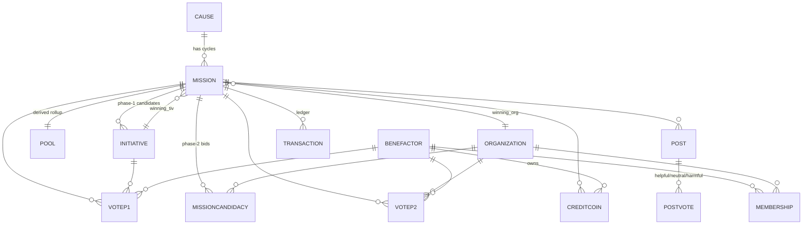
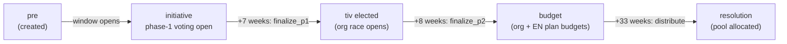

# Earthbucks — System Overview (v2, mission-centric)

Earthbux is a weekly charity pool elected by its community. Each week a **mission**
for one of seven rotating **causes** (Atmosphere · Oceans · Land · Forests ·
Wildlife · Human Rights · Human Progress) opens and runs through a multi-phase
lifecycle: an **initiative election** (which idea?), an **organization election**
(who runs it?), **budgeting**, **credit release**, and **resolution**.
**Earthbux News (EN)** supervises, publicizes, and helps organize the missions,
funded by a fixed cut of each pool.

> **This README documents the v2 backend + the in-progress frontend rebuild.**
> The platform was rebuilt around **missions** as the spine (replacing the older
> initiative-centric model). The cutover is complete; the public-page rewire is
> partway done (see [§9](#9-frontend-status)).

**Doc map**
- **README.md** (this file) — current system, architecture, data model, APIs.
- **STRUCTURE.md** — the product/design model (page-by-page intent).
- **INSTRUCTIONS.md** — historical per-pass build driver.

---

## 1. Architecture

```
                          ┌──────────────────────────────────────────┐
   Browser (static)       │  FastAPI app  (backend/app/main.py)       │
 ┌───────────────────┐    │                                           │
 │ index / cause /   │    │  routers/  ── crud.py ── models.py (ORM)   │
 │ profile / admin   │◄──►│     │            │           │            │
 │ .html             │HTTP│  auth.py     scheduler.py   database.py    │
 │                   │    │  (JWT)       bootstrap.py        │         │
 │ resources/js/     │    └───────────────────────────────── │ ───────┘
 │  ebx_shared.js    │                                       ▼
 └───────────────────┘                                  SQLite (earthbucks.db)
        ▲                                                Alembic-migrated
        │ built by esbuild from
        └ frontend/src/ebx_shared.ts
```

- **Backend** — FastAPI + SQLAlchemy 2.0 (typed ORM) + SQLite, schema-managed by
  Alembic. Served by `uvicorn app.main:app`. The same process also hosts the
  static HTML/JS, so the frontend talks to the API on the same origin.
- **Frontend** — plain HTML pages with inline scripts, plus a shared engine
  compiled from TypeScript: `frontend/src/ebx_shared.ts` → (esbuild) →
  `resources/js/ebx_shared.js`, exposed as a global `EBX`. **A `.ts` edit ships
  nothing until `npm run build` regenerates the JS.**
- **Auth** — JWT bearer tokens (`/auth/login`). Accounts carry a `role`
  (`benefactor | employee | admin`); employee/admin unlocks staff-only actions.

---

## 2. Data model (v2)

The **Mission** is the spine: one per `(cause, cycle)`. Initiatives and
organizations are *candidates* that point at a mission; the singular winners are
pointers on the mission itself. All money movement and vote mutations are logged
in one append-only **Transaction** ledger.



**15 tables.** `causes`, `missions`, `initiatives`, `organizations`,
`benefactor_accounts`, `memberships`, `mission_candidacies`, `votes_p1`,
`votes_p2`, `pools`, `credit_coins`, `posts`, `post_votes`, `queries`,
`transactions`.

Naming convention throughout the code: **`ben`** = benefactor, **`tiv`** =
initiative, **`org`** = organization (so e.g. `tiv_id = ForeignKey("initiatives.id")`).

Key design choices:
- **Mission spine** — created at cycle start (`current_phase='pre'`), holds
  `winning_tiv_id` / `winning_org_id` (the singular winners); the many candidates
  live on the back-ref collections.
- **Split voting** — `VoteP1` (initiative election) and `VoteP2` (org election)
  are separate, so phase-1 state can never leak into phase-2. The committed EBX
  lives on `VoteP1` (the old `Contribution` table merged in).
- **`MissionCandidacy`** — an org's bid to run a mission (replaces the old
  `OrgRegistration`); approval is what grants page-build access.
- **`Transaction`** — the single append-only ledger for both vote mutations
  (`type='vote'`) and money transfers (`type='transfer'`, with a `bucket`).
- **`Query`** — saved, staff-only data-console lookups (the admin browser).
- **`valence`** (`helpful | neutral | harmful`) on votes & posts — `harmful`
  means a vote *against* a tiv or a *block* on an org.

---

## 3. Mission lifecycle

Phases are server-authoritative (advanced by `scheduler.py`); the frontend only
*displays* phase. Timeline is anchored on `mission.started_at` (the day the
cause's window opens):



`current_phase` values: `pre · initiative · budget · credit · resolution`
(`finalize_p1` sets the winning tiv and keeps the mission in `initiative` while
the org race runs; `finalize_p2` advances to `budget`; `distribute_mission`
advances to `resolution`). A `credit` release phase is reserved between budget
and resolution for the staged return of the flexible remainder.

---

## 4. The weekly cycle & bootstrap

Seven causes run staggered 7-week windows — one cause's window opens each week
(the homepage annulus rotates 1/7 per week). Mission ids are `<prefix><cycle>`:

| Cause | prefix | Cause | prefix |
|---|---|---|---|
| atmosphere | `atm` | wildlife | `wil` |
| oceans | `oce` | human-rights | `hmr` |
| land | `lan` | human-progress | `hpr` |
| forests | `for` | | |

- **Genesis** `2026-06-15`. The first rotation is **`atm0, oce0, lan0, for0,
  wil0, hmr0, hpr0`**; the next is `atm1, …`. Cause *i*, cycle *k* opens at
  `genesis + (i + 7k)·week`.
- **`bootstrap.py`** — `bootstrap()` seeds the first rotation and assigns each
  cause's catalog initiatives to its cycle-0 mission as phase-1 candidates;
  `ensure_due()` is the idempotent weekly loader that creates each new mission as
  its window opens.
- **`scheduler.py`** — `run_due()` calls `ensure_due()` then advances every due
  phase (open → finalize_p1 → finalize_p2 → distribute). `maybe_run()` is a
  throttled hook wired into `GET /missions`, so reads keep the clock current
  without a separate cron. The frontend cycle anchor (`cycleStart`) matches the
  genesis date so the annulus reflects the real missions.

Current DB state: **atm0 = `initiative` (open)**, oce0…hpr0 = `pre` (open weekly
through 2026-07-27).

---

## 5. The money model

### At a glance — money in = money out

Benefactors commit EBX and vote in Phase 1; their combined commitments form the
mission **pool** (money *in*). After Phase 1, **every committed EBX lands in
exactly one of two buckets** (money *out*) — nothing is unaccounted for:

| Bucket | What it is | Size |
|---|---|---|
| **a + b — committed to a mission** | Stays committed to a mission's pool — the winning mission, with or without an org registered to it. Loser commitments roll forward to the cause's next-cycle initiative. | the remainder |
| **c — pool minimum (sent)** | The irrevocable send, taken the moment Phase 1 resolves. | **20%** if your initiative won, **10%** if it lost |

So for any benefactor `commitment = (committed to mission) + (pool minimum)`, and
across everyone `pool = Σ committed-to-mission + Σ pool-minimum`. (a and b are
tracked separately only for org attribution; for the money math they combine.)

Phase 2 applies the same shape to the org race: **100%** of your commitment is
sent if your organization wins, **20%** if not.

### Votes by phase

| Phase | Elects | Vote rule | Send rate (win / lose) | Tally fires |
|---|---|---|---|---|
| **1 — Initiative** | which initiative the mission runs | split one vote across initiatives; weight = committed EBX (10 EBX = 1 vote) | 20% / 10% | first day of the cause's active week |
| **2 — Organization** | which org runs it | 1 vote = 1 org; extra votes at rising prices | 100% / 20% | 8 weeks after the initiative election |

> **Auxiliary** (refines *where the committed-to-mission bucket ends up* — does
> not change money-in = money-out): the resolution-time EN/org/reward split (the
> 32nds table below), the 10% loser **commitment-fund** skim, amplified
> `size_factor` vote weighting, and the Phase-3 distrust withdrawal.

### Resolution split

At resolution, the mission **pool** (all committed EBX — nothing is refunded; the
remainder is held for the credit-release phase) is allocated in **32nds**:

| Slice | Fraction | Notes |
|---|---:|---|
| EN — mission side | 8/32 (¼) | EN's operating budget |
| EN — advance | 2/32 (1/16) | releases with the case post reward |
| **EN total** | **10/32 (5/16)** | |
| Org — mission side | 8/32 (¼) | guaranteed |
| Org — advance | 2/32 (1/16) | releases with the case post reward |
| **Org guaranteed** | **10/32 (5/16)** | the budgeting **floor** |
| Reward — best case | 1/32 | benefactor post reward |
| Reward — context/analysis | 1/32 | benefactor post reward |
| Reward — comments | 1/32 | benefactor post reward |
| **Flexible remainder** | **9/32** | released in credit phase → org or back to benefactors |
| **Total** | **32/32** | |

### Post rewards (refined) — which post wins, decided by which vote, paid when

Each discussion category is judged by a different phase's post-votes, so the
rewards release on a staggered timeline rather than all at the case-post moment:

| Category | Scope | Judged by | Reward |
|---|---|---|---|
| **Context** | cause-specific | Phase-1 post-votes | the EBX post reward (paid at P1 close) |
| **Analysis** | initiative-specific | Phase-2 post-votes | the EBX post reward (paid at P2 close) |
| **Evaluation** | mission outcome | Phase-3 post-votes | the EBX post reward (paid in P3) |
| **Case** | the winning argument | Phase-1 post-votes | **no cash** — an upgraded org membership (e.g. veto rights, a communication line, early Earthbux information) |

This restages the "advance" releases (which previously all rode the case-post
moment) onto each category's own phase close. The 32nds split above is unchanged
in size — only *who wins each reward slice and when it releases* is refined here.

- EN only takes its cut when the pool clears `POOL_THRESHOLD` ($100).
- **Budgeting range** (`mission_budget_range`): the org's **minimum** is a
  concrete figure (its guaranteed 10/32 of today's pool); the **maximum** is
  *uncapped* (guaranteed + the 9/32 flexible, and both grow as new donations
  arrive). The org drafts hypothetical budgets between the two.
- **Send rates** (phase-1 20%/10% win/lose, phase-2 100%/20% win/lose) define
  each benefactor's irrevocable-vs-returnable split at credit release — they are
  **not** a refund at resolution.
- **Loser carryover & commitment fund**: when an initiative loses, its backers'
  commitments are **not** spent here — they roll into the cause's next-cycle
  election at 90%, and a 10% skim is booked to the global `commitment_fund`
  bucket. See [§6](#6-voting--the-election-algorithm).
- Every slice is written to the `transactions` ledger; `pools` is a derived cache.

---

## 6. Voting & the election algorithm

All vote logic lives in `crud.py`; the scheduler (`scheduler.run_due`) decides
*when* to call it, the routers expose it. Money is **never refunded** — a vote's
"send rate" only sets the irrevocable-vs-returnable split computed later at credit
release.

**Constants** (`crud.py`): `EBX_PER_VOTE = 10` (10 EBX = 1 vote), `BASE_VOTE_EBX
= 10` (a vote carries weight even with no EBX bought), `SHARE_FLOOR = 0.1`,
`SHARE_SUM_CAP = 1.0`, `VALENCE_SIGN = {helpful:+1, neutral:0, harmful:−1}`,
send rates `P1 20/10` and `P2 100/20` (win/lose).

### Phase 1 — initiative election (`VoteP1`, one row per `(ben, tiv)`)

- **Cast / re-slate** (`replace_p1_shares`): a benefactor spreads `share` across
  several initiatives (continuous sliders, no 0.1 floor enforced on input; shares
  sum to ≤ 1.0). Each row's `ebx_committed = ebx_total · share`. The slate is
  editable any time before finalization; every change writes a vote `Transaction`.
  A no-EBX vote still holds `BASE_VOTE_EBX` of weight.
- **Commit** (`commit_p1_ebx`, `commit_p1`): locks EBX onto a tiv; allowed only
  while the mission is `pre`/`initiative`.
- **Tally** (`p1_tally`): per tiv, `votes = Σ (ebx_committed / EBX_PER_VOTE) ·
  sign(valence)`; harmful subtracts, neutral is 0. `weighted_share` is each tiv's
  positive share of the total. (The amplified weight `1 + b_ebx /
  (pool_excl · n · size_factor)` is documented here and scaffolded via
  `size_factor`; the live tally is currently the EBX-weighted form above.)
- **Finalize** (`finalize_p1`, fired by the scheduler on the **first day of the
  cause's active period**): elects the top `weighted_share` tiv (no-op if there's
  no positive signal yet, so an empty mission stays open). The winner → `active`,
  `mission.winning_tiv_id` is set, and the org race opens. **Status vocabulary is
  just `suggested | active | resolved`** (losers stay `suggested`; the winner is
  `active` through phases 2-4, then `resolved` at `distribute_mission`). The phase
  a tiv is in comes from its mission, not its status.
- **Loser carryover** (`_carry_losers_forward`): every non-winning initiative is
  **re-listed automatically into its cause's next-cycle mission** (`status` back to
  `suggested`, created on demand), carrying each backer's commitment forward at
  `1 − COMMITMENT_FUND_SKIM` (**90%**). The **10% skim** is booked to a global
  `commitment_fund` ledger bucket. The 80% locked behind a *winning* vote stays in
  the won mission and is untouched. (Rates are placeholders — tune later.)

### Phase 2 — organization election (`VoteP2`, one row per `(ben, mission)`)

- **Cast** (`cast_p2`): 1 vote for 1 org; extra votes bought at rising prices;
  `helpful` supports, `harmful` blocks.
- **Tally** (`p2_tally`): net votes (`Σ votes · sign(valence)`; blocks subtract).
- **Finalize** (`finalize_p2`, fired **8 weeks after the initiative election** = 15
  weeks after the mission opens): elects the top net-vote org, sets `winning_org_id`, advances the mission to
  `budget`. No-op without a positive signal.
- **Phase-2 withdrawal** (`withdraw_p1`, `POST /missions/{id}/p1/withdraw`): while
  the org race is open (after the tiv is elected, before `budget`), a benefactor
  can pull back their phase-1 commitment **minus the send** (20% if they backed the
  winning tiv, 10% otherwise). The refund is booked to the `refund` bucket; the
  send stays in the pool. (Phase-3 "org loses → 80% withdrawable with a distrust
  acknowledgment" is **deferred** — see `docs/mission_lifecycle.md`.)

---

## 7. API surface (63 routes)

| Router | Prefix | Highlights |
|---|---|---|
| `auth` | `/auth` | `signup`, `login`, `me` |
| `causes` | `/causes` | list / get / create (staff) |
| `organizations` | `/organizations` | list / get / `{id}/causes` (derived) / create (staff) |
| `initiatives` | `/initiatives` | list (cause/mission/status) / get / create / `{id}/approve` (staff) / `{id}/commit` |
| `missions` | `/missions` | list / get / `{id}/pool` / `{id}/budget-range`; fires the scheduler |
| `candidacies` | `/candidacies` | create bid / list / `{id}/approve` (staff) |
| `votes` | `/missions/{id}/p1\|p2/…` | `p1/votes` (PUT), `p1/commit`, `p1/tally`, `p2/vote`, `p2/commit`, `p2/tally` |
| `posts` | `/posts` | list / create (editorial = staff) / `{id}/react` |
| `benefactors` | `/benefactors/me` | watchlist, `credit-coins`, `memberships` |
| `transactions` | `/transactions` | the ledger (staff) |
| `admin` | `/admin` | `query/entities`, `query/run`, saved `queries`, `accounts/{id}/role`, `missions/{id}/distribute` |

Domain errors raise `ValueError` (→ 4xx); permission errors raise
`PermissionError` (→ 403). Staff-gated routes use the `get_current_staff`
dependency.

---

## 8. Admin data console (`admin.html`)

A from-scratch, read-only back-office over the live DB: employee sign-in, a
left-hand filetree of all 15 tables (`/admin/query/entities` + `/admin/query/run`
with simple column filters), and a ledger view (`/transactions`). It is
**DB-only** — every number comes from a live API call; the only localStorage key
is the auth token. Staff actions (`set_role`, `distribute`) have endpoints; the
page is browse-first for now.

---

## 9. Frontend status

The public pages were built on a **client-side simulation** (a mock election
engine + synthetic vote standings + per-browser localStorage votes). That layer
has been **fully deconstructed**:

- **Engine** (`ebx_shared.ts`) — `LocalElections` (which used to promote a
  phase-1 winner into phase-2) and the mock `Votes` synthesizer are neutralized;
  the data loaders now read **real v2 shapes** (`loadInitiatives`,
  `loadOrganizations`, `loadFeed`, new `loadMissions`); `cycleStart` is aligned
  to the mission genesis.
- **Pages** (`cause.html`, `index.html`, `profile.html`) — all localStorage vote
  stores and dead v1 endpoint calls are gutted into honest stubs that name their
  v2 replacement.

**Result:** the bugs where phase-1 votes leaked into phase-2 and where org
standings appeared before an election are gone — the client no longer fabricates
state. Pages render honest empty vote states.

**Remaining (rebuild):**
1. ✅ v2 data loaders + cycle anchor.
2. ⬜ Wire the cause page phase-1/phase-2 widgets to `/missions/{id}/p1|p2`
   (read tallies, write votes — server-authoritative).
3. ⬜ Homepage cards + profile wallet (`/benefactors/me/credit-coins`) from the
   backend.

---

## 10. Data & seeding

- **Reference data** (the 7 causes) — should live in an idempotent seed.
- **Live-data port** — `backend/seed/port_v1.py` copied the real data from the
  pre-cutover backup into the v2 schema: 7 causes, 4 accounts (password hashes
  preserved), 35 organizations, 55 initiatives (as a catalog, election state
  reset). Idempotent; one-off.
- **Sample data** — `backend/seed/pilot.py` (v1-shaped; needs a v2 rewrite).
- Current DB: 7 causes · 4 accounts · 35 orgs · 55 tivs · 7 missions.

---

## 11. Migrations & the v2 cutover

```
… e8c5d2a7b491 → f4a9c1d2e6b3 (v1 head) → a9f2c1b4d7e3  (v2 rebuild — current head)
```

`a9f2c1b4d7e3` drops the v1 tables and builds the mission-centric schema. The
cutover renamed the v2 modules into place; the v1 source is preserved inert as
`*_old.py` (`models_old`, `schemas_old`, `crud_old`, `main_old`, `rollover_old`)
and `routers_old/`. A pre-cutover DB backup is at
`backend/earthbucks.db.pre-v2.bak`. Run with `uvicorn app.main:app`.

---

## 12. File map

```
backend/
  app/
    main.py            FastAPI entrypoint (+ static hosting)
    models.py          15-table ORM (mission-centric)
    schemas.py         Pydantic v2 request/response models
    crud.py            domain logic: voting, tallies, money split, ledger, query console
    scheduler.py       phase clock + weekly mission auto-load
    bootstrap.py       mission timeline (genesis, prefixes, ensure_due)
    auth.py            password hashing + JWT + current-user/staff deps
    database.py        engine / session / Base
    config.py          settings (DATABASE_URL, size_factor, …)
    routers/           auth, causes, organizations, initiatives, missions,
                       candidacies, votes, posts, benefactors, transactions, admin
    *_old.py, routers_old/   inert v1 source (reference)
  alembic/versions/    migrations (head a9f2c1b4d7e3)
  seed/                port_v1.py (live-data port), pilot.py (v1 sample)
frontend/
  src/ebx_shared.ts    shared engine source (esbuild → resources/js/ebx_shared.js)
index.html  cause.html  profile.html  admin.html
resources/js/ebx_shared.js   built engine
STRUCTURE.md  INSTRUCTIONS.md
```

---

## 13. Running locally

```bash
cd backend
./.venv/bin/python -m alembic upgrade head        # schema (already applied)
./.venv/bin/python -m seed.port_v1                # one-off data port (idempotent)
./.venv/bin/python -c "from app.database import SessionLocal; from app import bootstrap; bootstrap.bootstrap(SessionLocal())"   # seed atm0..hpr0
./.venv/bin/uvicorn app.main:app --reload --port 8000
# → http://localhost:8000  (pages) · /admin (console) · /docs (API)
```

Rebuild the frontend engine after editing the TypeScript:

```bash
cd frontend && npm run build      # ebx_shared.ts → resources/js/ebx_shared.js
```
