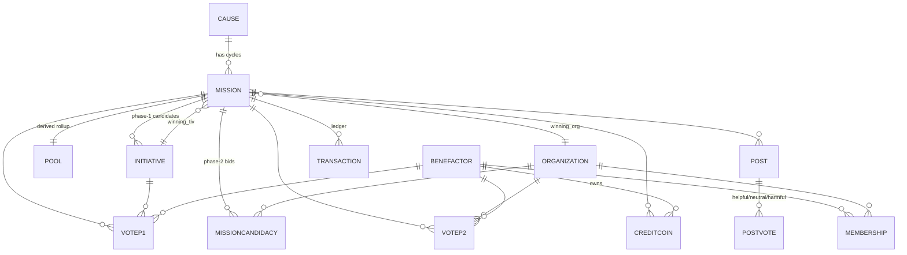
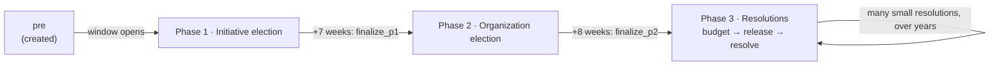

# Earthbucks — System Overview (v2, mission-centric)

Earthbux is a weekly charity pool elected by its community. Each week a **mission**
for one of seven rotating **causes** (Atmosphere · Oceans · Land · Forests ·
Wildlife · Human Rights · Human Progress) (a new cause can be initiated) opens and runs through **three phases**:
an **initiative election** (which idea?), an **organization election** (who runs
it?), and **resolutions** (the entire post-election back half — budgeting, credit
release, and the ongoing stream of small resolved outcomes — folded into one
continuous phase).

**Posts and discussion drive every phase.** Each phase is a structured discussion
with its own post types; the community's reactions to those posts decide which
initiative wins, which org runs it, and how the money is spent, and the best posts
win rewards. **Earthbux News (EN)**, funded by a cut of the pool, supervises,
publicizes, and helps organize the missions by stimulating that discussion,
connecting parties, and pooling resources.

**Doc map** — three canonical docs; supporting files are folded into them.
- **README.md** (this file) — the system model: architecture, data model, APIs,
  lifecycle, the discussion model, money, and the credit framework.
- **docs/structure.md** — the page-by-page build spec (one section per route).
- **docs/INSTRUCTIONS.md** — the build queue (`## BUILD SEQUENCE`) plus the
  living `## BACKLOG`.
- *(Merged in and deleted: `docs/mission_lifecycle.md` → §3/§5 (2026-07-15);
  `docs/posts.md` → §5 discussion model, and `docs/backlog.md` → INSTRUCTIONS
  `## BACKLOG` (2026-07-17).)*

---

## 1. Architecture

```
                          ┌──────────────────────────────────────────┐
   Browser (static)       │  FastAPI app  (backend/app/main.py)       │
 ┌───────────────────┐    │                                           │
 │ index / cause /   │    │  routers/  ── crud.py ── models.py (ORM)   │
 │ profile / admin   │◄──►│     │            │           │            │
 │ .html             │HTTP│  auth.py     scheduler.py   database.py    │
 │                   │    │  (JWT)       bootstrap.py        │         │
 │ resources/js/     │    └───────────────────────────────── │ ───────┘
 │  ebx_shared.js    │                                       ▼
 └───────────────────┘                                  SQLite (earthbucks.db)
        ▲                                                Alembic-migrated
        │ built by esbuild from
        └ frontend/src/ebx_shared.ts
```

- **Backend** — FastAPI + SQLAlchemy 2.0 (typed ORM) + SQLite, schema-managed by
  Alembic. Served by `uvicorn app.main:app`. The same process also hosts the
  static HTML/JS, so the frontend talks to the API on the same origin.
- **Frontend** — plain HTML pages with inline scripts, plus a shared engine
  compiled from TypeScript: `frontend/src/ebx_shared.ts` → (esbuild) →
  `resources/js/ebx_shared.js`, exposed as a global `EBX`. **A `.ts` edit ships
  nothing until `npm run build` regenerates the JS.**
- **Auth** — JWT bearer tokens (`/auth/login`). Accounts carry a `role`
  (`benefactor | employee | admin`); employee/admin unlocks staff-only actions.
- **Kids accounts (planned)** — benefactors aged **12–17** get full *voice*
  but gated *money*: they can vote and post like any benefactor, but **cannot
  add money without parental approval**. Implies a birthdate (or age bracket)
  on `BenefactorAccount`, a guardian link, and an approval flow on every
  money-in action; votes from unfunded kid accounts still carry
  `BASE_VOTE_EBX` weight. Legal review (COPPA/GDPR-K) before build — see the
  INSTRUCTIONS `## BACKLOG`.

---

## 2. Data model (v2)

The **Mission** is the spine: one per `(cause, cycle)`. Initiatives and
organizations are *candidates* that point at a mission; the singular winners are
pointers on the mission itself. All money movement and vote mutations are logged
in one append-only **Transaction** ledger.


```mermaid
erDiagram
    CAUSE        ||--o{ MISSION        : "has cycles"
    MISSION      ||--o{ INITIATIVE     : "phase-1 candidates"
    MISSION      ||--o{ MISSIONCANDIDACY : "phase-2 bids"
    MISSION      ||--o{ VOTEP1          : ""
    MISSION      ||--o{ VOTEP2          : ""
    MISSION      ||--|| POOL            : "derived rollup"
    MISSION      ||--o{ CREDITCOIN      : ""
    MISSION      ||--o{ POST            : ""
    MISSION      }o--|| INITIATIVE      : "winning_tiv"
    MISSION      }o--|| ORGANIZATION    : "winning_org"
    INITIATIVE   ||--o{ VOTEP1          : ""
    ORGANIZATION ||--o{ MISSIONCANDIDACY: ""
    ORGANIZATION ||--o{ VOTEP2          : ""
    BENEFACTOR   ||--o{ VOTEP1          : ""
    BENEFACTOR   ||--o{ VOTEP2          : ""
    BENEFACTOR   ||--o{ MEMBERSHIP      : ""
    BENEFACTOR   ||--o{ CREDITCOIN      : "owns"
    ORGANIZATION ||--o{ MEMBERSHIP      : ""
    POST         ||--o{ POSTVOTE        : "helpful/neutral/harmful"
    MISSION      ||--o{ TRANSACTION     : "ledger"
```

**15 tables.** `causes`, `missions`, `initiatives`, `organizations`,
`benefactor_accounts`, `memberships`, `mission_candidacies`, `votes_p1`,
`votes_p2`, `pools`, `credit_coins`, `posts`, `post_votes`, `queries`,
`transactions`.

Naming convention throughout the code: **`ben`** = benefactor, **`tiv`** =
initiative, **`org`** = organization (so e.g. `tiv_id = ForeignKey("initiatives.id")`).

Key design choices:
- **Mission spine** — created at cycle start (`current_phase='pre'`), holds
  `winning_tiv_id` / `winning_org_id` (the singular winners); the many candidates
  live on the back-ref collections.
- **Split voting** — `VoteP1` (initiative election) and `VoteP2` (org election)
  are separate, so phase-1 state can never leak into phase-2. The committed EBX
  lives on `VoteP1` (the old `Contribution` table merged in).
- **`MissionCandidacy`** — an org's bid to run a mission (replaces the old
  `OrgRegistration`); approval is what grants page-build access.
- **`Transaction`** — the single append-only ledger for both vote mutations
  (`type='vote'`) and money transfers (`type='transfer'`, with a `bucket`).
- **`Query`** — saved, staff-only data-console lookups (the admin browser).
- **`valence`** (`helpful | neutral | harmful`) on votes & posts — `harmful`
  means a vote *against* a tiv or a *block* on an org.
---

## 3. Mission lifecycle
Phases are server-authoritative (advanced by `scheduler.py`); the frontend only
*displays* phase. Timeline is anchored on `mission.started_at` (the day the
cause's window opens):


```mermaid
flowchart LR
    PRE["pre<br/>(created)"] -->|window opens| P1["Phase 1 · Initiative election"]
    P1 -->|"+7 weeks: finalize_p1"| P2["Phase 2 · Organization election"]
    P2 -->|"+8 weeks: finalize_p2"| P3["Phase 3 · Resolutions<br/>budget → release → resolve"]
    P3 -->|"many small resolutions, over years"| P3
```

**Three phases, but five code values (for now).** The lifecycle is now modeled as
three phases — **initiative election**, **organization election**, and
**resolutions** — where *resolutions* is the entire post-election back half:
budgeting, credit release, and the ongoing stream of resolved outcomes are
**stages within one phase, not separate phases.**

The code's `current_phase` enum still carries the old five values —
`pre · initiative · budget · credit · resolution` — which now map onto the three
phases:

| Phase | `current_phase` value(s) | Advanced by |
|---|---|---|
| 1 — Initiative election | `pre`, `initiative` | `finalize_p1` sets the winning tiv and keeps the mission in `initiative` while the org race runs |
| 2 — Organization election | `initiative` (org-race sub-state) | `finalize_p2` |
| 3 — Resolutions | `budget` → `credit` → `resolution` | `finalize_p2` opens budgeting; then per-resolution events (`distribute_mission` marks entry) |

> **Budget → release → resolve is one stream.** A mission does not "reach
> resolution" as a single event — it **opens** budgeting, releases credits in
> stages, and closes through MANY tiny **resolutions** (see [§5 — S/S/S &
> resolutions](#5-the-money-model)), possibly over years. Collapsing the three
> back-half enum values into a single `resolutions` value is proposed work — see
> the INSTRUCTIONS `## BACKLOG`.

### Goals

Streamline and publicize charity missions. Pool donations to avoid redundant or
competing efforts, expose wasteful or fraudulent actors, and reorient attention
toward the cause rather than the sponsor. Democratize *which* idea and *which*
organization gets funded, and report on the work independently through Earthbux
News (EN).

### Full phase map

Three phases. The back half (budgeting → credit release → resolved outcomes) is
one **Resolutions** phase with internal *stages*, not three separate phases:

| Phase | Stage | Window (from `started_at`) | What happens | Driven by |
|---|---|---|---|---|
| **1 — Initiative election** | pre / initiative | weeks < 1 → ~week 7 | Benefactors propose and vote on initiatives | *context* + *case* posts |
| **2 — Organization election** | — | ~week 8 (cause's final active day) | Benefactors nominate/vote on organizations | *analysis* + *review* posts |
| **3 — Resolutions** | budget | weeks 9–16 | Elected org drafts budgets from socially-selected **budgeting** (S/S/S) items; **EN verifies the org**; advance released | *budgeting* + *investigation* posts |
| | release | weeks 17–32 | Credits released in stages; 7–12 step progress reports (org report vs. EN parallel report, benefactor-moderated) | *mission-update* posts |
| | resolve | weeks 33+ | Many small **resolutions** accumulate, each moving coin value; impact summary. Missions may take **many years** to fully resolve | *budgeting* (S/S/S) posts |

The **organization election (phase 2) happens before any budgeting** — the org is
chosen on credentials and a short statement, not a detailed plan. Everything after
that election is the single **Resolutions** phase, and it runs post-by-post:
*budgeting* (S/S/S) posts become the budget and the resolutions themselves (see
[§5](#5-the-money-model)).

### Phase 2 — nominate → register/claim → elect

An initiative is a proposition; an organization is a **counterparty** that must
receive funds and do the work. So phase 2 is three steps, not one:

- **Nomination & registration (both open, no gate).** Orgs can self-register any
  time; benefactors can nominate any org as a candidate for any phase-2 mission
  (minimum: a name and a mission statement — required to be *elected*, not to
  receive votes). An org is a single entity — never nominated twice, no separate
  pages; near-duplicate names get a "did you mean?" prompt. Nominating and
  voting are free.
- **Claiming a mission (the gate).** A real representative **claims** the
  mission → their account gains authority over the budget and mission sequence.
  Claiming requires a **click-through legal agreement** (representative
  attestation — the basis to litigate fraud; see `docs/CONTRACT_DRAFT.md`). A
  nominated (not self-registered) org may claim until Phase 4 starts (claim
  window: `pre|initiative|budget`). Claiming bumps the mission's
  **guaranteed-to-pool rate** (unclaimed 0.20 → claimed 0.35, in `config.py`) —
  rewarding orgs for showing up, protecting benefactors when no one does.
- **Identity verification is EN's responsibility, performed during phase 3** —
  EN only verifies one organization per week (the week's single elected
  mission).

**If no org claims:** the mission is **not cancelled**. Advances are still sent;
the community executes the mission as best it can (e.g. donating the pool
onward) and EN still reports. These cases tend to end with smaller pools.
Earthbux never creates its own organizations — the community elects existing
ones.

**Fraud handling:** the advance lands at the *start* of phase 3, but EN verifies
*during* phase 3 — a fraudulent group could in theory win the advance.
Mitigations: the click-through agreement (litigation basis), EN verification
before the full pool unlocks, and recovery through litigation.

**Election content** (benefactor-authored, pre-vote due diligence): *Evaluation*
(my verdict on this org), *Context* (neutral background / track record),
*Analysis* (data or expert take). Org-authored: a *Pitch / mission statement*
plus *Responses*, kept visually distinct. "Feedback" is reserved for the
post-mission performance phases (4–5); evaluation = pre-vote.

### Withdrawals

- **Phase-2 withdrawal (implemented):** after the tiv is elected but before
  budgeting locks the pool, a benefactor may withdraw their phase-1 commitment
  **minus the send** (20% if they backed the winner, 10% otherwise). `POST
  /missions/{id}/p1/withdraw` → `crud.withdraw_p1`; refund booked to the
  `refund` bucket, the send stays in the pool.
- **Phase-3 org-loss withdrawal (deferred):** once orgs are decided, a
  benefactor whose org **loses** should have their 80% immediately
  withdrawable, but only after **acknowledging they don't trust the winning
  organization** (wording/flow TBD). Tune after phase 2 settles.

### Membership roles

Every org account is a set of members: **Contributor** (a benefactor who voted
for the org / holds credits for the mission — community), **Representative**
(may edit the mission page), **Executive** (highest org permission), and
**Beneficiary** (represents the recipients; unique profile surface; gets a
voice at the start of phase 2). Earthbux retains override authority (e.g. to
revoke a claim from a fraudulent or inactive rep). Mission memberships (held by
benefactors) and org memberships (held by approved org admins) are distinct,
but one person holding both gets a single combined experience.

---

## 4. The weekly cycle & bootstrap

Seven causes run staggered 7-week windows — one cause's window opens each week
(the homepage annulus rotates 1/7 per week). Mission ids are `<prefix><cycle>`:

| Cause | prefix | Cause | prefix |
|---|---|---|---|
| atmosphere | `atm` | wildlife | `wil` |
| oceans | `oce` | human-rights | `hmr` |
| land | `lan` | human-progress | `hpr` |
| forests | `for` | | |

- **Genesis** `2026-06-15`. The first rotation is **`atm0, oce0, lan0, for0,
  wil0, hmr0, hpr0`**; the next is `atm1, …`. Cause *i*, cycle *k* opens at
  `genesis + (i + 7k)·week`.
- **`bootstrap.py`** — `bootstrap()` seeds the first rotation and assigns each
  cause's catalog initiatives to its cycle-0 mission as phase-1 candidates;
  `ensure_due()` is the idempotent weekly loader that creates each new mission as
  its window opens.
- **`scheduler.py`** — `run_due()` calls `ensure_due()` then advances every due
  phase (open → finalize_p1 → finalize_p2 → distribute). `maybe_run()` is a
  throttled hook wired into `GET /missions`, so reads keep the clock current
  without a separate cron. The frontend cycle anchor (`cycleStart`) matches the
  genesis date so the annulus reflects the real missions.

Current DB state: **atm0 = `initiative` (open)**, oce0…hpr0 = `pre` (open weekly
through 2026-07-27).

---

## 5. The money model

### At a glance — money in = money out

Benefactors commit EBX and vote in Phase 1; their combined commitments form the
mission **pool** (money *in*). After Phase 1, **every committed EBX lands in
exactly one of two buckets** (money *out*) — nothing is unaccounted for:

| Bucket | What it is | Size |
|---|---|---|
| **a + b — committed to a mission** | Stays committed to a mission's pool — the winning mission, with or without an org registered to it. Loser commitments roll forward to the cause's next-cycle initiative. | the remainder |
| **c — pool minimum (sent)** | The irrevocable send, taken the moment Phase 1 resolves. | **20%** if your initiative won, **10%** if it lost |

So for any benefactor `commitment = (committed to mission) + (pool minimum)`, and
across everyone `pool = Σ committed-to-mission + Σ pool-minimum`. (a and b are
tracked separately only for org attribution; for the money math they combine.)

Phase 2 applies the same shape to the org race: **100%** of your commitment is
sent if your organization wins, **20%** if not.

### Votes by phase

| Phase | Elects | Vote rule | Send rate (win / lose) | Tally fires |
|---|---|---|---|---|
| **1 — Initiative** | which initiative the mission runs | split one vote across initiatives; weight = committed EBX (10 EBX = 1 vote) | 20% / 10% | first day of the cause's active week |
| **2 — Organization** | which org runs it | 1 vote = 1 org; extra votes at rising prices | 100% / 20% | 8 weeks after the initiative election |

> **Auxiliary** (refines *where the committed-to-mission bucket ends up* — does
> not change money-in = money-out): the resolution-time EN/org/reward split (the
> 32nds table below), the 10% loser **commitment-fund** skim, amplified
> `size_factor` vote weighting, and the Phase-3 distrust withdrawal.

### Resolution split

At resolution, the mission **pool** (all committed EBX — nothing is refunded; the
remainder is held for the credit-release phase) is allocated in **32nds**:

| Slice | Fraction | Notes |
|---|---:|---|
| EN — mission side | 8/32 (¼) | EN's operating budget |
| EN — advance | 2/32 (1/16) | releases with the case post reward |
| **EN total** | **10/32 (5/16)** | |
| Org — mission side | 8/32 (¼) | guaranteed |
| Org — advance | 2/32 (1/16) | releases with the case post reward |
| **Org guaranteed** | **10/32 (5/16)** | the budgeting **floor** |
| Reward — best context | 1/32 | benefactor post reward |
| Reward — best investigation | 1/32 | benefactor post reward |
| Reward — best analysis | 1/32 | benefactor post reward |
| **Flexible remainder** | **9/32** | released in credit phase → org or back to benefactors |
| **Total** | **32/32** | |

### The discussion model — a post type for every phase

Every phase is a structured discussion, and **the posts are what drive the
outcome**: *mission-support* posts (context/investigation/analysis) inform the
elections and carry the rewards, *review* posts (case/evaluation) argue the
initiative and judge the org's effort, and *budgeting* posts (service/supply/
support) become the budget and the resolutions. Commentary does **not** live in
the voting dialog. **New discussions originate on the Context page (`main.html`,
each tiv/org row's own thread) or the Mission page (`mission.html`)**; the
**Landing** page (`index.html`) aggregates all posts; the **cause/election page is
view-only**, showing only the top few posts per phase. The winning post in each
rewarded type is displayed prominently next to its **prize**.

**Two-tier types.** Every post carries a **`category` (supercategory)** and a
**`type` (subcategory)**. The single source of truth is
`backend/app/post_config.py` — limits, reactions, edit locks, rewards, and
membership-to-win all read from that one table. Three benefactor categories:

**Reactions are one backend enum, three columns** — `helpful · neutral · harmful`
(stored on `PostVote`; one `react_to_post` path for every post). A post type only
declares **which columns the frontend shows** and how they're **labelled**. No
type gets its own vote code.

| Category | Type (subcategory) | Limit per ben / mission | Reactions shown | Rewarded? |
|---|---|---|---|---|
| **Budgeting** | Service · Supply · Support | **one per type** (up to 3), rolling — a new slot opens only when the current item is **paid out** | **Helpful only** (upvote); neutral & harmful hidden, counts stay 0 | no — a budget line, not a prize |
| **Mission Support** | Context · Investigation · Analysis | **one each** | **Helpful / Neutral / Harmful** (full) | **yes — the 3 rewarded types**, one 1/32 each |
| **Review** | Case · Evaluation | **one each** | **Fair / Unfair** (= helpful / harmful); no neutral (count stays 0) — **both** counts displayed | perk (comm line), not cash |

Author tags: `<ben>` = benefactor · `<org>` = the mission's org · `<ebx>` =
Earthbux News. The three categories above are **benefactor-authored**; org/EN
posts (`org_update`, `mission_update`, `testimonial`, `editorial`, `headline`) are
unlimited, sit outside the per-ben allowance, and win nothing.

- **Budgeting.** Service = something we send people to DO (orgs) · Supply = what
  they need (bens) · Support = how we ensure honest resolution (ebx). Items are
  **never revoked** — a slot frees only when the money is **actually paid out**.
  Some fields (the committed cost line, once adopted) **cannot be edited**. S/S/S
  is **its own category now — it has nothing to do with context.**
- **Mission Support.** The three rewarded posts. **Neutral matters here** — it
  signals people are reading and feel neutral about a post, i.e. engagement where
  commitment isn't necessary. Winners resolve on a staggered clock: **context with
  the advances · investigation at the end of phase 3 · analysis later.**
- **Review.** *Case* pitches the initiative the ben supports; *evaluation* reviews
  the org's effort. Rated **fair / unfair**; **winner = most fair votes** (for now).
  Each winner earns a **direct line to Earthbux and the org** — a perk, so the
  winner **must be a member**.

**Edits are versioned updates.** Editing keeps the prior versions viewable (an
audit trail) rather than overwriting. **Replying to your own post is an allowed
alternative to editing it.** Budgeting items are the exception — some parts lock
once adopted (above).

**Membership is a requirement of being eligible to win.** Anyone in scope may post;
only mission members can *win* a reward or the review comm-line. This reconciles
the tax-deductible-reward claim with `is_mission_member` (§6): a winner is by
construction a member.

**Where each type may live:** *review* (case/evaluation on an org) can be posted on
**any org, any time**; *mission-support* and *budgeting* only exist **inside an
active mission**. Clicking a comment/reply opens the **Context** page for P1/P2 and
the **Mission** page for P3+. The **P1 recap** carries just two types — *context*
and *case*.

Post rules (limits, reactions, edit locks, membership-to-win) are enforced from
`post_config.py` — one table, read by both `create_post`/`react_to_post` and the
frontend composer. See [budgeting procedure](#sss--resolutions-the-budgeting-procedure).

### Post rewards (refined) — which post wins, decided by which vote, paid when

The three **mission-support** types are the rewarded posts — one **1/32** slice
each. This replaces the old best_case / context_or_analysis / comments slices; the
total 32nds split is unchanged in size. Winners resolve on a staggered clock, and
**a winner must be a mission member**:

| Rewarded type | Judged by | Winner decided / paid |
|---|---|---|
| **Context** | its post-votes (most helpful) | **with the advances** |
| **Investigation** | its post-votes (most helpful) | at the **end of phase 3** |
| **Analysis** | its post-votes (most helpful) | **later** (post-phase-3) |

**Review** posts win no cash: the most-*fair* **case** and the most-*fair*
**evaluation** each earn their author a **direct line to Earthbux and the org**
(plus any upgraded membership perks). **Budgeting** posts aren't prizes at all — an
upvoted item becomes a budget line and pays out as the money is spent.

Only *which post type wins each slice and when it releases* changed; the 32nds
sizes are unchanged. Enforcement reads the rewarded set from `post_config.py`
(`REWARDED_TYPES` = context · investigation · analysis).

- EN only takes its cut when the pool clears `POOL_THRESHOLD` ($100).
- **Budgeting range** (`mission_budget_range`): the org's **minimum** is a
  concrete figure (its guaranteed 10/32 of today's pool); the **maximum** is
  *uncapped* (guaranteed + the 9/32 flexible, and both grow as new donations
  arrive). The org drafts hypothetical budgets between the two.
- **Send rates** (phase-1 20%/10% win/lose, phase-2 100%/20% win/lose) define
  each benefactor's irrevocable-vs-returnable split at credit release — they are
  **not** a refund at resolution.
- **Loser carryover & commitment fund**: when an initiative loses, its backers'
  commitments are **not** spent here — they roll into the cause's next-cycle
  election at 90%, and a 10% skim is booked to the global `commitment_fund`
  bucket. See [§6](#6-voting--the-election-algorithm).
- Every slice is written to the `transactions` ledger; `pools` is a derived cache.

### Credits & EBX

- 1 credit = 1 EBX ≈ $1; EBX hold $1 value for 7 weeks post-mint.
- Coins mint at election settlement (`finalize_p2`), sized by each voter's
  remaining stake; **holding one = mission membership**. Staff/test coins render
  greyed in the wallet.
- `GET /coin-value` = global value (net platform flow / `coin_value_scale`);
  `mission.credit_value` moves with resolutions (`resolution_value_bump`).
- Minted credits become tax-deductible after they are committed to a charity
  and converted. The amount people keep as EBX (rather than converting /
  withdrawing) determines the pool available to budget with.
- **Design for failure:** many missions will fail (bad org, extreme costs) —
  the coin model must tolerate that.

### S/S/S → resolutions: the budgeting procedure

The key objects of Earthbux reporting:

| Term | Meaning | Carried by |
|---|---|---|
| **Service** | something we can send people to DO | orgs |
| **Supply** | WHAT those people need to do it | bens |
| **Support** | how we ensure the issue is resolved honestly | ebx |

A **resolution** is a small, mission-tied outcome we can reasonably assume was
accomplished; when it lands, its evaluation point is given and it moves the
mission's credit-coin value. **Resolution is not a single closing event** — the
Phase-3 resolutions stream *is* many tiny resolutions, and achieving them ahead
of schedule earns a higher cash reward.

> ✅ **Resolved (2026-07-19).** S/S/S is its own **category** (`budgeting`) with
> three **types** — service · supply · support. It is **not** a stance on context.
> The taxonomy lives in `backend/app/post_config.py`.

The procedure, end to end:

1. **Suggest (budgeting posts).** A benefactor posts a **budgeting** item under one
   of the three types — **service · supply · support** (one open per type, rolling).
   Orgs post itemized cost lists; users **upvote** items (upvote-only — no down or
   neutral); the socially selected picks drive the money routing. An item is never
   revoked, and its slot frees only when it is **paid out**.
2. **Budget (phase 3).** The org drafts hypothetical budgets between its
   guaranteed floor (10/32) and the uncapped maximum (+9/32 flexible, growing
   with donations). The release phase gets a projected **mission length** /
   end date (`missions.projected_end_at`) — one strategy: end right before
   that cause's next phase-1, so the org can bid for another pool.
3. **Steps.** Each release-phase **step** (`mission_steps`) carries a
   guaranteed + potential pool, finalized by the end of budgeting (no
   maximums). Step creation locks when the mission leaves `budget`.
4. **Resolve.** `POST /posts/{id}/resolve` (context → resolution) and
   `POST /missions/{id}/steps/{id}/resolve`, gated on mission operators; each
   bumps coin value and logs an `evaluation`-bucket ledger note; early step
   resolution is flagged for bonus. Admin gantt renders the plan.

Post lanes now live in `post_config.py`, not scattered constants. Authoring is
open to any benefactor within scope; **membership gates *winning*, not posting.**
Org/EN lanes are unchanged: `org_update` = authoring-org members · `editorial` /
`headline` = staff.

### The creditcoin — front & back (planned: the 3D earth)

The creditcoin becomes a two-sided card, **born on `mission.html`**:

- **Front** — the facts: value, initiative, organization, election info, key
  dates.
- **Back** — a **3D earth** the user can rotate toward three key locations:
  1. the current user's home location,
  2. the location(s) where the mission must take place,
  3. the location(s) of the organization(s).

Missions will have different **location-types** (e.g. a fixed site vs. a
region vs. distributed/global), which the globe must render appropriately.
Requires location fields on benefactors, missions (typed), and organizations —
see the INSTRUCTIONS `## BACKLOG`.

### Transactional credit — decision framework

Benefactors should be able to **tune** a donation — to a cause, to an
initiative within that cause, or simply to *the next mission* — and change the
availability of their money throughout the process, possibly targeting a
location, an organization, or a beneficiary type. The questions and key
decisions to settle before building:

**1. Donation targets (what can EBX be aimed at?)**
- Which target levels exist: platform-wide ("next mission") → cause →
  initiative → mission → org → location → beneficiary type?
- Is a target a *constraint* (money can only go there) or a *preference*
  (routing weight)? Constraints can strand money; preferences dilute intent.
- What happens to targeted money when the target never materializes (the
  initiative never wins, no mission in that location)? Expiry → next mission?
  Carryover like the loser path (90% + skim)?
- Do targeted donations count as phase-1 votes, or is donating and voting
  decoupled?

**2. Availability (when can the benefactor change their mind?)**
- Which states can money be in: `available → committed → sent → converted`?
  Define the full state machine and which transitions the benefactor controls.
- At each phase, what fraction is withdrawable? (Today: P2 window minus the
  send; phase-3 distrust withdrawal deferred.) Does targeting change the rates?
- Can availability be scheduled ("release 10/week"), or only toggled?
- Does changing a target mid-phase re-price the send rate already accrued?

**3. Routing & precedence**
- When constraints conflict (org X but location Y, and X doesn't operate in
  Y), who wins — and is the benefactor told at donate time or at routing time?
- Order of application: location vs org vs beneficiary-type filters.
- Does untargeted money in a pool inherit the socially-selected S/S/S picks by
  default (it should — decide explicitly)?
- Minimum granularity: is location a country / region / radius / mission-site
  match (ties into the mission location-types)?

**4. Ledger & value**
- Every tuning change is a `Transaction` — new `type='retarget'` or a bucket?
- Do targeted coins carry their target on the coin (visible on the coin
  front)? Does a tighter target affect coin value or rewards?
- Tax-deductibility timing: at commit, at send, or at conversion — and does
  targeting change it?

**5. Abuse & failure modes**
- Can targeting be used to steer a pool toward a colluding org (a benefactor
  "buying" an election via availability games)? Caps needed?
- What happens to tightly-targeted money in a failed mission (design for
  failure, as with coins)?
- Parental-approval interaction: kids' money (see §Accounts) presumably can't
  be retargeted without re-approval — confirm.

---

## 6. Voting & the election algorithm

All vote logic lives in `crud.py`; the scheduler (`scheduler.run_due`) decides
*when* to call it, the routers expose it. Money is **never refunded** — a vote's
"send rate" only sets the irrevocable-vs-returnable split computed later at credit
release.

**Constants** (`crud.py`): `EBX_PER_VOTE = 10` (10 EBX = 1 vote), `BASE_VOTE_EBX
= 10` (a vote carries weight even with no EBX bought), `SHARE_FLOOR = 0.1`,
`SHARE_SUM_CAP = 1.0`, `VALENCE_SIGN = {helpful:+1, neutral:0, harmful:−1}`,
send rates `P1 20/10` and `P2 100/20` (win/lose).

### Phase 1 — initiative election (`VoteP1`, one row per `(ben, tiv)`)

- **Cast / re-slate** (`replace_p1_shares`): a benefactor spreads `share` across
  several initiatives (continuous sliders, no 0.1 floor enforced on input; shares
  sum to ≤ 1.0). Each row's `ebx_committed = ebx_total · share`. The slate is
  editable any time before finalization; every change writes a vote `Transaction`.
  A no-EBX vote still holds `BASE_VOTE_EBX` of weight.
- **Commit** (`commit_p1_ebx`, `commit_p1`): locks EBX onto a tiv; allowed only
  while the mission is `pre`/`initiative`.
- **Tally** (`p1_tally`): per tiv, `votes = Σ (ebx_committed / EBX_PER_VOTE) ·
  sign(valence)`; harmful subtracts, neutral is 0. `weighted_share` is each tiv's
  positive share of the total. (The amplified weight `1 + b_ebx /
  (pool_excl · n · size_factor)` is documented here and scaffolded via
  `size_factor`; the live tally is currently the EBX-weighted form above.)
- **Finalize** (`finalize_p1`, fired by the scheduler on the **first day of the
  cause's active period**): elects the top `weighted_share` tiv (no-op if there's
  no positive signal yet, so an empty mission stays open). The winner → `active`,
  `mission.winning_tiv_id` is set, and the org race opens. **Status vocabulary is
  just `suggested | active | resolved`** (losers stay `suggested`; the winner is
  `active` through phases 2-4, then `resolved` at `distribute_mission`). The phase
  a tiv is in comes from its mission, not its status.
- **Loser carryover** (`_carry_losers_forward`): every non-winning initiative is
  **re-listed automatically into its cause's next-cycle mission** (`status` back to
  `suggested`, created on demand), carrying each backer's commitment forward at
  `1 − COMMITMENT_FUND_SKIM` (**90%**). The **10% skim** is booked to a global
  `commitment_fund` ledger bucket. The 80% locked behind a *winning* vote stays in
  the won mission and is untouched. (Rates are placeholders — tune later.)

### Phase 2 — organization election (`VoteP2`, one row per `(ben, mission)`)

- **Cast** (`cast_p2`): 1 vote for 1 org; extra votes bought at rising prices;
  `helpful` supports, `harmful` blocks.
- **Tally** (`p2_tally`): net votes (`Σ votes · sign(valence)`; blocks subtract).
- **Finalize** (`finalize_p2`, fired **8 weeks after the initiative election** = 15
  weeks after the mission opens): elects the top net-vote org, sets `winning_org_id`, advances the mission to
  `budget`. No-op without a positive signal.
- **Phase-2 withdrawal** (`withdraw_p1`, `POST /missions/{id}/p1/withdraw`): while
  the org race is open (after the tiv is elected, before `budget`), a benefactor
  can pull back their phase-1 commitment **minus the send** (20% if they backed the
  winning tiv, 10% otherwise). The refund is booked to the `refund` bucket; the
  send stays in the pool. (Phase-3 "org loses → 80% withdrawable with a distrust
  acknowledgment" is **deferred** — see [§3 Withdrawals](#withdrawals).)

---

## 7. API surface (63 routes)

| Router | Prefix | Highlights |
|---|---|---|
| `auth` | `/auth` | `signup`, `login`, `me` |
| `causes` | `/causes` | list / get / create (staff) |
| `organizations` | `/organizations` | list / get / `{id}/causes` (derived) / create (staff) |
| `initiatives` | `/initiatives` | list (cause/mission/status) / get / create / `{id}/approve` (staff) / `{id}/commit` |
| `missions` | `/missions` | list / get / `{id}/pool` / `{id}/budget-range`; fires the scheduler |
| `candidacies` | `/candidacies` | create bid / list / `{id}/approve` (staff) |
| `votes` | `/missions/{id}/p1\|p2/…` | `p1/votes` (PUT), `p1/commit`, `p1/tally`, `p2/vote`, `p2/commit`, `p2/tally` |
| `posts` | `/posts` | list / create (editorial = staff) / `{id}/react` |
| `benefactors` | `/benefactors/me` | watchlist, `credit-coins`, `memberships` |
| `transactions` | `/transactions` | the ledger (staff) |
| `admin` | `/admin` | `query/entities`, `query/run`, saved `queries`, `accounts/{id}/role`, `missions/{id}/distribute` |

Domain errors raise `ValueError` (→ 4xx); permission errors raise
`PermissionError` (→ 403). Staff-gated routes use the `get_current_staff`
dependency.

---

## 8. Admin data console (`admin.html`)

A from-scratch, read-only back-office over the live DB: employee sign-in, a
left-hand filetree of all 15 tables (`/admin/query/entities` + `/admin/query/run`
with simple column filters), and a ledger view (`/transactions`). It is
**DB-only** — every number comes from a live API call; the only localStorage key
is the auth token. Staff actions (`set_role`, `distribute`) have endpoints; the
page is browse-first for now.

---

## 9. Frontend status

The public pages were built on a **client-side simulation** (a mock election
engine + synthetic vote standings + per-browser localStorage votes). That layer
has been **fully deconstructed**:

- **Engine** (`ebx_shared.ts`) — `LocalElections` (which used to promote a
  phase-1 winner into phase-2) and the mock `Votes` synthesizer are neutralized;
  the data loaders now read **real v2 shapes** (`loadInitiatives`,
  `loadOrganizations`, `loadFeed`, new `loadMissions`); `cycleStart` is aligned
  to the mission genesis.
- **Pages** (`cause.html`, `index.html`, `profile.html`) — all localStorage vote
  stores and dead v1 endpoint calls are gutted into honest stubs that name their
  v2 replacement.

**Result:** the bugs where phase-1 votes leaked into phase-2 and where org
standings appeared before an election are gone — the client no longer fabricates
state. Pages render honest empty vote states.

**Remaining (rebuild):**
1. ✅ v2 data loaders + cycle anchor.
2. ⬜ Wire the cause page phase-1/phase-2 widgets to `/missions/{id}/p1|p2`
   (read tallies, write votes — server-authoritative).
3. ⬜ Homepage cards + profile wallet (`/benefactors/me/credit-coins`) from the
   backend.

---

## 10. Data & seeding

- **Reference data** (the 7 causes) — should live in an idempotent seed.
- **Live-data port** — `backend/seed/port_v1.py` copied the real data from the
  pre-cutover backup into the v2 schema: 7 causes, 4 accounts (password hashes
  preserved), 35 organizations, 55 initiatives (as a catalog, election state
  reset). Idempotent; one-off.
- **Sample data** — `backend/seed/pilot.py` (v1-shaped; needs a v2 rewrite).
- Current DB: 7 causes · 4 accounts · 35 orgs · 55 tivs · 7 missions.

---

## 11. Migrations & the v2 cutover

```
… e8c5d2a7b491 → f4a9c1d2e6b3 (v1 head) → a9f2c1b4d7e3  (v2 rebuild — current head)
```

`a9f2c1b4d7e3` drops the v1 tables and builds the mission-centric schema. The
cutover renamed the v2 modules into place; the v1 source is preserved inert as
`*_old.py` (`models_old`, `schemas_old`, `crud_old`, `main_old`, `rollover_old`)
and `routers_old/`. A pre-cutover DB backup is at
`backend/earthbucks.db.pre-v2.bak`. Run with `uvicorn app.main:app`.

---

## 12. File map

```
backend/
  app/
    main.py            FastAPI entrypoint (+ static hosting)
    models.py          15-table ORM (mission-centric)
    schemas.py         Pydantic v2 request/response models
    crud.py            domain logic: voting, tallies, money split, ledger, query console
    scheduler.py       phase clock + weekly mission auto-load
    bootstrap.py       mission timeline (genesis, prefixes, ensure_due)
    auth.py            password hashing + JWT + current-user/staff deps
    database.py        engine / session / Base
    config.py          settings (DATABASE_URL, size_factor, …)
    routers/           auth, causes, organizations, initiatives, missions,
                       candidacies, votes, posts, benefactors, transactions, admin
    *_old.py, routers_old/   inert v1 source (reference)
  alembic/versions/    migrations (head a9f2c1b4d7e3)
  seed/                port_v1.py (live-data port), pilot.py (v1 sample)
frontend/
  src/ebx_shared.ts    shared engine source (esbuild → resources/js/ebx_shared.js)
index.html  cause.html  profile.html  admin.html
resources/js/ebx_shared.js   built engine
docs/
  structure.md       page-by-page build spec (per route)
  INSTRUCTIONS.md    build queue (## BUILD SEQUENCE) + ## BACKLOG
  CONTRACT_DRAFT.md  representative attestation (claim gate)
```

---

## 13. Running locally

```bash
cd backend
./.venv/bin/python -m alembic upgrade head        # schema (already applied)
./.venv/bin/python -m seed.port_v1                # one-off data port (idempotent)
./.venv/bin/python -c "from app.database import SessionLocal; from app import bootstrap; bootstrap.bootstrap(SessionLocal())"   # seed atm0..hpr0
./.venv/bin/uvicorn app.main:app --reload --port 8000
# → http://localhost:8000  (pages) · /admin (console) · /docs (API)
```

Rebuild the frontend engine after editing the TypeScript:

```bash
cd frontend && npm run build      # ebx_shared.ts → resources/js/ebx_shared.js
```
