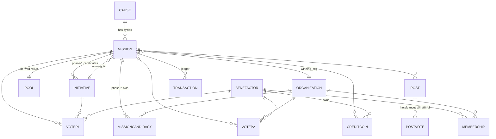
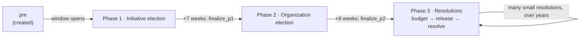

# Earthbucks — System Overview (v2, mission-centric)

Earthbux is a weekly charity pool elected by its community. Each week a **mission**
for one of seven rotating **causes** opens and runs through **two elections**:
an **initiative election** (which idea?), an **organization election** (who runs
it?).

**Earthbux News (EN)**, funded by a cut of the pool, supervises,
publicizes, and helps organize the missions by creating a social network around each mission.
Stimulating discussion, connecting parties, and pooling resources.


**Doc map** — three canonical docs; supporting files are folded into them.
- **README.md** (this file) — the system model: architecture, data model, APIs,
  lifecycle, the discussion model, money, and the credit framework.
- **docs/structure.md** — the page-by-page build spec (one section per route).
- **docs/INSTRUCTIONS.md** — the build queue (`## BUILD SEQUENCE`) plus the
  living `## BACKLOG`.

---

## 1. Architecture

```
                          ┌──────────────────────────────────────────┐
   Browser (static)       │  FastAPI app  (backend/app/main.py)       │
 ┌───────────────────┐    │                                           │
 │ index / cause /   │    │  routers/  ── crud.py ── models.py (ORM)   │
 │ profile / admin   │◄──►│     │            │           │            │
 │ / mission.html    │HTTP│  auth.py     scheduler.py   database.py    │
 │                   │    │  (JWT)       bootstrap.py        │         │
 │ resources/js/     │    └───────────────────────────────── │ ───────┘
 │  ebx_shared.js    │                                       ▼
 └───────────────────┘                                  SQLite (earthbucks.db)
        ▲                                                Alembic-migrated
        │ built by esbuild from
        └ frontend/src/ebx_shared.ts
```

- **Backend** — FastAPI + SQLAlchemy 2.0 (typed ORM) + SQLite, schema-managed by
  Alembic. Served by `uvicorn app.main:app`. The same process also hosts the
  static HTML/JS, so the frontend talks to the API on the same origin.
- **Frontend** — plain HTML pages with inline scripts, plus a shared engine
  compiled from TypeScript: `frontend/src/ebx_shared.ts` → (esbuild) →
  `resources/js/ebx_shared.js`, exposed as a global `EBX`. **A `.ts` edit ships
  nothing until `npm run build` regenerates the JS.**
- **Auth** — JWT bearer tokens (`/auth/login`). Accounts carry a `role`
  (`benefactor | employee | admin`); employee/admin unlocks staff-only actions.
- **Kids accounts (planned)** — benefactors aged **12–17** get full *voice*
  but gated *money*: they can vote and post like any benefactor, but **cannot
  add money without parental approval**. Implies a birthdate (or age bracket)
  on `BenefactorAccount`, a guardian link, and an approval flow on every
  money-in action; votes from unfunded kid accounts still carry
  `BASE_VOTE_EBX` weight. Legal review (COPPA/GDPR-K) before build — see the
  INSTRUCTIONS `## BACKLOG`.
- **Railway** https://ebx-production.up.railway.app/ 


---

## 2. Data model (v2)

The **Mission** is the spine: one per `(cause, cycle)`. Initiatives and
organizations are *candidates* that point at a mission; the singular winners are
pointers on the mission itself. All money movement and vote mutations are logged
in one append-only **Transaction** ledger.


```mermaid
erDiagram
    CAUSE        ||--o{ MISSION        : "has cycles"
    MISSION      ||--o{ INITIATIVE     : "phase-1 candidates"
    MISSION      ||--o{ MISSIONCANDIDACY : "phase-2 bids"
    MISSION      ||--o{ VOTEP1          : ""
    MISSION      ||--o{ VOTEP2          : ""
    MISSION      ||--|| POOL            : "derived rollup"
    MISSION      ||--o{ CREDITCOIN      : ""
    MISSION      ||--o{ POST            : ""
    MISSION      }o--|| INITIATIVE      : "winning_tiv"
    MISSION      }o--|| ORGANIZATION    : "winning_org"
    INITIATIVE   ||--o{ VOTEP1          : ""
    ORGANIZATION ||--o{ MISSIONCANDIDACY: ""
    ORGANIZATION ||--o{ VOTEP2          : ""
    BENEFACTOR   ||--o{ VOTEP1          : ""
    BENEFACTOR   ||--o{ VOTEP2          : ""
    BENEFACTOR   ||--o{ MEMBERSHIP      : ""
    BENEFACTOR   ||--o{ CREDITCOIN      : "owns"
    ORGANIZATION ||--o{ MEMBERSHIP      : ""
    POST         ||--o{ POSTVOTE        : "helpful/neutral/harmful"
    MISSION      ||--o{ TRANSACTION     : "ledger"
```

**16 tables.** `causes`, `missions`, `initiatives`, `organizations`,
`benefactor_accounts`, `memberships`, `mission_candidacies`, `votes_p1`,
`votes_p2`, `cause_votes`, `pools`, `credit_coins`, `posts`, `post_votes`,
`queries`, `transactions`.

Naming convention throughout the code: **`ben`** = benefactor, **`tiv`** =
initiative, **`org`** = organization (so e.g. `tiv_id = ForeignKey("initiatives.id")`).

Key design choices:
- **Mission spine** — created at cycle start (`current_phase='pre'`), holds
  `winning_tiv_id` / `winning_org_id` (the singular winners); the many candidates
  live on the back-ref collections.
- **Split voting** — `VoteP1` (initiative election) and `VoteP2` (org election)
  are separate, so phase-1 state can never leak into phase-2. The committed EBX
  lives on `VoteP1` (the old `Contribution` table merged in).
- **`MissionCandidacy`** — an org's bid to run a mission (replaces the old
  `OrgRegistration`); approval is what grants page-build access.
- **`Transaction`** — the single append-only ledger for both vote mutations
  (`type='vote'`) and money transfers (`type='transfer'`, with a `bucket`).
- **`CauseVote`** — §5 (2026-08-06): one benefactor's vote, for one WEEK, on
  which cause should hold an upcoming window. The seven causes are themselves
  elected (§4, *Changing a cause*), so `Cause` grew `status`
  (`active | suggested | retired`), `proposed_by_id`, and a **nullable**
  `index` — a suggested cause holds no window until it wins one.
- **`Query`** — saved, staff-only data-console lookups (the admin browser).
- **`valence`** (`helpful | neutral | harmful`) on votes & posts — `harmful`
  means a vote *against* a tiv or a *block* on an org.
---

## 3. Mission lifecycle
Phases are server-authoritative (advanced by `scheduler.py`); the frontend only
*displays* phase. Timeline is anchored on `mission.started_at` (the day the
cause's window opens):


```mermaid
flowchart LR
    PRE["pre<br/>(created)"] -->|window opens| P1["Phase 1 · Initiative election"]
    P1 -->|"+7 weeks: finalize_p1"| P2["Phase 2 · Organization election"]
    P2 -->|"+8 weeks: finalize_p2"| P3["Phase 3 · Resolutions<br/>budget → release → resolve"]
    P3 -->|"many small resolutions, over years"| P3
```

**Three phases, but five code values (for now).** The lifecycle is now modeled as
three phases — **initiative election**, **organization election**, and
**resolutions** — where *resolutions* is the entire post-election back half:
budgeting, credit release, and the ongoing stream of resolved outcomes are
**stages within one phase, not separate phases.**

The code's `current_phase` enum still carries the old five values —
`pre · initiative · budget · credit · resolution` — which now map onto the three
phases:

| Phase | `current_phase` value(s) | Advanced by |
|---|---|---|
| 1 — Initiative election | `pre`, `initiative` | `finalize_p1` sets the winning tiv and keeps the mission in `initiative` while the org race runs |
| 2 — Organization election | `initiative` (org-race sub-state) | `finalize_p2` |
| 3 — Resolutions | `budget` → `credit` → `resolution` | `finalize_p2` opens budgeting; then per-resolution events (`distribute_mission` marks entry) |

> **Budget → release → resolve is one stream.** A mission does not "reach
> resolution" as a single event — it **opens** budgeting, releases credits in
> stages, and closes through MANY tiny **resolutions** (see [§5 — S/S/S &
> resolutions](#5-the-money-model)), possibly over years. Collapsing the three
> back-half enum values into a single `resolutions` value is proposed work — see
> the INSTRUCTIONS `## BACKLOG`.

### Goals

Streamline and publicize charity missions. Pool donations to avoid redundant or
competing efforts, expose wasteful or fraudulent actors, and reorient attention
toward the cause rather than the sponsor. Democratize *which* idea and *which*
organization gets funded, and report on the work independently through Earthbux
News (EN).

### Full phase map

Three phases. The back half (budgeting → credit release → resolved outcomes) is
one **Resolutions** phase with internal *stages*, not three separate phases:

| Phase | Stage | Window (from `started_at`) | What happens | Driven by |
|---|---|---|---|---|
| **1 — Initiative election** | pre / initiative | weeks < 1 → ~week 7 | Benefactors propose and vote on initiatives | *context* + *case* posts |
| **2 — Organization election** | — | ~week 8 (cause's final active day) | Benefactors nominate/vote on organizations | *analysis* + *review* posts |
| **3 — Resolutions** | budget | weeks 9–16 | Elected org drafts budgets from socially-selected **budgeting** (S/S/S) items; **EN verifies the org**; advance released | *budgeting* + *investigation* posts |
| | release | weeks 17–32 | Credits released in stages; 7–12 step progress reports (org report vs. EN parallel report, benefactor-moderated) | *mission-update* posts |
| | resolve | weeks 33+ | Many small **resolutions** accumulate, each moving coin value; impact summary. Missions may take **many years** to fully resolve | *budgeting* (S/S/S) posts |

The **organization election (phase 2) happens before any budgeting** — the org is
chosen on credentials and a short statement, not a detailed plan. Everything after
that election is the single **Resolutions** phase, and it runs post-by-post:
*budgeting* (S/S/S) posts become the budget and the resolutions themselves (see
[§5](#5-the-money-model)).

### Phase 2 — nominate → register/claim → elect

An initiative is a proposition; an organization is a **counterparty** that must
receive funds and do the work. So phase 2 is three steps, not one:

- **Nomination & registration (both open, no gate).** Orgs can self-register any
  time; benefactors can nominate any org as a candidate for any phase-2 mission
  (minimum: a name and a mission statement — required to be *elected*, not to
  receive votes). An org is a single entity — never nominated twice, no separate
  pages; near-duplicate names get a "did you mean?" prompt. Nominating and
  voting are free.
- **Claiming a mission (the gate).** A real representative **claims** the
  mission → their account gains authority over the budget and mission sequence.
  Claiming requires a **click-through legal agreement** (representative
  attestation — the basis to litigate fraud; see `docs/CONTRACT_DRAFT.md`). A
  nominated (not self-registered) org may claim until Phase 4 starts (claim
  window: `pre|initiative|budget`). Claiming bumps the mission's
  **guaranteed-to-pool rate** (unclaimed 0.20 → claimed 0.35, in `config.py`) —
  rewarding orgs for showing up, protecting benefactors when no one does.
- **Identity verification is EN's responsibility, performed during phase 3** —
  EN only verifies one organization per week (the week's single elected
  mission).

**If no org claims:** the mission is **not cancelled**. Advances are still sent;
the community executes the mission as best it can (e.g. donating the pool
onward) and EN still reports. These cases tend to end with smaller pools.
Earthbux never creates its own organizations — the community elects existing
ones.

**Fraud handling:** the advance lands at the *start* of phase 3, but EN verifies
*during* phase 3 — a fraudulent group could in theory win the advance.
Mitigations: the click-through agreement (litigation basis), EN verification
before the full pool unlocks, and recovery through litigation.

**Election content** (benefactor-authored, pre-vote due diligence): *Evaluation*
(my verdict on this org), *Context* (neutral background / track record),
*Analysis* (data or expert take). Org-authored: a *Pitch / mission statement*
plus *Responses*, kept visually distinct. "Feedback" is reserved for the
post-mission performance phases (4–5); evaluation = pre-vote.

### Withdrawals

- **Phase-2 withdrawal (CLOSED 2026-08-20b, restated 2026-08-28):**
  `crud.withdraw_p1` raises a named refusal. What it points at has changed with
  the finalized model, and the old wording here — "convert into another
  organization election (**one of three**)" and "a loss returns 90% **as cash**"
  — described two mechanisms that no longer exist: the three-conversion budget
  (retired with `MAX_CONVERSIONS`) and the loser's cash refund (there is one
  clean 10% skim for everybody now, and the other 90% is EBX, not cash). The two
  real exits today are: **set the allocation back down** inside its own week
  (`POST /wallet/commit` is a position, not an addition), or **move it** to
  another open race (`POST /wallet/move`, free and unlimited until the roll).
  After the roll there is no exit — it is EBX and it stays with its mission.
  `cause.html` still shows the button; removing it is a backlog item.
- **Phase-3 org-loss withdrawal (deferred):** once orgs are decided, a
  benefactor whose org **loses** should have their 90% immediately
  withdrawable, but only after **acknowledging they don't trust the winning
  organization** (wording/flow TBD). Tune after phase 2 settles.

### Membership roles

Every org account is a set of members: **Contributor** (a benefactor who voted
for the org / holds credits for the mission — community), **Representative**
(may edit the mission page), **Executive** (highest org permission), and
**Beneficiary** (represents the recipients; unique profile surface; gets a
voice at the start of phase 2). Earthbux retains override authority (e.g. to
revoke a claim from a fraudulent or inactive rep). Mission memberships (held by
benefactors) and org memberships (held by approved org admins) are distinct,
but one person holding both gets a single combined experience.

---

## 4. The weekly cycle & bootstrap

Seven causes run staggered 7-week windows — one cause's window opens each week
(the homepage annulus rotates 1/7 per week). Mission ids are `<prefix><cycle>`:

| Cause | prefix | Cause | prefix |
|---|---|---|---|
| atmosphere | `atm` | wildlife | `wil` |
| oceans | `oce` | human-rights | `hmr` |
| land | `lan` | human-progress | `hpr` |
| forests | `for` | | |

- **Genesis** `2026-06-15`. The first rotation is **`atm0, oce0, lan0, for0,
  wil0, hmr0, hpr0`**; the next is `atm1, …`. Cause *i*, cycle *k* opens at
  `genesis + (i + 7k)·week`.
- **`bootstrap.py`** — `bootstrap()` seeds the first rotation and assigns each
  cause's catalog initiatives to its cycle-0 mission as phase-1 candidates;
  `ensure_due()` is the idempotent weekly loader that creates each new mission as
  its window opens.
- **`scheduler.py`** — `run_due()` calls `ensure_due()` then advances every due
  phase (open → finalize_p1 → finalize_p2 → distribute). `maybe_run()` is a
  throttled hook wired into `GET /missions`, so reads keep the clock current
  without a separate cron. The frontend cycle anchor (`cycleStart`) matches the
  genesis date so the annulus reflects the real missions.

Current DB state: **atm0 = `initiative` (open)**, oce0…hpr0 = `pre` (open weekly
through 2026-07-27).

### ME and OE — the two halves a benefactor sees

The lifecycle above is one continuous machine, but a benefactor is only ever
looking at one of two things, and the Context page names them (2026-08-06):

- **ME — Mission Election.** *The entire process before the initiative election,
  i.e. before the mission starts.* It covers the cause being settled for that
  window and the initiatives competing to become the mission. It ends the moment
  an initiative is elected: the mission has initiated.
- **OE — Organization Election.** *The mission's first 8 weeks*, in which the
  community elects the organization that will run it. It ends when
  `winning_org_id` is set and budgeting begins.

They are page states, not new database phases — ME is a mission in `pre` /
`initiative` with no `winning_tiv_id`; OE is one with a winner and no
`winning_org_id`.

### Changing a cause

The seven causes are not fixed forever. Any cause window can be contested:

- Benefactors vote for a **challenger** cause to hold an upcoming window, or
  suggest a new one for the catalogue.
- **A challenger only wins if the SAME challenger takes the week 7 weeks in a
  row** (raised from 6 on 2026-08-06 — one week per column of the streak bars).
  A run that breaks — or that moves to a different challenger part-way — resets
  to the incumbent and pushes the swap date out by a full challenge period. This
  is deliberate: a cause has to be resistant to a single bad week, or the
  rotation could be captured by whoever happens to show up.
- If no challenger clears that bar, the window's incumbent is **confirmed** and
  the interface says so outright: *"&lt;incumbent&gt; will be the next cause for
  the mission commencing &lt;ME day&gt;"* — which is always at least 7 weeks out,
  because that is how long the challenge period runs.
- A replaced cause takes over the window that would have been the incumbent's;
  the rotation length (7) does not change.

Causes must be **ubiquitously essential human experiences**, corruption-
resistant ("thick skin" — resources allocated to resilience), with a real
prospect of change (`INSTRUCTIONS.md` → Cause framework).

**Status: built 2026-08-06.** `cause_votes` holds one vote per
`(benefactor, window, week)`; `causes` carries `status`
(`active | suggested | retired`), `proposed_by_id` and a nullable `index` — a
suggested cause holds no window until it wins one. Endpoints:
`POST /causes/suggest` (name + colour, hex-validated, refused if it clashes with
an active cause's colour), `POST /causes/vote`, `GET /causes/ballot/{slot}`,
`GET /causes/vote/mine`. Migration `b7d4e9a1c206`, applied automatically at
startup.

**Seven columns, advertised as six.** The ballot's leftmost column is the
current week; the rightmost aggregates the six weeks *before* the contest
opened, so a challenger that was already winning arrives with that behind it
instead of starting from nothing. A column is won by whoever clears >50% of the
votes cast in it, and the streak fills from the left — lose a week and it
resets.

**Still to build:** the swap itself. Nothing yet retires the incumbent and hands
its window to a challenger that has taken all seven columns; that belongs in
`scheduler.run_due()`, before `bootstrap.ensure_due()` creates the window's
mission.

---

## 5. The money model (in the early stages)

### At a glance — one rate, four states

*Finalized 2026-08-27c. `docs/token_model.md` is the full statement and
`docs/ME_OE_FINALIZATION.md` is the record of the decisions; this is the short
version.*

**In the early stages, Tokens are convertible; EBX is not.** That is the whole model, and everything
else follows from it.

```
unallocated  →  committed  →  minted  →  donated
free tokens     to a tiv       to a       consumed by the
                or a phl       mission    org, or by Earthbux
```

- **Ten tokens appear each week**, against that week's cause, and can only be
  spent in its elections. Ten is a floor, not a ration: hold six and four
  arrive, hold twenty and twenty are votable. A granted token has no free window
  — it appears in its election week — so it can be neither transferred nor
  withdrawn. **Purchased tokens are the only mobile money**: any race, and
  withdrawable at face value until they enter one.
- **The vote is a split; the commit is an amount.** Percentages across up to ten
  initiatives, and one number for the whole election. A slate can stand before
  the tokens that will back it.
- **The week change is the ratchet.** Inside its own week an allocation is a
  draft — move it as often as you like, at no cost. At the roll, every standing
  organization-election allocation becomes EBX for that mission and stops
  moving. Initiative allocations stay soft until the election closes, because
  EBX cannot predate its mission.
- **A clean 10%, across the board.** Winners and losers pay the same skim. The
  other 90% becomes the benefactor's EBX for that mission — held, mission-tied,
  and donated in tranches as the mission runs, each deductible when it crosses.
- **Being right is worth standing, not money**: early EBX for backing the
  winning initiative, an upgraded mission membership for backing the winning
  philanthropy, and influence in the next decision (2× / 2× / 1.5×).

The promise, in one clause: **10% of whatever you commit is the skim; the other
90% becomes your EBX for that mission.**

### Where a donation goes

A commitment is **10% donated and 90% held**, and the held part is donated later,
in tranches, as the mission runs. Two words that are easy to run together and
must not be:

- **Donate** is the benefactor's act, and each EBX crosses that line **once**.
  What is donated is split by percentage between **Earthbux** and the elected
  **organization**.
- **Spend** is what each of those two does with its share afterwards,
  **incrementally**, over the life of the mission.

So a benefactor can watch their donation being used without their donation
changing size — which is the point of holding a receipt whose worth tracks how
well the money was spent.

**Not built.** There is no donation intake and no researcher payout; the
Earthbux/organization percentages are not set, and what triggers each tranche
after the first belongs to the parked resolutions work. The ledger's `bucket`
field is where they will land.

### Votes by phase

| Phase | Elects | Vote rule | At the close |
|---|---|---|---|
| **1 — Initiative** | which initiative the mission runs | a percentage split across up to 10 initiatives, times one commit | nothing is skimmed. Backers of the winner mint **early EBX**; backers of a loser keep **marked tokens** |
| **2 — Organization** | which org runs it | one philanthropy per benefactor; weight follows the curve | a clean **10%** of every stake is donated; the rest is EBX |

### Resolution split

At resolution, the mission **pool** (all committed EBX — nothing is refunded; the
remainder is held for the credit-release phase) is allocated in **32nds**:

| Slice | Fraction | Notes |
|---|---:|---|
| EN — mission side | 8/32 (¼) | EN's operating budget |
| EN — advance | 2/32 (1/16) | releases with the case post reward |
| **EN total** | **10/32 (5/16)** | |
| Org — mission side | 8/32 (¼) | guaranteed |
| Org — advance | 2/32 (1/16) | releases with the case post reward |
| **Org guaranteed** | **10/32 (5/16)** | the budgeting **floor** |
| Reward — best context | 1/32 | benefactor post reward |
| Reward — best investigation | 1/32 | benefactor post reward |
| Reward — best analysis | 1/32 | benefactor post reward |
| **Flexible remainder** | **9/32** | released in credit phase → org or back to benefactors |
| **Total** | **32/32** | |

### The discussion model — a post type for every phase

Every phase is a structured discussion, and **the posts are what drive the
outcome**: *reswearch* posts (context/investigation/analysis) inform the
elections and carry the rewards, *review* posts (case/evaluation) argue the
initiative and judge the org's effort, and *budgeting* posts (service/supply/
support) become the budget and the resolutions. Commentary does **not** live in
the voting dialog. **New discussions originate on the Context page (`main.html`,
each tiv/org row's own thread) or the Mission page (`mission.html`)**; the
**Landing** page (`index.html`) aggregates all posts; the **cause/election page is
view-only**, showing only the top few posts per phase. The winning post in each
rewarded type is displayed prominently next to its **prize**.

**Two-tier types.** Every post carries a **`category` (supercategory)** and a
**`type` (subcategory)**. The single source of truth is
`backend/app/post_config.py` — limits, reactions, edit locks, rewards, and
membership-to-win all read from that one table. Three benefactor categories:

**Reactions are one backend enum, three columns** — `helpful · neutral · harmful`
(stored on `PostVote`; one `react_to_post` path for every post). A post type only
declares **which columns the frontend shows** and how they're **labelled**. No
type gets its own vote code.

| Category | Type (subcategory) | Limit per ben / mission | Reactions shown | Rewarded? |
|---|---|---|---|---|
| **Budgeting** | Service · Supply · Support | **one per type** (up to 3), rolling — a new slot opens only when the current item is **paid out** | **Helpful only** (upvote); neutral & harmful hidden, counts stay 0 | no — a budget line, not a prize |
| **Research** | Context · Investigation · Analysis | **one each** | **Helpful / Neutral / Harmful** (full) | **yes — the 3 rewarded types**, one 1/32 each |
| **Review** | Case · Evaluation | **one each** | **Fair / Unfair** (= helpful / harmful); no neutral (count stays 0) — **both** counts displayed | perk (comm line), not cash |

Research must be tied to a mission.
Case -> Initiative or Cause
Evaluation -> Philanthropy

Author tags: `<ben>` = benefactor · `<org>` = the mission's org · `<ebx>` =
Earthbux News. The three categories above are **benefactor-authored**; org/EN
posts (`org_update`, `mission_update`, `testimonial`, `editorial`, `headline`) are
unlimited, sit outside the per-ben allowance, and win nothing.

- **Budgeting.** Service = something we send people to DO (orgs) · Supply = what
  they need (bens) · Support = how we ensure honest resolution (ebx). Items are
  **never revoked** — a slot frees only when the money is **actually paid out**.
  Some fields (the committed cost line, once adopted) **cannot be edited**. S/S/S
  is **its own category now — it has nothing to do with context.**
- **Mission Support.** The three rewarded posts. **Neutral matters here** — it
  signals people are reading and feel neutral about a post, i.e. engagement where
  commitment isn't necessary. Winners resolve on a staggered clock: **context with
  the advances · investigation at the end of phase 3 · analysis later.**
- **Review.** *Case* pitches the initiative the ben supports; *evaluation* reviews
  the org's effort. Rated **fair / unfair**; **winner = most fair votes** (for now).
  Each winner earns a **direct line to Earthbux and the org** — a perk, so the
  winner **must be a member**.

**Edits are versioned updates.** Editing keeps the prior versions viewable (an
audit trail) rather than overwriting. **Replying to your own post is an allowed
alternative to editing it.** Budgeting items are the exception — some parts lock
once adopted (above).

**Membership is a requirement of being eligible to win.** Anyone in scope may post;
only mission members can *win* a reward or the review comm-line. This reconciles
the tax-deductible-reward claim with `is_mission_member` (§6): a winner is by
construction a member.

**Where each type may live:** *review* (case/evaluation on an org) can be posted on
**any org, any time**; *mission-support* and *budgeting* only exist **inside an
active mission**. Clicking a comment/reply opens the **Context** page for P1/P2 and
the **Mission** page for P3+. The **P1 recap** carries just two types — *context*
and *case*.

Post rules (limits, reactions, edit locks, membership-to-win) are enforced from
`post_config.py` — one table, read by both `create_post`/`react_to_post` and the
frontend composer. See [budgeting procedure](#sss--resolutions-the-budgeting-procedure).

### Post rewards (refined) — which post wins, decided by which vote, paid when

The three **mission-support** types are the rewarded posts — one **1/32** slice
each. This replaces the old best_case / context_or_analysis / comments slices; the
total 32nds split is unchanged in size. Winners resolve on a staggered clock, and
**a winner must be a mission member**:

| Rewarded type | Judged by | Winner decided / paid |
|---|---|---|
| **Context** | its post-votes (most helpful) | **with the advances** |
| **Investigation** | its post-votes (most helpful) | at the **end of phase 3** |
| **Analysis** | its post-votes (most helpful) | **later** (post-phase-3) |

**Review** posts win no cash: the most-*fair* **case** and the most-*fair*
**evaluation** each earn their author a **direct line to Earthbux and the org**
(plus any upgraded membership perks). **Budgeting** posts aren't prizes at all — an
upvoted item becomes a budget line and pays out as the money is spent.

Only *which post type wins each slice and when it releases* changed; the 32nds
sizes are unchanged. Enforcement reads the rewarded set from `post_config.py`
(`REWARDED_TYPES` = context · investigation · analysis).

- EN only takes its cut when the pool clears `POOL_THRESHOLD` ($100).
- **Budgeting range** (`mission_budget_range`): the org's **minimum** is a
  concrete figure (its guaranteed 10/32 of today's pool); the **maximum** is
  *uncapped* (guaranteed + the 9/32 flexible, and both grow as new donations
  arrive). The org drafts hypothetical budgets between the two.
- **The skim** is a clean **10%** of every stake at the organization election,
  winners and losers alike (2026-08-27c), and it is the first donation tranche
  rather than a charge outside the flow. The 20%/10% and 100%/20% send rates,
  and the loser carryover with its `commitment_fund` skim, are **retired** —
  nothing has rolled to a cause's next election since 2026-08-20. See
  [§6](#6-voting--the-election-algorithm).
- Every slice is written to the `transactions` ledger; `pools` is a derived cache.

### Credits & EBX

- **EBX is a state, not a second currency.** A token becomes EBX when its
  mission identity is final — at the roll after an organization-election
  allocation, or on the spot for a backer of the winning initiative. It is
  mission-tied and it does not move.
- **The mint and the coin are two events.** EBX exists at mission identity; the
  COIN — `models.CreditCoin`, the receipt — is issued later, at budget
  (`BUDGET_SET_WEEKS`). `mint_mission_coins` still runs at `finalize_p2`, which
  is the older timing and a named backlog item. **Holding a coin = mission
  membership.** Staff/test coins render greyed in the wallet.
- `GET /coin-value` = global value (net platform flow / `coin_value_scale`);
  `mission.credit_value` moves with resolutions (`resolution_value_bump`).
- Deductibility follows the **donation**, not a conversion: each EBX crosses to
  Earthbux and the elected organization once, in tranches as the mission runs,
  and is deductible when it crosses. "Converting" is not a step in the model any
  more — a move between races is free and changes nothing about what is owed.
  What determines the pool available to budget with is how much EBX stays held
  against the mission rather than having crossed already.
- **Design for failure:** many missions will fail (bad org, extreme costs) —
  the coin model must tolerate that.

### S/S/S → resolutions: the budgeting procedure

The key objects of Earthbux reporting:

| Term | Meaning | Carried by |
|---|---|---|
| **Service** | something we can send people to DO | orgs |
| **Supply** | WHAT those people need to do it | bens |
| **Support** | how we ensure the issue is resolved honestly | ebx |

A **resolution** is a small, mission-tied outcome we can reasonably assume was
accomplished; when it lands, its evaluation point is given and it moves the
mission's credit-coin value. **Resolution is not a single closing event** — the
Phase-3 resolutions stream *is* many tiny resolutions, and achieving them ahead
of schedule earns a higher cash reward.

> ✅ **Resolved (2026-07-19).** S/S/S is its own **category** (`budgeting`) with
> three **types** — service · supply · support. It is **not** a stance on context.
> The taxonomy lives in `backend/app/post_config.py`.

The procedure, end to end:

1. **Suggest (budgeting posts).** A benefactor posts a **budgeting** item under one
   of the three types — **service · supply · support** (one open per type, rolling).
   Orgs post itemized cost lists; users **upvote** items (upvote-only — no down or
   neutral); the socially selected picks drive the money routing. An item is never
   revoked, and its slot frees only when it is **paid out**.
2. **Budget (phase 3).** The org drafts hypothetical budgets between its
   guaranteed floor (10/32) and the uncapped maximum (+9/32 flexible, growing
   with donations). The release phase gets a projected **mission length** /
   end date (`missions.projected_end_at`) — one strategy: end right before
   that cause's next phase-1, so the org can bid for another pool.
3. **Steps.** Each release-phase **step** (`mission_steps`) carries a
   guaranteed + potential pool, finalized by the end of budgeting (no
   maximums). Step creation locks when the mission leaves `budget`.
4. **Resolve.** `POST /posts/{id}/resolve` (context → resolution) and
   `POST /missions/{id}/steps/{id}/resolve`, gated on mission operators; each
   bumps coin value and logs an `evaluation`-bucket ledger note; early step
   resolution is flagged for bonus. Admin gantt renders the plan.

Post lanes now live in `post_config.py`, not scattered constants. Authoring is
open to any benefactor within scope; **membership gates *winning*, not posting.**
Org/EN lanes are unchanged: `org_update` = authoring-org members · `editorial` /
`headline` = staff.

### The creditcoin — front & back (planned: the 3D earth)

The creditcoin becomes a two-sided card, **born on `mission.html`**:

- **Front** — the facts: value, initiative, organization, election info, key
  dates.
- **Back** — a **3D earth** the user can rotate toward three key locations:
  1. the current user's home location,
  2. the location(s) where the mission must take place,
  3. the location(s) of the organization(s).

Missions will have different **location-types** (e.g. a fixed site vs. a
region vs. distributed/global), which the globe must render appropriately.
Requires location fields on benefactors, missions (typed), and organizations —
see the INSTRUCTIONS `## BACKLOG`.

### Transactional credit — decision framework

Benefactors should be able to **tune** a donation — to a cause, to an
initiative within that cause, or simply to *the next mission* — and change the
availability of their money throughout the process, possibly targeting a
location, an organization, or a beneficiary type. The questions and key
decisions to settle before building:

**1. Donation targets (what can EBX be aimed at?)**
- Which target levels exist: platform-wide ("next mission") → cause →
  initiative → mission → org → location → beneficiary type?
- Is a target a *constraint* (money can only go there) or a *preference*
  (routing weight)? Constraints can strand money; preferences dilute intent.
- What happens to targeted money when the target never materializes (the
  initiative never wins, no mission in that location)? Expiry → next mission?
  Carryover like the loser path (90% + skim)?
- Do targeted donations count as phase-1 votes, or is donating and voting
  decoupled?

**2. Availability (when can the benefactor change their mind?)**
- ~~Which states can money be in: `available → committed → sent → converted`?~~
  **ANSWERED 2026-08-27c** — `unallocated → committed → minted → donated`, and
  the benefactor controls exactly one transition (commit / move), inside one
  week. See §5. The rest of this list is still open.
- At each phase, what fraction is withdrawable? (Today: P2 window minus the
  send; phase-3 distrust withdrawal deferred.) Does targeting change the rates?
- Can availability be scheduled ("release 10/week"), or only toggled?
- Does changing a target mid-phase re-price the send rate already accrued?

**3. Routing & precedence**
- When constraints conflict (org X but location Y, and X doesn't operate in
  Y), who wins — and is the benefactor told at donate time or at routing time?
- Order of application: location vs org vs beneficiary-type filters.
- Does untargeted money in a pool inherit the socially-selected S/S/S picks by
  default (it should — decide explicitly)?
- Minimum granularity: is location a country / region / radius / mission-site
  match (ties into the mission location-types)?

**4. Ledger & value**
- Every tuning change is a `Transaction` — new `type='retarget'` or a bucket?
- Do targeted coins carry their target on the coin (visible on the coin
  front)? Does a tighter target affect coin value or rewards?
- Tax-deductibility timing: at commit, at send, or at conversion — and does
  targeting change it?

**5. Abuse & failure modes**
- Can targeting be used to steer a pool toward a colluding org (a benefactor
  "buying" an election via availability games)? Caps needed?
- What happens to tightly-targeted money in a failed mission (design for
  failure, as with coins)?
- Parental-approval interaction: kids' money (see §Accounts) presumably can't
  be retargeted without re-approval — confirm.

---

## 6. Voting & the election algorithm

All vote logic lives in `crud.py`; the scheduler (`scheduler.run_due`) decides
*when* to call it, the routers expose it. Money is **never refunded** — a vote's
"send rate" only sets the irrevocable-vs-returnable split computed later at credit
release.

**Constants** (`crud.py`): `EBX_PER_VOTE = 10` (10 EBX = 1 vote), `BASE_VOTE_EBX
= 10` (a vote carries weight even with no tokens committed), `SHARE_SUM_CAP = 1.0`,
`VALENCE_SIGN = {helpful:+1, neutral:0, harmful:−1}`, `P1_SEND_* = 0` (the
initiative election is a routing step) and `P2_SKIM = 0.10` — **one rate, paid
by everyone**. The win/lose fork went on 2026-08-27c.

### Phase 1 — initiative election (`VoteP1`, one row per `(ben, tiv)`)

- **Cast / re-slate** (`replace_p1_shares`): **one amount and one slate.** The
  slate is a percentage split across at most `MAX_SPLIT_TIVS` (10) initiatives —
  the VOTE, which needs no tokens to stand — and the commit is one number for the
  whole election. Each row's `stake_ct = commit × share`, by largest remainder,
  so a mission's rows sum to the commit exactly. Editable any time before
  finalization; every change writes a vote `Transaction`.
  Since 2026-08-27c the commit is reconciled against the **wallet**: raising it
  spends unallocated ct, lowering it hands the difference back (an initiative
  allocation is soft until the close), and granted ct may only enter the
  elections of the cause it was granted against. The client-side
  `10 + localStorage` budget that preceded it is gone, along with the double
  count it caused in the allocations panel.
  Every tiv in a slate **must belong to that mission** — the guard matches ids
  explicitly, so an initiative with a NULL `mission_id` is rejected rather than
  silently inserted (that hole produced a `UNIQUE(ben_id, tiv_id)` 500; §0a
  2026-08-05). `create_tiv` now adopts the cause's open phase-1 mission when a
  proposal arrives without one, and `adopt_orphan_tivs` repairs legacy orphans at
  startup.
- **Commit** (`commit_p1_ebx`, `commit_p1`): locks EBX onto a tiv; allowed only
  while the mission is `pre`/`initiative`.
- **Tally** (`p1_tally`): per tiv, `votes = Σ (ebx_committed / EBX_PER_VOTE) ·
  sign(valence)`; harmful subtracts, neutral is 0. `weighted_share` is each tiv's
  positive share of the total. (The amplified weight `1 + b_ebx /
  (pool_excl · n · size_factor)` is documented here and scaffolded via
  `size_factor`; the live tally is currently the EBX-weighted form above.)
- **Finalize** (`finalize_p1`, fired by the scheduler on the **first day of the
  cause's active period**): elects the top `weighted_share` tiv (no-op if there's
  no positive signal yet, so an empty mission stays open). The winner → `active`,
  `mission.winning_tiv_id` is set, and the org race opens. **Status vocabulary is
  just `suggested | active | resolved`** (losers stay `suggested`; the winner is
  `active` through phases 2-4, then `resolved` at `distribute_mission`). The phase
  a tiv is in comes from its mission, not its status.
- **Loser re-listing** (`_relist_losers`, renamed 2026-08-20): every non-winning
  initiative is **re-listed automatically into its cause's next-cycle mission**
  (`status` back to `suggested`, created on demand). **The idea moves; the money
  does not.** Until 2026-08-20 this also dragged each backer's vote row into the
  next cycle minus a 10% skim; there is one skim now and it falls after the
  organization election, so `COMMITMENT_FUND_SKIM` is 0 and nothing rolls.
- **Carrying the money forward** (`_open_oe_stakes`, 2026-08-20): every backer —
  the winner's and the losers' alike — gets a `VoteP2` stake in THIS mission's
  organization election holding the whole of what they committed, with no
  philanthropy named, plus the credit coin's **first element** (cause,
  initiative backed, date, winning initiative). Idempotent per mission.

### What happens to a commitment once phase 1 closes

Rewritten 2026-08-27c. `docs/token_model.md` §7 is the full statement:

- **Nothing is skimmed and nothing rolls to another cause.** The whole
  commitment moves into the winning initiative's organization election, in the
  same mission. The initiative election is a routing step, not a settlement.
- **Backers of the winner mint EARLY EBX.** Their ct become EBX for this mission
  on the spot, a week ahead of everybody else's, locked in this organization
  election until it finalizes and counting exactly as tokens for voting in it.
  That is the reward for being right: the same money, sooner, in a mission they
  chose.
- **Backers of a loser keep MARKED TOKENS.** Still tokens, still movable,
  carrying the initiative they voted for. They may go to any of the eight open
  organization elections **by voting for a philanthropy there** — the vote is the
  commitment — and a token that waits watches six more races open under it, which
  is the model's fourteen. If it does neither, it commits to whoever wins the
  race it is sitting in: silence is not a withdrawal.
- **The one skim falls when the philanthropy is elected**: a clean 10% of every
  stake, whoever it backed, with the other 90% becoming that benefactor's EBX
  for the mission.
- **The pre-2026-08-20 carryover machinery still exists** —
  `GET/PUT /missions/{id}/p1/carryover`, `_send_floor`, the `carryover` ledger
  bucket — and still describes races finalized under the old rules honestly.
  Removing the endpoints is a backlog item.

### Phase 2 — organization election (`VoteP2`, one row per `(ben, mission)`)

- **Cast** (`cast_p2`): 1 vote for 1 org; extra votes bought at rising prices;
  `helpful` supports, `harmful` blocks.
- **Tally** (`p2_tally`): net votes (`Σ votes · sign(valence)`; blocks subtract).
  §2 (2026-08-05) it also reports **EBX per org** plus `total_ebx` /
  `total_votes`, and sorts on EBX — the Context page's election cards rank and
  size an org race by money, not by percentage, "because that allows one to
  estimate the total pool size". EBX counts at face value regardless of valence:
  a block still spent its money. `GET /benefactors/me/p2-votes` returns every
  org vote a benefactor holds (the twin of `/p1-votes`) so a page full of cards
  needs one round-trip, not one per card.
- **Finalize** (`finalize_p2`, fired **8 weeks after the initiative election** = 15
  weeks after the mission opens): elects the top net-vote org, sets `winning_org_id`, advances the mission to
  `budget`. No-op without a positive signal.
- **Settlement** (`_settle_oe_stakes`, 2026-08-27c): everything still a token
  becomes EBX — an unvoted stake follows the winner of the race it is sitting in,
  and a marked token that never moved commits here too — and then the first
  donation tranche crosses at a clean 10%. Booked per benefactor rather than
  recomputed on every read, which is what `minted_ct` / `donated_ct` are for.
- **Phase-2 withdrawal** (`withdraw_p1`) is a **named refusal**. Inside the week
  an allocation is undone by setting it back down (`POST /wallet/commit` is a
  position); after the roll it is EBX, and EBX stays with its mission. The only
  exit from the token bin is `POST /wallet/withdraw`, open to purchased ct that
  has not entered an election. (Phase-3 "org loses → 80% withdrawable with a
  distrust acknowledgment" is **deferred** — see [§3 Withdrawals](#withdrawals).)

---

## 7. API surface (63 routes)

| Router | Prefix | Highlights |
|---|---|---|
| `auth` | `/auth` | `signup`, `login`, `me` |
| `causes` | `/causes` | list / get / create (staff) |
| `organizations` | `/organizations` | list / get / `{id}/causes` (derived) / create (staff) |
| `initiatives` | `/initiatives` | list (cause/mission/status) / get / create / `{id}/approve` (staff) / `{id}/commit` |
| `missions` | `/missions` | list / get / `{id}/pool` / `{id}/budget-range`; fires the scheduler |
| `candidacies` | `/candidacies` | create bid / list / `{id}/approve` (staff) |
| `votes` | `/missions/{id}/p1\|p2/…` | `p1/votes` (PUT), `p1/commit`, `p1/tally`, `p2/vote`, `p2/commit`, `p2/tally` |
| `posts` | `/posts` | list / create (editorial = staff) / `{id}/react` |
| `benefactors` | `/benefactors/me` | watchlist, `credit-coins`, `memberships` |
| `transactions` | `/transactions` | the ledger (staff) |
| `admin` | `/admin` | `query/entities`, `query/run`, saved `queries`, `accounts/{id}/role`, `missions/{id}/distribute` |

Domain errors raise `ValueError` (→ 4xx); permission errors raise
`PermissionError` (→ 403). Staff-gated routes use the `get_current_staff`
dependency.

---

## 8. Admin data console (`admin.html`)

A from-scratch, read-only back-office over the live DB: employee sign-in, a
left-hand filetree of all 15 tables (`/admin/query/entities` + `/admin/query/run`
with simple column filters), and a ledger view (`/transactions`). It is
**DB-only** — every number comes from a live API call; the only localStorage key
is the auth token. Staff actions (`set_role`, `distribute`) have endpoints; the
page is browse-first for now.

---

## 9. Frontend status

The public pages were built on a **client-side simulation** (a mock election
engine + synthetic vote standings + per-browser localStorage votes). That layer
has been **fully deconstructed**:

- **Engine** (`ebx_shared.ts`) — `LocalElections` (which used to promote a
  phase-1 winner into phase-2) and the mock `Votes` synthesizer are neutralized;
  the data loaders now read **real v2 shapes** (`loadInitiatives`,
  `loadOrganizations`, `loadFeed`, new `loadMissions`); `cycleStart` is aligned
  to the mission genesis.
- **Pages** (`cause.html`, `index.html`, `profile.html`) — all localStorage vote
  stores and dead v1 endpoint calls are gutted into honest stubs that name their
  v2 replacement.

**Result:** the bugs where phase-1 votes leaked into phase-2 and where org
standings appeared before an election are gone — the client no longer fabricates
state. Pages render honest empty vote states.

**Remaining (rebuild):**
1. ✅ v2 data loaders + cycle anchor.
2. ✅ Wire the cause page phase-1/phase-2 widgets to `/missions/{id}/p1|p2`
   (read tallies, write votes — server-authoritative).
3. ✅ Homepage cards + profile wallet (`/benefactors/me/credit-coins`) from the
   backend.

### The five surfaces, as of 2026-08-28

| Page | What it is | State |
|---|---|---|
| `index.html` | About Earthbux — §1a–§1e, the runway off `GET /stats` | built |
| `main.html` | **The Election Page** — the voting surface | ◑ |
| `cause.html` | **The Discussion** — the posts box, the wheel, the cause bar | ◑ |
| `mission.html` | Mission page — grid a–g, post-support annulus layer 1 | ◑ |
| `profile.html` | **The benefactor's own side of the election page** | ◑ |
| `admin.html` | Read-only back office over the live DB | ◑ |

Three things landed on 2026-08-28 that change how two of those read:

- **The election cards are the FIELD again.** They carry the top three, and
  nothing about the reader. "My vote" and "what is left of my budget" were two
  of a card's three rows and they have moved to `profile.html`, where a
  benefactor's own position now has a page instead of fourteen fragments of one.
- **One annulus.** `main.html`'s ring is thin and static: seven sectors, the
  selected cause coloured, a white glow around **this week's** sector, and the
  marker travelling clockwise through it. The twenty-one chevron rays are gone —
  the marker is the only moving thing on the ring, so it is what direction
  means. The pie is untouched and the ring frames it.
- **One cause bar, on both pages.** `cause.html` carries the same seven-tab bar
  as `main.html`, and with it the sentence that used to caption the wheel, plus
  the step the chosen cause is standing on.

---

## 10. Data & seeding

- **Reference data** (the 7 causes) — should live in an idempotent seed.
- **Live-data port** — `backend/seed/port_v1.py` copied the real data from the
  pre-cutover backup into the v2 schema: 7 causes, 4 accounts (password hashes
  preserved), 35 organizations, 55 initiatives (as a catalog, election state
  reset). Idempotent; one-off.
- **Sample data** — `backend/seed/pilot.py` (v1-shaped; needs a v2 rewrite).
- Current DB: 7 causes · 4 accounts · 35 orgs · 55 tivs · 7 missions.

---

## 11. Migrations & the v2 cutover

```
… e8c5d2a7b491 → f4a9c1d2e6b3 (v1 head) → a9f2c1b4d7e3  (v2 rebuild — current head)
```

`a9f2c1b4d7e3` drops the v1 tables and builds the mission-centric schema. The
cutover renamed the v2 modules into place; the v1 source is preserved inert as
`*_old.py` (`models_old`, `schemas_old`, `crud_old`, `main_old`, `rollover_old`)
and `routers_old/`. A pre-cutover DB backup is at
`backend/earthbucks.db.pre-v2.bak`. Run with `uvicorn app.main:app`.

---

## 12. File map

```
backend/
  app/
    main.py            FastAPI entrypoint (+ static hosting)
    models.py          15-table ORM (mission-centric)
    schemas.py         Pydantic v2 request/response models
    crud.py            domain logic: voting, tallies, money split, ledger, query console
    scheduler.py       phase clock + weekly mission auto-load
    bootstrap.py       mission timeline (genesis, prefixes, ensure_due)
    auth.py            password hashing + JWT + current-user/staff deps
    database.py        engine / session / Base
    config.py          settings (DATABASE_URL, size_factor, …)
    routers/           auth, causes, organizations, initiatives, missions,
                       candidacies, votes, posts, benefactors, transactions, admin
    *_old.py, routers_old/   inert v1 source (reference)
  alembic/versions/    migrations (head a9f2c1b4d7e3)
  seed/                port_v1.py (live-data port), pilot.py (v1 sample)
frontend/
  src/ebx_shared.ts    shared engine source (esbuild → resources/js/ebx_shared.js)
index.html  main.html  cause.html  mission.html  profile.html  admin.html
resources/js/ebx_shared.js   built engine
docs/
  structure.md       page-by-page build spec (per route)
  INSTRUCTIONS.md    build queue (## BUILD SEQUENCE) + ## BACKLOG
  CONTRACT_DRAFT.md  representative attestation (claim gate)
```

---

## 13. Running locally

```bash
cd backend
./.venv/bin/python -m alembic upgrade head        # schema (already applied)
# ./.venv/bin/python -m seed.port_v1              # GONE — see docs/to_delete.md §B
./.venv/bin/python -c "from app.database import SessionLocal; from app import bootstrap; bootstrap.bootstrap(SessionLocal())"   # seed atm0..hpr0
./.venv/bin/uvicorn app.main:app --reload --port 8000
# → http://localhost:8000  (pages) · /admin (console) · /docs (API)
```

Rebuild the frontend engine after editing the TypeScript:

```bash
cd frontend && npm run build      # ebx_shared.ts → resources/js/ebx_shared.js
```

---

## 14. The checks — what each one is, and how to run it

*Added 2026-08-28. There are eleven, they all pass, and none of them is a unit
test: each drives the real server and asserts something a person would notice.
Run them against a server on `127.0.0.1:8000`.*

### Two flavours

**jsdom checks** render a page in a headless DOM and read what it says. Fast,
no browser, but jsdom cannot drag a slider or click through a flow.

```bash
node scripts/<name>.js [http://127.0.0.1:8000]
```

**Playwright checks** drive a real Chromium, because what they guard is a
*sequence* — sign in, dial an amount, press Commit, read the server back.

```bash
npx playwright install chromium      # once
node scripts/<name>.js
# or point them at a browser you already have:
PW_CHROME=/path/to/chrome node scripts/oe_check.js
```

### The eleven

| Check | Browser | What it guards |
|---|---|---|
| `render_check` | jsdom | Every page mounts, every expected element is present exactly once, no script errors. The smoke test — run it first. |
| `landing_check` | jsdom | `index.html`'s §1a–§1e say the words they are supposed to say. 43 assertions. |
| `posts_box_check` | jsdom | `cause.html`'s discussion box: the phase tabs, the category tabs, what is open when. |
| `carryover_check` | jsdom | The signed-OUT path still renders — the failure mode where a page only works logged in. |
| `date_audit` | jsdom | Every mission's five dates, from `EBX.Cycle.missionDates`, against the 7-week rotation. Two of them are FIXED POINTS you gave directly (atm0 → Aug 11, atm1 → Sep 29): if a change breaks either, the change is wrong. |
| `unit_sweep` | jsdom | **Tokens vs EBX.** Walks the visible text of every page and flags any "EBX" sitting beside a vote or commit word. A source grep cannot do this — `EBX.` is the client namespace. |
| **`ce_check`** | **Chromium** | **The CAUSE election.** Thirteen dated windows, six already confirmed and seven open; that a row of the cause table points the panel at the cause holding that window; that clicking keep-or-replace only DRAFTS a vote and Commit is what sends it; that the server refuses a confirmed window and an active cause as a challenger; that `?state=ce` deep-links. 80 assertions. |
| **`oe_check`** | **Chromium** | **The ORGANIZATION election table**, and above all the conservation law: eight races and one unallocated balance share a single pot, so it dials amounts up and down and checks that nothing is created or destroyed on the way. Also: that a commitment is a POSITION (revisable inside its week), that the race pool moves when you commit, that an unassigned stake is still in the pool, that a refresh does not pay the grant twice. 90 assertions. |
| **`profile_check`** | **Chromium** | The profile page's shape: three cards on top, seven weekly windows around the globe, the clockwise rule (top card in columns, side cards in rows, and the left column reversed), two cause colours per card, the globe actually turning, and that member mode is gated on a coin being *selected*. 42 assertions. |
| `token_model_check` | — | Pure arithmetic in `token_model.py`. No server. 108 assertions. |
| `wallet_check` | — | `wallet.py` against a live database: the position, the week roll, unlimited moves, withdrawal, early EBX vs a mark, the flat skim. 123 assertions. |

Both Chromium checks used to carry a hardcoded `executablePath` pointing at a
directory, so **neither had ever run** until 2026-08-28. They resolve a browser
properly now — `PW_CHROME`, then the known install paths, then Playwright's own.
