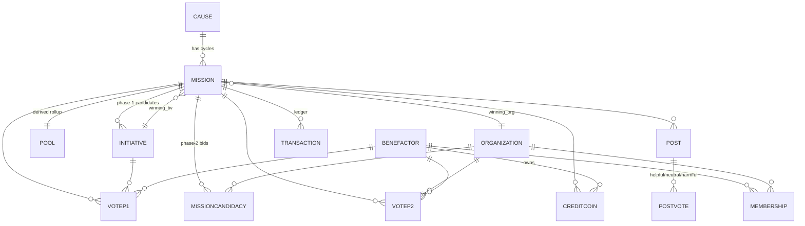

# Earthbucks — System Overview
*Drafting for V3.*

Earthbux is a weekly charity pool elected by its community. Each week a **mission**
for one of seven rotating **causes** opens and runs through **two elections**:
an **initiative election** (which idea?), an **organization election** (who runs
it?).

**Earthbux News (EN)** Stimulating discussion, connecting parties, and pooling resources, funded by a cut of the pool. Supervises, publicizes, and helps organize the missions by creating a network around each mission.

*The DEX* 'credit coins' traded like crypto

                         EARTHBUX NETWORK
                    /                       \
                   /                         \
          EARTHBUX NEWS              EARTHBUX PLATFORM
          Journalism & research       Participation & infrastructure
                   │                         │
             reporting,               voting, profiles,
             investigations,           rewards, social,
             analysis, etc.            benefactor tools, etc.


                 ┌───────────────────┐
                 │   EARTHBUX NEWS   │
                 │ research +        │
                 │ journalism        │
                 └─────────┬─────────┘
                           │
                    information
                           ↓
                 ┌───────────────────┐
                 │ EARTHBUX PLATFORM │
                 │ participation +   │
                 │ coordination      │
                 └─────────┬─────────┘
                           │
                    participation
                           ↓
                 ┌───────────────────┐
                 │ real-world        │
                 │ initiatives       │
                 └─────────┬─────────┘
                           │
                    results + data
                           │
                           └──────────→ NEWS

**Doc map** — seven documents, and everything else has been folded into one of
them (2026-09-09). Each one opens with a `## Contents` that its body follows.

- **README.md** (this file) — the system model: architecture, data model, APIs,
  lifecycle, the discussion model, money, and the credit framework. It is the
  summary layer: where a section here and a doc below disagree, **the doc is the
  model and this file is what has to catch up.**
- **docs/structure.md** — the page-by-page build spec, one section per route.
  Each page's **▶ NEXT** heading is its build order, box by box.
- **docs/INSTRUCTIONS.md** — the build queue (`## BUILD SEQUENCE`), the living
  `## BACKLOG`, `## THE PLAN` (the build clock and the mission clock, folded in
  from `gantt.md`), and `## REMOVAL REGISTER` (what is safe to delete, folded in
  from `to_delete.md`).
- **docs/mission_model.md** — each mission's process in full: the phases, who
  owes what on which date, vetting, and the agreement an organization signs
  (§7, folded in from `CONTRACT_DRAFT.md`). [§3](#3-mission-lifecycle) is the
  summarized version.
- **docs/money_model.md** — the money model in full: the finality ladder, the
  grant, the DEX, the 32nds. [§5](#5-the-money-model) is the summarized version.
  Its §0 lists the rulings of 2026-09-16; its §12 is what the code implements.
- **docs/RESEARCH.md** — the evidence base: research justifying Earthbux,
  situating it in the charity ecosystem, planning relationships, and finding
  missions and causes to focus on. The landscape brief and the endowed-grantmaker
  deep dive are folded in as §2 and §3. Not a build doc.
- **docs/roles.md** — the jobs Earthbux has to staff, plus the roles a
  benefactor plays inside a mission and the humans an organization has to name
  before it can be paid.

*Data, not documents:* `docs/DRL.csv`, `DRL_major_players.csv`,
`DRL_partners_targets.csv`, `DRL_sources.csv` — the donation-recipient landscape
as four tables, cited from `RESEARCH.md` §0a. *Retired:* `docs/_to_delete/`, and
what went there and why is `INSTRUCTIONS.md` `## REMOVAL REGISTER`.

<!-- TOC -->
## Contents

- [1. Architecture](#1-architecture)
- [2. Data model (v2)](#2-data-model-v2)
- [3. Mission lifecycle](#3-mission-lifecycle)
  - [Goals](#goals)
  - [Full phase map](#full-phase-map)
  - [Phase 2 — nominate → register/claim → elect](#phase-2--nominate--registerclaim--elect)
  - [Withdrawals](#withdrawals)
  - [Membership roles](#membership-roles)
- [4. The weekly cycle & bootstrap](#4-the-weekly-cycle--bootstrap)
  - [ME and OE — the two halves a benefactor sees](#me-and-oe--the-two-halves-a-benefactor-sees)
  - [Changing a cause](#changing-a-cause)
- [5. The money model](#5-the-money-model)
  - [The benefactor's loop](#the-benefactors-loop)
  - [The finality ladder](#the-finality-ladder)
  - [The grant](#the-grant)
  - [The DEX](#the-dex)
  - [The deployment schedule — the 32nds](#the-deployment-schedule--the-32nds)
  - [Votes by phase](#votes-by-phase)
  - [The discussion model — a post type for every phase](#the-discussion-model--a-post-type-for-every-phase)
  - [Post rewards (refined) — which post wins, decided by which vote, paid when](#post-rewards-refined--which-post-wins-decided-by-which-vote-paid-when)
  - [EBX, the coin, and deductibility](#ebx-the-coin-and-deductibility)
  - [What the code does](#what-the-code-does)
  - [S/S/S → resolutions: the budgeting procedure](#sss--resolutions-the-budgeting-procedure)
  - [The creditcoin — front & back (planned: the 3D earth)](#the-creditcoin--front--back-planned-the-3d-earth)
  - [Transactional credit — what the DEX answered, and what it did not](#transactional-credit--what-the-dex-answered-and-what-it-did-not)
- [6. Voting & the election algorithm](#6-voting--the-election-algorithm)
  - [Phase 1 — initiative election (`VoteP1`, one row per `(ben, tiv)`)](#phase-1--initiative-election-votep1-one-row-per-ben-tiv)
  - [What happens to a commitment once phase 1 closes](#what-happens-to-a-commitment-once-phase-1-closes)
  - [Phase 2 — organization election (`VoteP2`, one row per `(ben, mission)`)](#phase-2--organization-election-votep2-one-row-per-ben-mission)
- [7. API surface (63 routes)](#7-api-surface-63-routes)
- [8. Admin data console (`admin.html`)](#8-admin-data-console-adminhtml)
- [9. Frontend status](#9-frontend-status)
  - [The five surfaces, as of 2026-08-28](#the-five-surfaces-as-of-2026-08-28)
- [10. Data & seeding](#10-data--seeding)
- [11. Migrations & the v2 cutover](#11-migrations--the-v2-cutover)
- [12. File map](#12-file-map)
  - [12a. The docs index](#12a-the-docs-index)
- [13. Running locally](#13-running-locally)
- [14. The checks — what each one is, and how to run it](#14-the-checks--what-each-one-is-and-how-to-run-it)
  - [Two flavours](#two-flavours)
  - [The eleven](#the-eleven)

<!-- /TOC -->

---
## 1. Architecture

```
                          ┌──────────────────────────────────────────┐
   Browser (static)       │  FastAPI app  (backend/app/main.py)       │
 ┌───────────────────┐    │                                           │
 │ index / cause /   │    │  routers/  ── crud.py ── models.py (ORM)   │
 │ profile / admin   │◄──►│     │            │           │            │
 │ / mission.html    │HTTP│  auth.py     scheduler.py   database.py    │
 │                   │    │  (JWT)       bootstrap.py        │         │
 │ resources/js/     │    └───────────────────────────────── │ ───────┘
 │  ebx_shared.js    │                                       ▼
 └───────────────────┘                                  SQLite (earthbucks.db)
        ▲                                                Alembic-migrated
        │ hand-edited — no build step
        └ (the TypeScript copy was retired 2026-09-16)
```

- **Backend** — FastAPI + SQLAlchemy 2.0 (typed ORM) + SQLite, schema-managed by
  Alembic. Served by `uvicorn app.main:app`. The same process also hosts the
  static HTML/JS, so the frontend talks to the API on the same origin.
- **Frontend** — plain HTML pages with inline scripts, plus a shared engine,
  `resources/js/ebx_shared.js`, exposed as a global `EBX`. **It is edited
  directly; there is no build step.** The TypeScript source it used to be
  compiled from had fallen ~24 KB behind it and was retired on 2026-09-16.
- **Auth** — JWT bearer tokens (`/auth/login`). Accounts carry a `role`
  (`benefactor | employee | admin`); employee/admin unlocks staff-only actions.
- **Kids accounts (planned)** — benefactors aged **12–17** get full *voice*
  but gated *money*: they can vote and post like any benefactor, but **cannot
  add money without parental approval**. Implies a birthdate (or age bracket)
  on `BenefactorAccount`, a guardian link, and an approval flow on every
  money-in action; votes from unfunded kid accounts still carry
  `BASE_VOTE_EBX` weight. Legal review (COPPA/GDPR-K) before build — see the
  INSTRUCTIONS `## BACKLOG`.
- **Live** https://earthbux.net — the domain (Squarespace registrar, bought
  2026-09-09 with Google Workspace mail on it). It is an **ALIAS `@`** and a
  **CNAME `www`** onto the Railway service plus Railway's TXT verification
  record; the app is same-origin (`apiBase: ''`), so nothing in the frontend
  knows the hostname and no build changes when it moves.
- **Railway** https://ebx-production.up.railway.app/ — the origin, and still a
  valid URL. Keep it: it is what you test against when DNS is the suspect.

*future*
- add native os and mobile apps.
---

## 2. Data model (v2)

One weekly **Mission** per `(cause, cycle)`. Initiatives and organizations are *candidates* that point at a mission; the singular winners are
pointers on the mission itself. All money movement and vote mutations are logged
in one append-only **Transaction** ledger.


```mermaid
erDiagram
    CAUSE        ||--o{ MISSION        : "has cycles"
    MISSION      ||--o{ INITIATIVE     : "phase-1 candidates"
    MISSION      ||--o{ MISSIONCANDIDACY : "phase-2 bids"
    MISSION      ||--o{ VOTEP1          : ""
    MISSION      ||--o{ VOTEP2          : ""
    MISSION      ||--|| POOL            : "derived rollup"
    MISSION      ||--o{ CREDITCOIN      : ""
    MISSION      ||--o{ POST            : ""
    MISSION      }o--|| INITIATIVE      : "winning_tiv"
    MISSION      }o--|| ORGANIZATION    : "winning_org"
    INITIATIVE   ||--o{ VOTEP1          : ""
    ORGANIZATION ||--o{ MISSIONCANDIDACY: ""
    ORGANIZATION ||--o{ VOTEP2          : ""
    BENEFACTOR   ||--o{ VOTEP1          : ""
    BENEFACTOR   ||--o{ VOTEP2          : ""
    BENEFACTOR   ||--o{ MEMBERSHIP      : ""
    BENEFACTOR   ||--o{ CREDITCOIN      : "owns"
    ORGANIZATION ||--o{ MEMBERSHIP      : ""
    POST         ||--o{ POSTVOTE        : "helpful/neutral/harmful"
    MISSION      ||--o{ TRANSACTION     : "ledger"
```

**16 tables.** `causes`, `missions`, `initiatives`, `organizations`,
`benefactor_accounts`, `memberships`, `mission_candidacies`, `votes_p1`,
`votes_p2`, `cause_votes`, `pools`, `credit_coins`, `posts`, `post_votes`,
`queries`, `transactions`.

Naming convention throughout the code: **`ben`** = benefactor, **`tiv`** =
initiative, **`org`** = organization (so e.g. `tiv_id = ForeignKey("initiatives.id")`).

Key design choices:
- **Mission spine** — created at cycle start (`current_phase='pre'`), holds
  `winning_tiv_id` / `winning_org_id` (the singular winners); the many candidates
  live on the back-ref collections.
- **Split voting** — `VoteP1` (initiative election) and `VoteP2` (org election)
  are separate, so phase-1 state can never leak into phase-2. The committed EBX
  lives on `VoteP1` (the old `Contribution` table merged in).
- **`MissionCandidacy`** — an org's bid to run a mission (replaces the old
  `OrgRegistration`); approval is what grants page-build access.
- **`Transaction`** — the single append-only ledger for both vote mutations
  (`type='vote'`) and money transfers (`type='transfer'`, with a `bucket`).
- **`CauseVote`** — §5 (2026-08-06): one benefactor's vote, for one WEEK, on
  which cause should hold an upcoming window. The seven causes are themselves
  elected (§4, *Changing a cause*), so `Cause` grew `status`
  (`active | suggested | retired`), `proposed_by_id`, and a **nullable**
  `index` — a suggested cause holds no window until it wins one.
- **`Query`** — saved, staff-only data-console lookups (the admin browser).
- **`valence`** (`helpful | neutral | harmful`) on votes & posts — `harmful`
  means a vote *against* a tiv or a *block* on an org.
---
*future*
- Credit coins will need dex logic

## 3. Mission lifecycle
Phases are server-authoritative (advanced by `scheduler.py`); the frontend only
*displays* phase. Timeline is anchored on `mission.started_at` (the day the
cause's window opens):

### Goals

Streamline and publicize charity missions. Pool donations to avoid redundant or
competing efforts, expose wasteful or fraudulent actors, and reorient attention
toward the cause rather than the sponsor. Democratize *which* idea and *which*
organization gets funded, and report on the work independently through Earthbux
News (EN).

### Full phase map

- 4 phases

**T** is the initiative election — "mission started", UX week 0 — and it is
`started_at + 7wk`, because `started_at` is when the cause window OPENS. Every
later date in the model is quoted from T, so the table is too, with the
`started_at` week beside it.

| Phase | Stage | Window (from T) | (from `started_at`) | What happens | Driven by |
|---|---|---|---|---|---|
| **1 — Initiative election** | pre / initiative | T−7wk → **T** | weeks 0 → 7 | Benefactors propose and vote on initiatives | *context* + *case* posts |
| **2 — Organization election** | — | T → **T+8wk** | weeks 7 → 15 | Benefactors nominate/vote on organizations | *analysis* + *review* posts |
| **3 — Resolutions** | budget | T+8wk → **T+15wk** | weeks 15 → 22 | Elected org drafts budgets from socially-selected **budgeting** (S/S/S) items; **EN verifies the org**; advance released | *budgeting* + *investigation* posts |
| | release | T+15wk onward | weeks 22+ | Credits released in stages; 7–12 step progress reports (org report vs. EN parallel report, benefactor-moderated) | *mission-update* posts |
| | resolve | continuous | — | Many small **resolutions** accumulate, each moving coin value; impact summary. Missions may take **many years** to fully resolve | *budgeting* (S/S/S) posts |

- Framing is the phase where orgs get confirmed
- Exchange is the phase where they do the stuff.

The **organization election (phase 2) happens before any budgeting** — the org is
chosen on credentials and a short statement, not a detailed plan. Everything after
that election is the single **Resolutions** phase, and it runs post-by-post:
*budgeting* (S/S/S) posts become the budget and the resolutions themselves (see
[§5](#5-the-money-model)).

### Phase 2 — nominate → register/claim → elect

An initiative is a proposition; an organization is a **counterparty** that must
receive funds and do the work. So phase 2 is three steps, not one:

- **Nomination & registration (both open, no gate).** Orgs can self-register any
  time; benefactors can nominate any org as a candidate for any phase-2 mission
  (minimum: a name and a mission statement — required to be *elected*, not to
  receive votes). An org is a single entity — never nominated twice, no separate
  pages; near-duplicate names get a "did you mean?" prompt. Nominating and
  voting are free.
- **Claiming a mission (the gate).** A real representative **claims** the
  mission → their account gains authority over the budget and mission sequence.
  Claiming requires a **click-through legal agreement** (representative
  attestation — the basis to litigate fraud; see `docs/mission_model.md` §7). A
  nominated (not self-registered) org may claim until Phase 4 starts (claim
  window: `pre|initiative|budget`). Claiming bumps the mission's
  **guaranteed-to-pool rate** (unclaimed 0.20 → claimed 0.35, in `config.py`) —
  rewarding orgs for showing up, protecting benefactors when no one does.
- **Identity verification is EN's responsibility, performed during phase 3** —
  EN only verifies one organization per week (the week's single elected
  mission).

**If no org claims:** the mission is **not cancelled**. Advances are still sent;
the community executes the mission as best it can (e.g. donating the pool
onward) and EN still reports. These cases tend to end with smaller pools.
Earthbux never creates its own organizations — the community elects existing
ones.

**Fraud handling:** the advance lands at the *start* of phase 3, but EN verifies
*during* phase 3 — a fraudulent group could in theory win the advance.
Mitigations: the click-through agreement (litigation basis), EN verification
before the full pool unlocks, and recovery through litigation.

**Election content** (benefactor-authored, pre-vote due diligence): *Evaluation*
(my verdict on this org), *Context* (neutral background / track record),
*Analysis* (data or expert take). Org-authored: a *Pitch / mission statement*
plus *Responses*, kept visually distinct. "Feedback" is reserved for the
post-mission performance phases (4–5); evaluation = pre-vote.

### Withdrawals

*Restated 2026-09-16 against [`docs/money_model.md`](docs/money_model.md) §6.*

- **Purchased tokens that have not entered an election** can be withdrawn at face
  value, to Cash, at any time. Granted tokens never can.
- **Until budget day (T+15) the non-final part of a stake can be withdrawn as
  cash** — `POST /wallet/withdraw-stake` (built 2026-09-16, build-seq §2), open
  once the mission's initiative election has closed. The finality ladder decides
  how much is final: 10% of an ME stake at T, another 10% of an OE stake at T+8,
  everything at T+15. No page offers it yet.
- **From budget day on there is no cash exit.** A benefactor who no longer
  believes in a mission sells its EBX for another mission's EBX on the DEX.
- **Losers are not refunded; they move.** Backers of a losing initiative or a
  losing organization exchange into another mission during framing
  (T+8 → T+15). `cause.html` still shows the old phase-2 withdraw button; removing
  it is a REMOVAL REGISTER item.

### Membership roles

Every org account is a set of members: **Contributor** (a benefactor who voted
for the org / holds credits for the mission — community), **Representative**
(may edit the mission page), **Executive** (highest org permission), and
**Beneficiary** (represents the recipients; unique profile surface; gets a
voice at the start of phase 2). Earthbux retains override authority (e.g. to
revoke a claim from a fraudulent or inactive rep). Mission memberships (held by
benefactors) and org memberships (held by approved org admins) are distinct,
but one person holding both gets a single combined experience.

---

## 4. The weekly cycle & bootstrap

Seven causes run staggered 7-week windows — one cause's window opens each week
(the homepage annulus rotates 1/7 per week). Mission ids are `<prefix><cycle>`:

| Cause | prefix | Cause | prefix |
|---|---|---|---|
| atmosphere | `atm` | wildlife | `wil` |
| oceans | `oce` | human-rights | `hmr` |
| land | `lan` | human-progress | `hpr` |
| forests | `for` | | |

- **Genesis** `2026-06-15`. The first rotation is **`atm0, oce0, lan0, for0,
  wil0, hmr0, hpr0`**; the next is `atm1, …`. Cause *i*, cycle *k* opens at
  `genesis + (i + 7k)·week`.
- **`bootstrap.py`** — `bootstrap()` seeds the first rotation and assigns each
  cause's catalog initiatives to its cycle-0 mission as phase-1 candidates;
  `ensure_due()` is the idempotent weekly loader that creates each new mission as
  its window opens.
- **`scheduler.py`** — `run_due()` calls `ensure_due()` then advances every due
  phase (open → finalize_p1 → finalize_p2 → distribute). `maybe_run()` is a
  throttled hook wired into `GET /missions`, so reads keep the clock current
  without a separate cron. The frontend cycle anchor (`cycleStart`) matches the
  genesis date so the annulus reflects the real missions.

Current DB state: **atm0 = `initiative` (open)**, oce0…hpr0 = `pre` (open weekly
through 2026-07-27).

### ME and OE — the two halves a benefactor sees

The lifecycle above is one continuous machine, but a benefactor is only ever
looking at one of two things, and the Context page names them (2026-08-06):

- **ME — Mission Election.** *The entire process before the initiative election,
  i.e. before the mission starts.* It covers the cause being settled for that
  window and the initiatives competing to become the mission. It ends the moment
  an initiative is elected: the mission has initiated.
- **OE — Organization Election.** *The mission's first 8 weeks*, in which the
  community elects the organization that will run it. It ends when
  `winning_org_id` is set and budgeting begins.

They are page states, not new database phases — ME is a mission in `pre` /
`initiative` with no `winning_tiv_id`; OE is one with a winner and no
`winning_org_id`.

### Changing a cause

The seven causes are not fixed forever. Any cause window can be contested:

- Benefactors vote for a **challenger** cause to hold an upcoming window, or
  suggest a new one for the catalogue.
- **A challenger only wins if the SAME challenger takes the week 7 weeks in a
  row** (raised from 6 on 2026-08-06 — one week per column of the streak bars).
  A run that breaks — or that moves to a different challenger part-way — resets
  to the incumbent and pushes the swap date out by a full challenge period. This
  is deliberate: a cause has to be resistant to a single bad week, or the
  rotation could be captured by whoever happens to show up.
- If no challenger clears that bar, the window's incumbent is **confirmed** and
  the interface says so outright: *"&lt;incumbent&gt; will be the next cause for
  the mission commencing &lt;ME day&gt;"* — which is always at least 7 weeks out,
  because that is how long the challenge period runs.
- A replaced cause takes over the window that would have been the incumbent's;
  the rotation length (7) does not change.

Causes must be **ubiquitously essential human experiences**, corruption-
resistant ("thick skin" — resources allocated to resilience), with a real
prospect of change (`INSTRUCTIONS.md` → Cause framework).

**Status: built 2026-08-06.** `cause_votes` holds one vote per
`(benefactor, window, week)`; `causes` carries `status`
(`active | suggested | retired`), `proposed_by_id` and a nullable `index` — a
suggested cause holds no window until it wins one. Endpoints:
`POST /causes/suggest` (name + colour, hex-validated, refused if it clashes with
an active cause's colour), `POST /causes/vote`, `GET /causes/ballot/{slot}`,
`GET /causes/vote/mine`. Migration `b7d4e9a1c206`, applied automatically at
startup.

**Seven columns, advertised as six.** The ballot's leftmost column is the
current week; the rightmost aggregates the six weeks *before* the contest
opened, so a challenger that was already winning arrives with that behind it
instead of starting from nothing. A column is won by whoever clears >50% of the
votes cast in it, and the streak fills from the left — lose a week and it
resets.

**Still to build:** the swap itself. Nothing yet retires the incumbent and hands
its window to a challenger that has taken all seven columns; that belongs in
`scheduler.run_due()`, before `bootstrap.ensure_due()` creates the window's
mission.

---

## 5. The money model

*Summary of [`docs/money_model.md`](docs/money_model.md), rewritten **2026-09-16**.
Where this and that file disagree, that file is right. Its §0 lists every ruling;
its §12 lists what the code does and does not implement.*

**EBX is a non-withdrawable digital unit representing a holder's position in a
mission's remaining charitable capital.** Each mission runs its own fungible EBX
pool. After budget day EBX trades on the **Earthbux DEX** for other missions' EBX,
and it is **consumed** as the mission's capital is deployed — to the elected
organization, to Earthbux operations, and to authorized citizen-research rewards.
**Cash buys a position in a mission; after budget day the only way out of a
position is into another mission.**

### The benefactor's loop

```
Choose mission (P1 initiative election, P2 organization election)
   ↓
Commit tokens ───────────────────► 10% final at T, +10% at T+8
   ↓                                  (rest withdrawable as cash)
Framing, T+8 → T+15 ─────────────► losers exchange into another mission
   ↓
Budget day, T+15 ────────────────► 100% FINAL — the donation receipt is complete
   ↓                                  the organization claims 5/16 of the pool
Watch · hold / sell / buy another mission (the DEX, P4)
   ↓
Eventually all capital is deployed
```

### The finality ladder

| When | What becomes final |
|---|---|
| **T** — initiative election closes | 10% of every ME stake |
| **T+8** — organization election closes | another 10% of every OE stake (20% of money carried from the ME) |
| **T+15** — budget day | 100% |

- **A skim only marks finality.** A final ct is deductible and can no longer be
  withdrawn as cash; it stays in the benefactor's position and funds nothing by
  itself. Winners and losers pay the same rates.
- **Until T+15 the non-final part is withdrawable as cash** (`POST /wallet/withdraw-stake`; no page yet).
- **Losers move during framing.** Backers of a losing initiative or a losing
  organization exchange into another mission during T+8 → T+15 and become EBX
  there (not built — today the code mints losing-org backers behind the winner).
- **Commit** is the button a benefactor presses. Committing to a cause or an
  initiative is not a donation; committing to an organization makes EBX; 100% is a
  donation only at T+15.

### The grant

Ten tokens a week, **stamped with the week, never a cause** — a granted token may
enter the ME or OE closing that week. Ten is a floor (`max(0, 10 − free)`). The
grant is **real money**: Earthbux grants $1 per user per week, funded by
program-related investments, so granted tokens mint ordinary EBX.

### The DEX

**Per-mission pools plus a common pool** (decided); constant-product pricing
(`x · y = k`); **capital follows the claim** — converting EBX-A to EBX-B moves the
capital to mission B. DEX price (what people expect) and coin value (what the
mission has achieved) are different numbers and are never drawn as one. After the
organization's guaranteed 5/16, capital is deployed in **provenance order** —
converted-in first, then organization-election money, then the winning
initiative's backers last. **That order is the reward for being right**; there
are no correctness multipliers. Delisting is not yet designed.

### The deployment schedule — the 32nds

| Slice | 32nds | Goes to |
|---|---:|---|
| Research rewards | 3 | 1 each: situation · investigation · analysis |
| Advances | 4 | 2 to Earthbux · 2 to the organization |
| Framing release | 8 | the organization, on budget day |
| Flexible | 17 | Earthbux (max 8) · the organization · benefactor exchange |
| **Total** | **32** | |

The organization's **guaranteed 10/32 (5/16)** — framing release plus advance — is
claimed from the whole pool **on budget day**, before the exchange begins, so the
DEX cannot undermine it. Earthbux can receive at most 2 + 8 = 10/32. During the
exchange phase the organization's releases are triggered by community support for
budget items, **weighted by the voter's EBX holdings**; a negative vote only counts
from a holder.

### Votes by phase

| Phase | Elects | Vote rule | At the close |
|---|---|---|---|
| **P1 — Initiative** | which initiative the mission runs | a whole-percentage split across up to 10 initiatives, times one commit | 10% of every stake final; the winner's backers mint early EBX; losers hold marked tokens until framing |
| **P2 — Organization** | which org runs it | one organization per benefactor; weight follows the block curve | another 10% final; the org is named |
| **P3 — Framing** | — | budget items posted, not yet voted | budget day (T+15): 100% final, organization claims 5/16 |
| **P4 — Exchange** | releases | holder-weighted support for budget items | tranches released as exchanges; DEX open |

### The discussion model — a post type for every phase

Every phase is a structured discussion, and **the posts are what drive the
outcome**: *reswearch* posts (context/investigation/analysis) inform the
elections and carry the rewards, *review* posts (case/evaluation) argue the
initiative and judge the org's effort, and *budgeting* posts (service/supply/
support) become the budget and the resolutions. Commentary does **not** live in
the voting dialog. **New discussions originate on the Context page (`main.html`,
each tiv/org row's own thread) or the Mission page (`mission.html`)**; the
**Landing** page (`index.html`) aggregates all posts; the **cause/election page is
view-only**, showing only the top few posts per phase. The winning post in each
rewarded type is displayed prominently next to its **prize**.

**Two-tier types.** Every post carries a **`category` (supercategory)** and a
**`type` (subcategory)**. The single source of truth is
`backend/app/post_config.py` — limits, reactions, edit locks, rewards, and
membership-to-win all read from that one table. Three benefactor categories:

**Reactions are one backend enum, three columns** — `helpful · neutral · harmful`
(stored on `PostVote`; one `react_to_post` path for every post). A post type only
declares **which columns the frontend shows** and how they're **labelled**. No
type gets its own vote code.

| Category | Type (subcategory) | Limit per ben / mission | Reactions shown | Rewarded? |
|---|---|---|---|---|
| **Budgeting** | Service · Supply · Support | **one per type** (up to 3), rolling — a new slot opens only when the current item is **paid out** | **Helpful only** (upvote); neutral & harmful hidden, counts stay 0 | no — a budget line, not a prize |
| **Research** | Context · Investigation · Analysis | **one each** | **Helpful / Neutral / Harmful** (full) | **yes — the 3 rewarded types**, one 1/32 each |
| **Review** | Case · Evaluation | **one each** | **Fair / Unfair** (= helpful / harmful); no neutral (count stays 0) — **both** counts displayed | perk (comm line), not cash |

Research must be tied to a mission.
Case -> Initiative or Cause
Evaluation -> Philanthropy

Author tags: `<ben>` = benefactor · `<org>` = the mission's org · `<ebx>` =
Earthbux News. The three categories above are **benefactor-authored**; org/EN
posts (`org_update`, `mission_update`, `testimonial`, `editorial`, `headline`) are
unlimited, sit outside the per-ben allowance, and win nothing.

- **Budgeting.** Service = something we send people to DO (orgs) · Supply = what
  they need (bens) · Support = how we ensure honest resolution (ebx). Items are
  **never revoked** — a slot frees only when the money is **actually paid out**.
  Some fields (the committed cost line, once adopted) **cannot be edited**. S/S/S
  is **its own category now — it has nothing to do with context.**
- **Mission Support.** The three rewarded posts. **Neutral matters here** — it
  signals people are reading and feel neutral about a post, i.e. engagement where
  commitment isn't necessary. Winners resolve on a staggered clock: **context with
  the advances · investigation at the end of phase 3 · analysis later.**
- **Review.** *Case* pitches the initiative the ben supports; *evaluation* reviews
  the org's effort. Rated **fair / unfair**; **winner = most fair votes** (for now).
  Each winner earns a **direct line to Earthbux and the org** — a perk, so the
  winner **must be a member**.

**Edits are versioned updates.** Editing keeps the prior versions viewable (an
audit trail) rather than overwriting. **Replying to your own post is an allowed
alternative to editing it.** Budgeting items are the exception — some parts lock
once adopted (above).

**Membership is a requirement of being eligible to win.** Anyone in scope may post;
only mission members can *win* a reward or the review comm-line. This reconciles
the tax-deductible-reward claim with `is_mission_member` (§6): a winner is by
construction a member.

**Where each type may live:** *review* (case/evaluation on an org) can be posted on
**any org, any time**; *mission-support* and *budgeting* only exist **inside an
active mission**. Clicking a comment/reply opens the **Context** page for P1/P2 and
the **Mission** page for P3+. The **P1 recap** carries just two types — *context*
and *case*.

Post rules (limits, reactions, edit locks, membership-to-win) are enforced from
`post_config.py` — one table, read by both `create_post`/`react_to_post` and the
frontend composer. See [budgeting procedure](#sss--resolutions-the-budgeting-procedure).

### Post rewards (refined) — which post wins, decided by which vote, paid when

The three **mission-support** types are the rewarded posts — one **1/32** slice
each. This replaces the old best_case / context_or_analysis / comments slices; the
total 32nds split is unchanged in size. Winners resolve on a staggered clock, and
**a winner must be a mission member**:

| Rewarded type | Judged by | Winner decided / paid |
|---|---|---|
| **Context** | its post-votes (most helpful) | **with the advances** |
| **Investigation** | its post-votes (most helpful) | at the **end of phase 3** |
| **Analysis** | its post-votes (most helpful) | **later** (post-phase-3) |

**Review** posts win no cash: the most-*fair* **case** and the most-*fair*
**evaluation** each earn their author a **direct line to Earthbux and the org**
(plus any upgraded membership perks). **Budgeting** posts aren't prizes at all — an
upvoted item becomes a budget line and pays out as the money is spent.

Only *which post type wins each slice and when it releases* changed; the 32nds
sizes are unchanged. Enforcement reads the rewarded set from `post_config.py`
(`REWARDED_TYPES` = context · investigation · analysis).

- EN only draws its share once the pool clears `POOL_THRESHOLD` ($100).
- **Budgeting range** (`mission_budget_range`): the org's **minimum** is a
  concrete figure (its guaranteed 10/32 of today's pool); the **maximum** adds its
  share of the 17/32 flexible, and both grow as new donations arrive. The org
  drafts hypothetical budgets between the two. Capital follows the claim on the
  DEX, but the floor is paid on budget day, before the DEX opens, so the market
  cannot move it.
- **The skims** (2026-09-16): 10% final at the initiative election and another
  10% at the organization election, winners and losers alike. They only mark
  finality — nothing is paid out of a skim. Earthbux is funded from its 2/32
  advance and up to 8/32 of the flexible, like any other line.
- Every slice is written to the `transactions` ledger; `pools` is a derived cache.

### EBX, the coin, and deductibility

- **EBX is a position.** It exists from the moment a stake mints (the winning
  initiative's backers at T, organization-election money at the week roll, losers
  when they exchange in framing) and leaves existence when the capital it
  represents is deployed.
- **The mint and the coin are two events.** The COIN — `models.CreditCoin`, the
  receipt — should issue at budget day; `mint_mission_coins` still runs at
  `finalize_p2`. **Holding a coin = mission membership**, and membership survives
  consumption: a donor keeps it because they hold the coin-receipt of the initial
  advance.
- **Deductibility follows the ladder.** 10% at T, another 10% at T+8, all of it at
  T+15. The receipt is complete on budget day. A later DEX trade does not create,
  reverse or resize a deduction. ⚠ Needs a lawyer — `docs/money_model.md` §14.
- `GET /coin-value` = global value (net platform flow / `coin_value_scale`);
  `mission.credit_value` moves with resolutions (`resolution_value_bump`). DEX
  price is a **separate number** from coin value.
- **Design for failure:** many missions will fail. The DEX makes failure visible
  and tradeable, but the coin model must tolerate a mission that resolves to
  nothing.

### What the code does

*`docs/money_model.md` §12 is the full list.* Built **2026-09-16**: `ME_SKIM` and
`OE_SKIM` (0.10 each, booked into `votes_p2.donated_ct`, which now means
final-so-far); budget-day finality (`wallet.final_ct_of`, `final_ct` on
`GET /wallet`); grants stamped with a week (`grant_week`; `grant_cause_id` dropped,
migration `e1a7c3b95d20`); correctness multipliers removed; the 32nds as
constants in `token_model.py`. **Not built:** losers staying tokens through
framing, cash withdrawal of the non-final part until T+15, the organization's 5/16
claim, the withdrawal button on a page (the endpoint exists), percentage sliders on main.html, buying tokens, the DEX, provenance-order
deployment, holder-weighted budget voting, and research-reward payouts.

### S/S/S → resolutions: the budgeting procedure

The key objects of Earthbux reporting:

| Term | Meaning | Carried by |
|---|---|---|
| **Service** | something we can send people to DO | orgs |
| **Supply** | WHAT those people need to do it | bens |
| **Support** | how we ensure the issue is resolved honestly | ebx |

A **resolution** is a small, mission-tied outcome we can reasonably assume was
accomplished; when it lands, its evaluation point is given and it moves the
mission's credit-coin value. **Resolution is not a single closing event** — the
Phase-3 resolutions stream *is* many tiny resolutions, and achieving them ahead
of schedule earns a higher cash reward.

> ✅ **Resolved (2026-07-19).** S/S/S is its own **category** (`budgeting`) with
> three **types** — service · supply · support. It is **not** a stance on context.
> The taxonomy lives in `backend/app/post_config.py`.

The procedure, end to end:

1. **Suggest (budgeting posts).** A benefactor posts a **budgeting** item under one
   of the three types — **service · supply · support** (one open per type, rolling).
   Orgs post itemized cost lists; users **upvote** items (upvote-only — no down or
   neutral); the socially selected picks drive the money routing. An item is never
   revoked, and its slot frees only when it is **paid out**.
2. **Budget (framing, P3).** The org drafts hypothetical budgets between its
   guaranteed floor (10/32, claimed on budget day) and its maximum (+ its share
   of the 17/32 flexible, growing with donations). The release phase gets a projected **mission length** /
   end date (`missions.projected_end_at`) — one strategy: end right before
   that cause's next phase-1, so the org can bid for another pool.
3. **Steps.** Each release-phase **step** (`mission_steps`) carries a
   guaranteed + potential pool, finalized by the end of budgeting (no
   maximums). Step creation locks when the mission leaves `budget`.
4. **Resolve.** `POST /posts/{id}/resolve` (context → resolution) and
   `POST /missions/{id}/steps/{id}/resolve`, gated on mission operators; each
   bumps coin value and logs an `evaluation`-bucket ledger note; early step
   resolution is flagged for bonus. Admin gantt renders the plan.

Post lanes now live in `post_config.py`, not scattered constants. **Membership
gates posting as well as winning** — settled 2026-09-08 (§0c), where this line
said the opposite of the code and the code won. `POST_REQUIRES_MEMBERSHIP` covers
all three benefactor categories and `crud.create_post` enforces it: to author a
*budgeting*, *research* or *review* post on a mission you must hold a membership
there **or** have committed a phase-1 stake, which the model reads as an
agreement to become a member. It is a low bar on purpose — a stake is one
click — and it keeps drive-by posting off missions the author has no position in.
Reversing it is one line in `post_config.py`; reversing it in the docs alone is
what produced the disagreement. Org/EN lanes are unchanged: `org_update` =
authoring-org members · `editorial` / `headline` = staff.

### The creditcoin — front & back (planned: the 3D earth)

The creditcoin becomes a two-sided card, **born on `mission.html`**:

- **Front** — the facts: value, initiative, organization, election info, key
  dates.
- **Back** — a **3D earth** the user can rotate toward three key locations:
  1. the current user's home location,
  2. the location(s) where the mission must take place,
  3. the location(s) of the organization(s).

Missions will have different **location-types** (e.g. a fixed site vs. a
region vs. distributed/global), which the globe must render appropriately.
Requires location fields on benefactors, missions (typed), and organizations —
see the INSTRUCTIONS `## BACKLOG`.

### Transactional credit — what the DEX answered, and what it did not

Benefactors should be able to **tune** a donation — to a cause, to an initiative
within a cause, or simply to *the next mission* — and change the availability of
their money throughout the process. The 2026-09-04 rewrite answers the biggest
questions in this list by making the answer structural rather than a setting:
**you tune by trading.** What remains open is listed after.

**Answered by the model (2026-09-16):**

- ~~At each phase, what fraction is withdrawable?~~ The non-final part, as cash,
  until T+15: 90% after the ME, 80% of ME-carried money after the OE, nothing
  from budget day on. Purchased, uncommitted tokens are always withdrawable.
- ~~Which states can money be in?~~ `unallocated → committed → EBX → consumed`,
  with *final* as an overlay and DEX trading as a loop on EBX.
- ~~What happens to targeted money when the target never materializes?~~ Backers
  of a losing initiative or organization exchange into another mission during
  framing.
- ~~Tax-deductibility timing?~~ The ladder: 10% at T, +10% at T+8, 100% at T+15.
- ~~Does changing a target mid-phase re-price the send rate already accrued?~~
  There are no send rates. There are two skims and a pool price.

**Still open:**

**1. Targets below the mission.** Committing is per-mission by construction. Is
there any sub-mission target left worth having — a location, a beneficiary type,
an S/S/S line — and is such a target a *constraint* (money can only go there,
and can strand) or a *preference* (routing weight, which dilutes intent)?

**2. Does price do anything, or only say something?** Today it is pure signal.
Candidates for giving it teeth: steering the 17/32 flexible toward
premium missions, gating an org replacement on a sustained discount, or feeding
the cause election. Each one turns the DEX into a governance mechanism and
invites the manipulation in §5 below.

**3. Routing & precedence.** When constraints conflict (org X but location Y, and
X doesn't operate in Y), who wins — and is the benefactor told at commit time or
at routing time? Does untargeted capital inherit the socially-selected S/S/S
picks by default (it should — decide explicitly)?

**4. Ledger & value.** Is a swap a `Transaction` of its own type (`swap`), or a
paired burn/mint? Do coins carry the position that funded them, or the position
currently held? Does DEX price appear on the coin front at all — and if it does,
how is it kept visually distinct from coin value?

**5. Abuse & failure modes.** The DEX adds a market, and markets attract the
things markets attract:
- **Wash trading to manufacture confidence.** A benefactor round-tripping their
  own position moves the price without changing anyone's exposure. Caps, fees,
  or per-account netting?
- **Steering a pool toward a colluding org** by buying that mission's EBX to
  make it look supported — cheaper than the old "buying an election via
  availability games", so this got *more* pressing, not less.
- **Thin-pool swings.** With per-mission pools, a small trade in a quiet mission
  produces a dramatic price. Minimum liquidity before a price is displayed at
  all?
- **Grant-funded market pressure** — the grant is real money (PRI-funded), so
  granted EBX is backed; the question is only whether many small accounts can
  move thin pools.
- **Kids' accounts.** Money gated by parental approval (see §Accounts)
  presumably cannot be traded without re-approval — and a trade is now the
  ordinary way to act, not an edge case. Confirm before kids' accounts ship.
- **Failed missions.** Tightly-held EBX in a mission that resolves to nothing:
  the holder donated, the money did little, and there is no remedy by design.
  Confirm this is what we mean to say to them, in those words.

---

## 6. Voting & the election algorithm

All vote logic lives in `crud.py`; the scheduler (`scheduler.run_due`) decides
*when* to call it, the routers expose it. Money is **never refunded** — a vote's
"send rate" only sets the irrevocable-vs-returnable split computed later at credit
release.

**Constants** (`crud.py`): `EBX_PER_VOTE = 10` (10 EBX = 1 vote), `BASE_VOTE_EBX
= 10` (a vote carries weight even with no tokens committed), `SHARE_SUM_CAP = 1.0`,
`VALENCE_SIGN = {helpful:+1, neutral:0, harmful:−1}`, `P1_SEND_* = 0.10` and
`P2_SKIM = 0.10` — the finality ladder's two skims (2026-09-16), mirrored from
`token_model.py`. See [What the code does](#what-the-code-does).

### Phase 1 — initiative election (`VoteP1`, one row per `(ben, tiv)`)

- **Cast / re-slate** (`replace_p1_shares`): **one amount and one slate.** The
  slate is a percentage split across at most `MAX_SPLIT_TIVS` (10) initiatives —
  the VOTE, which needs no tokens to stand — and the commit is one number for the
  whole election. Each row's `stake_ct = commit × share`, by largest remainder,
  so a mission's rows sum to the commit exactly. Editable any time before
  finalization; every change writes a vote `Transaction`.
  Since 2026-08-27c the commit is reconciled against the **wallet**: raising it
  spends unallocated ct and granted ct may only enter the elections closing on
  its grant week (2026-09-16; for the ME that is the week's active cause). The client-side `10 + localStorage` budget that
  preceded it is gone, along with the double count it caused in the allocations
  panel. Lowering a commit before the close hands the difference back; the final
  part of a stake (after a skim) cannot come back.
  Every tiv in a slate **must belong to that mission** — the guard matches ids
  explicitly, so an initiative with a NULL `mission_id` is rejected rather than
  silently inserted (that hole produced a `UNIQUE(ben_id, tiv_id)` 500; §0a
  2026-08-05). `create_tiv` now adopts the cause's open phase-1 mission when a
  proposal arrives without one, and `adopt_orphan_tivs` repairs legacy orphans at
  startup.
- **Commit** (`commit_p1_ebx`, `commit_p1`): locks EBX onto a tiv; allowed only
  while the mission is `pre`/`initiative`.
- **Tally** (`p1_tally`): per tiv, `votes = Σ (ebx_committed / EBX_PER_VOTE) ·
  sign(valence)`; harmful subtracts, neutral is 0. `weighted_share` is each tiv's
  positive share of the total. (The amplified weight `1 + b_ebx /
  (pool_excl · n · size_factor)` is documented here and scaffolded via
  `size_factor`; the live tally is currently the EBX-weighted form above.)
- **Finalize** (`finalize_p1`, fired by the scheduler on the **first day of the
  cause's active period**): elects the top `weighted_share` tiv (no-op if there's
  no positive signal yet, so an empty mission stays open). The winner → `active`,
  `mission.winning_tiv_id` is set, and the org race opens. **Status vocabulary is
  just `suggested | active | resolved`** (losers stay `suggested`; the winner is
  `active` through phases 2-4, then `resolved` at `distribute_mission`). The phase
  a tiv is in comes from its mission, not its status.
- **Loser re-listing** (`_relist_losers`, renamed 2026-08-20): every non-winning
  initiative is **re-listed automatically into its cause's next-cycle mission**
  (`status` back to `suggested`, created on demand). **The idea moves; the money
  does not**: losing backers hold marked tokens in this mission and exchange into
  another mission during framing. `COMMITMENT_FUND_SKIM` is 0.
- **Carrying the money forward** (`_open_oe_stakes`): every backer — the
  winner's and the losers' alike — gets a `VoteP2` stake in THIS mission's
  organization election holding the whole of what they committed, with no
  organization named, plus the credit coin's **first element** (cause, initiative
  backed, date, winning initiative). **10% of the stake is booked final**
  (`donated_ct`, 2026-09-16). The winner's share mints as early EBX; the rest is a
  marked token. Idempotent per mission.

### What happens to a commitment once phase 1 closes

*`docs/money_model.md` §6 is the full statement (2026-09-16).*

- **10% of every stake is final**, winners and losers alike. It stays in the
  benefactor's position; the other 90% can still be withdrawn as cash until T+15
  (not built).
- **Backers of the winning initiative mint early EBX** in the organization
  election. There is no multiplier for being right — their reward is being
  deployed last.
- **Backers of a losing initiative hold marked tokens** and exchange into another
  mission during framing (T+8 → T+15), becoming EBX there. Today's code still lets
  a marked token move to any open OE race during the OE instead.
- **The pre-2026-08-20 carryover machinery still exists** —
  `GET/PUT /missions/{id}/p1/carryover`, `_send_floor`, the `carryover` ledger
  bucket — and still describes races finalized under the old rules honestly.
  Removing the endpoints is a REMOVAL REGISTER item.

### Phase 2 — organization election (`VoteP2`, one row per `(ben, mission)`)

- **Cast** (`cast_p2`): 1 vote for 1 org; extra votes bought at rising prices;
  `helpful` supports, `harmful` blocks.
- **Tally** (`p2_tally`): net votes (`Σ votes · sign(valence)`; blocks subtract).
  §2 (2026-08-05) it also reports **EBX per org** plus `total_ebx` /
  `total_votes`, and sorts on EBX — the Context page's election cards rank and
  size an org race by money, not by percentage, "because that allows one to
  estimate the total pool size". EBX counts at face value regardless of valence:
  a block still spent its money. `GET /benefactors/me/p2-votes` returns every
  org vote a benefactor holds (the twin of `/p1-votes`) so a page full of cards
  needs one round-trip, not one per card.
- **Finalize** (`finalize_p2`, fired **8 weeks after the initiative election** = 15
  weeks after the mission opens): elects the top net-vote org, sets `winning_org_id`, advances the mission to
  `budget`. No-op without a positive signal.
- **Settlement** (`_settle_oe_stakes`): everything still a token mints to EBX
  behind the winner (silence follows the winner of its own race), and **another
  10% of every stake is booked final**, once. ⚠ The model keeps losing-organization
  backers as tokens through framing so they can exchange into another mission;
  the code still mints them here (`docs/money_model.md` §12, framing item 1).
- **Withdrawal.** The model allows the non-final part of a stake to be withdrawn
  as cash until T+15. Not built: `withdraw_p1` is still a named refusal, and the
  only live exit is `POST /wallet/withdraw` for purchased ct that has not entered
  a mission.

---

## 7. API surface (63 routes)

| Router | Prefix | Highlights |
|---|---|---|
| `auth` | `/auth` | `signup`, `login`, `me` |
| `causes` | `/causes` | list / get / create (staff) |
| `organizations` | `/organizations` | list / get / `{id}/causes` (derived) / create (staff) |
| `initiatives` | `/initiatives` | list (cause/mission/status) / get / create / `{id}/approve` (staff) / `{id}/commit` |
| `missions` | `/missions` | list / get / `{id}/pool` / `{id}/budget-range`; fires the scheduler |
| `candidacies` | `/candidacies` | create bid / list / `{id}/approve` (staff) |
| `votes` | `/missions/{id}/p1\|p2/…` | `p1/votes` (PUT), `p1/commit`, `p1/tally`, `p2/vote`, `p2/commit`, `p2/tally` |
| `posts` | `/posts` | list / create (editorial = staff) / `{id}/react` |
| `benefactors` | `/benefactors/me` | watchlist, `credit-coins`, `memberships` |
| `transactions` | `/transactions` | the ledger (staff) |
| `admin` | `/admin` | `query/entities`, `query/run`, saved `queries`, `accounts/{id}/role`, `missions/{id}/distribute` |

Domain errors raise `ValueError` (→ 4xx); permission errors raise
`PermissionError` (→ 403). Staff-gated routes use the `get_current_staff`
dependency.

---

## 8. Admin data console (`admin.html`)

A from-scratch, read-only back-office over the live DB: employee sign-in, a
left-hand filetree of all 15 tables (`/admin/query/entities` + `/admin/query/run`
with simple column filters), and a ledger view (`/transactions`). It is
**DB-only** — every number comes from a live API call; the only localStorage key
is the auth token. Staff actions (`set_role`, `distribute`) have endpoints; the
page is browse-first for now.

---

## 9. Frontend status

The public pages were built on a **client-side simulation** (a mock election
engine + synthetic vote standings + per-browser localStorage votes). That layer
has been **fully deconstructed**:

- **Engine** (`ebx_shared.js`) — `LocalElections` (which used to promote a
  phase-1 winner into phase-2) and the mock `Votes` synthesizer are neutralized;
  the data loaders now read **real v2 shapes** (`loadInitiatives`,
  `loadOrganizations`, `loadFeed`, new `loadMissions`); `cycleStart` is aligned
  to the mission genesis.
- **Pages** (`cause.html`, `index.html`, `profile.html`) — all localStorage vote
  stores and dead v1 endpoint calls are gutted into honest stubs that name their
  v2 replacement.

**Result:** the bugs where phase-1 votes leaked into phase-2 and where org
standings appeared before an election are gone — the client no longer fabricates
state. Pages render honest empty vote states.

**Remaining (rebuild):**
1. ✅ v2 data loaders + cycle anchor.
2. ✅ Wire the cause page phase-1/phase-2 widgets to `/missions/{id}/p1|p2`
   (read tallies, write votes — server-authoritative).
3. ✅ Homepage cards + profile wallet (`/benefactors/me/credit-coins`) from the
   backend.

### The five surfaces, as of 2026-08-28

| Page | What it is | State |
|---|---|---|
| `index.html` | About Earthbux — §1a–§1e, the runway off `GET /stats` | built |
| `main.html` | **The Election Page** — the voting surface | ◑ |
| `cause.html` | **The Discussion** — the posts box, the wheel, the cause bar | ◑ |
| `mission.html` | Mission page — grid a–g, post-support annulus layer 1 | ◑ |
| `profile.html` | **The benefactor's own side of the election page** | ◑ |
| `admin.html` | Read-only back office over the live DB | ◑ |

Three things landed on 2026-08-28 that change how two of those read:

- **The election cards are the FIELD again.** They carry the top three, and
  nothing about the reader. "My vote" and "what is left of my budget" were two
  of a card's three rows and they have moved to `profile.html`, where a
  benefactor's own position now has a page instead of fourteen fragments of one.
- **One annulus.** `main.html`'s ring is thin and static: seven sectors, the
  selected cause coloured, a white glow around **this week's** sector, and the
  marker travelling clockwise through it. The twenty-one chevron rays are gone —
  the marker is the only moving thing on the ring, so it is what direction
  means. The pie is untouched and the ring frames it.
- **One cause bar, on both pages.** `cause.html` carries the same seven-tab bar
  as `main.html`, and with it the sentence that used to caption the wheel, plus
  the step the chosen cause is standing on.

---

## 10. Data & seeding

- **Reference data** (the 7 causes) — should live in an idempotent seed.
- **Live-data port** — ~~`backend/seed/port_v1.py`~~ **is not in the tree.** It
  copied the real data out of the pre-cutover backup at the v2 cutover and was
  removed once it had run; so was the backup it read
  (`backend/earthbucks.db.pre-v2.bak`). Both were documented here long after
  they were gone, including a command that cannot execute. Corrected 2026-09-08
  (build-seq §6).
- **Sample data** — `backend/seed/pilot.py` is **retired** (build-seq §6,
  "remove pilot seed"). It is v1-shaped, it cannot run against the v2 schema,
  and it is the origin of the synthetic `init-0NN` initiatives and the
  GameMaster account that still make up most of the development database. It is
  listed in `docs/INSTRUCTIONS.md` `## REMOVAL REGISTER` §B rather than deleted here, because deleting
  the generator does not remove the rows and the rows are what the pages are
  currently developed against. **What replaces it is the voting bots.**
- **Bots** (`scripts/bots/ebx_bots.py`, built 2026-09-16, rebuilt for build-seq
  §2). Three AI benefactors with personalities (`scripts/bots/personas.json`):
  **Jax3000** (aggressive forest-and-wildlife defender), **JJ420** (easygoing
  ecosystem expert), **BotJoe9** (establishment-leaning, social justice). They
  drive the REAL endpoints. Standard-library Python; one task per run, every bot
  at once (a thread each), against any origin (`--base https://earthbux.net`):
  `plan` (read-only JSON of the week and each bot's stakes and posts) ·
  `initiatives` (ME vote in whole percentages, propose, case for/against, reply,
  rate) · `organizations` (OE commit, nominate, case, reply, rate) · `budget`
  (costed service/supply/support items, upvotes) · `research` (create or UPDATE
  context/investigation/analysis posts) · `exchange` (move between open OE races,
  withdraw the non-final part as cash). Words come from `--content week.json`
  (keyed by handle, then task — `content.example.json`), or `--ai` (each bot asks
  Claude with web search, in character; needs `ANTHROPIC_API_KEY` + `EBX_BOT_MODEL`);
  with neither, bots still vote, rate, upvote and exchange. `--dry-run` prints
  every write; `--only Jax3000` runs one bot.
  - **2026-09-17 (build-seq §1):** `initiatives` votes in **every** open
    initiative election — tokens in the upcoming one, a 0-token preference in the
    others — and `organizations` votes only in this week's race plus races whose
    initiative election the bot backed (the same rule the server now enforces for
    everyone). Two staff commands: `sync --from-db backend/earthbucks.db` adds the
    local version's non-pilot initiatives and organizations to the site (a bot
    for open elections, the `--staff-handle` account for windows that have
    passed), and `backfill` elects an organization in every past race that never
    got one (`GET /admin/elections/unelected-orgs`, `POST
    /admin/missions/{id}/backfill-org`). The staff password comes from
    `EBX_STAFF_PASSWORD` or a prompt and is never stored.
  - **The bot signature:** `benefactor_accounts.is_test` (migration
    `f7b2d9e41c63`). A signup carrying the server's `EBX_BOT_KEY` in
    `X-EBX-Bot-Key` is created as a test account; staff can mark any account with
    `POST /admin/accounts/{id}/test`. Test accounts are excluded from `/stats`
    member counts. Bot passwords live in `scripts/bots/bots.local.json`
    (git-ignored).
  - **New endpoints the bots needed:** `PUT /posts/{id}` (edit your own post) and
    `POST /wallet/withdraw-stake` (the non-final part, as cash, until budget day).
    A committed organization-election stake now also qualifies a benefactor to
    post in that mission (`crud.can_post_mission`).
- Current DB: 7 causes · 5 accounts (4 benefactors + the GameMaster admin) ·
  35 orgs · 55 tivs · 20 missions.

---

## 11. Migrations & the v2 cutover

```
… e8c5d2a7b491 → f4a9c1d2e6b3 (v1 head) → a9f2c1b4d7e3  (v2 rebuild)
                                        … → c5d8f2a91e67  (aug27c finalized ME/OE)
                                        … → e1a7c3b95d20 → f7b2d9e41c63 → a7c1e9d3b5f2  (sep17 votes_p1 per mission — CURRENT HEAD)
```

`a9f2c1b4d7e3` drops the v1 tables and builds the mission-centric schema. The
cutover renamed the v2 modules into place. **The inert v1 source this paragraph
used to describe — `*_old.py`, `routers_old/`, and the
`backend/earthbucks.db.pre-v2.bak` backup — is no longer in the tree**; it was
removed at some point and documented here anyway (corrected 2026-09-08,
build-seq §6). Git has it if it is ever wanted. Run with
`uvicorn app.main:app` from `backend/`.

---

## 12. File map

```
backend/
  app/
    main.py            FastAPI entrypoint (+ static hosting)
    models.py          15-table ORM (mission-centric)
    schemas.py         Pydantic v2 request/response models
    crud.py            domain logic: voting, tallies, money split, ledger, query console
    scheduler.py       phase clock + weekly mission auto-load
    bootstrap.py       mission timeline (genesis, prefixes, ensure_due)
    auth.py            password hashing + JWT + current-user/staff deps
    database.py        engine / session / Base
    config.py          settings (DATABASE_URL, size_factor, …)
    routers/           auth, causes, organizations, initiatives, missions,
                       candidacies, votes, posts, benefactors, transactions,
                       admin, stats
    token_model.py     the money arithmetic (pure)
    wallet.py          the only module that lets the money touch the database
    post_config.py     post categories, types, limits, the flag classifier stub
  alembic/versions/    migrations (head f7b2d9e41c63)
  seed/                pilot.py (v1 sample — RETIRED, see §10)
frontend/             RETIRED 2026-09-16 — inert; REMOVAL REGISTER §A
index.html  main.html  cause.html  mission.html  profile.html  admin.html
resources/js/
  ebx_shared.js      the shared engine, and its own source: edit it directly,
                     then bump the `?v=` on the pages' script tags.
  ebx_page.js        page helpers: the html escaper, date/number formatters,
                     the watchlist (2026-09-08)
  css/ebx_frontend.css   shared styles, incl. the five-tab site nav
scripts/             the check suite — see §14
  bots/ebx_bots.py   the voting bots (§10)
docs/
  README's seven-file doc map, listed at the top of this file:
  structure.md  INSTRUCTIONS.md  mission_model.md  money_model.md
  RESEARCH.md   roles.md
  DRL.csv  DRL_major_players.csv  DRL_partners_targets.csv  DRL_sources.csv
  _to_delete/        retired originals — see §12a
```

### 12a. The docs index

*Build-seq §6 asked for an index and said "we don't need all of these docs".
That was answered by pruning on 2026-09-09: fourteen files became **seven
documents and four CSVs**, and the prune was done by folding, not deleting —
every fold is recorded in `INSTRUCTIONS.md` `## REMOVAL REGISTER`, and the
originals are in `docs/_to_delete/`.*

| File | What it is | Standing |
|---|---|---|
| `structure.md` | page-by-page build spec, one section per route | **canonical** |
| `INSTRUCTIONS.md` | the build queue + backlog + the plan + the removal register | **canonical** |
| `money_model.md` | the money model in full — rewritten 2026-09-16 (finality ladder, grant week, 32nds, DEX) | **canonical** |
| `mission_model.md` | what a mission IS between the two elections: phases, obligations, framing artifacts, vetting, and the org agreement | **canonical** — the spec `mission.html` is built from |
| `RESEARCH.md` | the donation-landscape evidence base, sourced | **canonical** — evidence, not a build doc |
| `roles.md` | the jobs Earthbux has to staff | **canonical** — one screen, and it is the org chart |
| `README.md` | this file — the system model and the summary layer | **canonical** |
| `DRL.csv` · `DRL_major_players.csv` · `DRL_partners_targets.csv` · `DRL_sources.csv` | the recipient landscape as data, one file per tab of the retired workbook | **data** — cited from `RESEARCH.md` §0a |

**What was folded on 2026-09-09, and where it went**

| Was | Now |
|---|---|
| `gantt.md` | `INSTRUCTIONS.md` `## THE PLAN` |
| `to_delete.md` | `INSTRUCTIONS.md` `## REMOVAL REGISTER` |
| `CONTRACT_DRAFT.md` | `mission_model.md` §7 |
| the vetting checklist (was `RESEARCH.md` appendix) | `mission_model.md` §6a — it is a gate, not evidence |
| `Donation_Landscape_Brief.md` | `RESEARCH.md` §2, with its two stale figures flagged against §3 |
| `Endowed_Grantmakers_Deep_Dive.md` | `RESEARCH.md` §3 |
| `Donation_Recipient_Landscape.xlsx` | dropped — all four tabs exported to CSVs beside `DRL.csv` |
| `PLAN_2026-09-02.md` · `PLAN_2026-08-28.md` · `ME_OE_FINALIZATION.md` | `docs/_to_delete/` — spent planning passes and the superseded 2026-08-27c decision record |

**The rule that keeps it at seven.** A new document is only a document if it is
canonical for something no existing file owns. A pass, a decision record, or a
piece of research is a **section** of the file that owns that subject, dated in
place. That is why the plan is in the queue file and the contract is in the
mission file.

---

## 13. Running locally

```bash
cd backend
./.venv/bin/python -m alembic upgrade head        # schema (already applied)
# ./.venv/bin/python -m seed.port_v1              # GONE — see INSTRUCTIONS.md ## REMOVAL REGISTER §B
./.venv/bin/python -c "from app.database import SessionLocal; from app import bootstrap; bootstrap.bootstrap(SessionLocal())"   # seed atm0..hpr0
./.venv/bin/uvicorn app.main:app --reload --port 8000
# → http://localhost:8000  (pages) · /admin (console) · /docs (API)
```

There is no frontend build: edit `resources/js/ebx_shared.js` directly and bump
the `?v=` on the pages' script tags.

---

## 14. The checks — what each one is, and how to run it

*Added 2026-08-28; **thirteen** since 2026-09-08. None of them is a unit test:
each drives the real server and asserts something a person would notice. Run
them against a server on `127.0.0.1:8000`.*

> **2026-09-08:** the eight non-Chromium checks were run at the end of that pass
> and all pass. The three Chromium ones (`oe_check`, `ce_check`,
> `profile_check`) were **not** run — you keep Chromium and prefer to run them
> yourself. Two of them have assertions that this pass deliberately changed and
> that you should expect to see move: `oe_check` now requires **Commit on the OE
> ballot** (it used to assert its ABSENCE), and its eight-row table assertions
> now describe the *Show all races* view rather than the default.

### Two flavours

**jsdom checks** render a page in a headless DOM and read what it says. Fast,
no browser, but jsdom cannot drag a slider or click through a flow.

```bash
node scripts/<name>.js [http://127.0.0.1:8000]
```

**Playwright checks** drive a real Chromium, because what they guard is a
*sequence* — sign in, dial an amount, press Commit, read the server back.

```bash
npx playwright install chromium      # once
node scripts/<name>.js
# or point them at a browser you already have:
PW_CHROME=/path/to/chrome node scripts/oe_check.js
```

### The eleven

| Check | Browser | What it guards |
|---|---|---|
| `render_check` | jsdom | Every page mounts, every expected element is present exactly once, no script errors. The smoke test — run it first. |
| `landing_check` | jsdom | `index.html` as rebuilt 2026-09-15 plus build-seq §2 (2026-09-16): How it Works, the four dated steps and their links, the halves below the steps, research band above budget band, runway vs `/stats`, the analytics beacon. 35 assertions. |
| `posts_box_check` | jsdom | `cause.html`'s discussion box: the phase tabs, the category tabs, what is open when. |
| `carryover_check` | jsdom | The signed-OUT path still renders — the failure mode where a page only works logged in. |
| `date_audit` | jsdom | Every mission's five dates, from `EBX.Cycle.missionDates`, against the 7-week rotation. Two of them are FIXED POINTS you gave directly (atm0 → Aug 11, atm1 → Sep 29): if a change breaks either, the change is wrong. |
| `unit_sweep` | jsdom | **Tokens vs EBX.** Walks the visible text of every page and flags any "EBX" sitting beside a vote or commit word. A source grep cannot do this — `EBX.` is the client namespace. |
| **`ce_check`** | **Chromium** | **The CAUSE election.** Thirteen dated windows, six already confirmed and seven open; that a row of the cause table points the panel at the cause holding that window; that clicking keep-or-replace only DRAFTS a vote and Commit is what sends it; that the server refuses a confirmed window and an active cause as a challenger; that `?state=ce` deep-links. 80 assertions. |
| **`oe_check`** | **Chromium** | **The ORGANIZATION election table**, and above all the conservation law: eight races and one unallocated balance share a single pot, so it dials amounts up and down and checks that nothing is created or destroyed on the way. Also: that a commitment is a POSITION (revisable inside its week), that the race pool moves when you commit, that an unassigned stake is still in the pool, that a refresh does not pay the grant twice. 90 assertions. |
| **`profile_check`** | **Chromium** | The profile page's shape: three cards on top, seven weekly windows around the globe, the clockwise rule (top card in columns, side cards in rows, and the left column reversed), two cause colours per card, the globe actually turning, and that member mode is gated on a coin being *selected*. 42 assertions. |
| `token_model_check` | — | Pure arithmetic in `token_model.py`. No server. 107 assertions. Asserts the 2026-09-16 model: the finality ladder (10% / +10% / 100%), no correctness multipliers, the 32nds, the grant week. |
| `wallet_check` | — | `wallet.py` against a live database: the position, the week roll, unlimited moves, withdrawal, early EBX vs a mark, the ME and OE skims booked as finality, the grant week, the $1 organization-election minimum, stake withdrawal, and (2026-09-17) far races closed without an ME stake. 133 assertions. |
| `election_check` | — | The 2026-09-17 counting rules against a throwaway copy of the database: no losing-vote carryover (totals, tally, re-vote), whole-percentage slates that keep their ratios, decided elections refuse slates, the organization vote ladder, only this week's race without an ME stake, the staff ME reset and organization backfill, and (2026-09-17b) the repair of a counted figure that drifted from its money, a re-listed loser's rating starting empty, and an adopted orphan folding instead of colliding with the per-mission key. 41 assertions. |
| ~~`build_guard`~~ | — | **Retired 2026-09-16** with the TypeScript source it guarded. Prints a notice and exits; REMOVAL REGISTER §A. |
| **`carry_audit`** | — | **New 2026-09-08.** Lists phase-1 positions standing in an initiative election that has already closed with **no phase-2 row to carry them** — money that was invisible on every surface until the `read_wallet` fix. It prints and stops: each line is a case-by-case call (carry it, refund it, or leave it), and where the organization election is already decided, carrying it would inject money into a settled race. Eight positions today, six of them mechanical. |

Both Chromium checks used to carry a hardcoded `executablePath` pointing at a
directory, so **neither had ever run** until 2026-08-28. They resolve a browser
properly now — `PW_CHROME`, then the known install paths, then Playwright's own.
