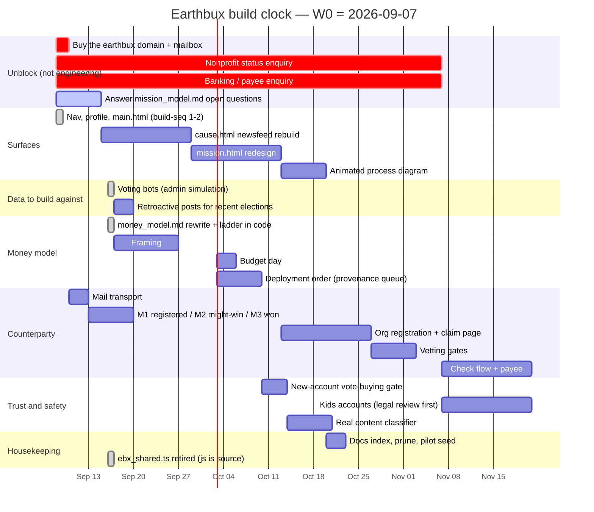

# INSTRUCTIONS — the queue, the plan, and the register

*The one file the build runs from. `## BUILD SEQUENCE` is the queue and the only
section a build pass executes; `## BACKLOG` is everything named but not queued;
`## THE PLAN` is the two clocks and the dates (folded in from `gantt.md`,
2026-09-09); `## REMOVAL REGISTER` is what is safe to delete and what is not
(folded in from `to_delete.md`, 2026-09-09). Doc map and system model:
[`README.md`](../README.md).*

<!-- TOC -->
## Contents

- [AI TUNING](#ai-tuning)
- [BUILD SEQUENCE](#build-sequence)
- [CONVERSATION](#conversation)
- [BACKLOG](#backlog)
  - [▶ NOW — posting & newsfeed (phases 1–2, the focus)](#now--posting--newsfeed-phases-12-the-focus)
  - [Cause framework (absorbed from jax notes 2.txt, 2026-07-31)](#cause-framework-absorbed-from-jax-notes-2txt-2026-07-31)
  - [Model notes absorbed from CONVERSATION (2026-08-06) — documented, not built](#model-notes-absorbed-from-conversation-2026-08-06--documented-not-built)
  - [Bugs (clear these for a clean phase-1/2 experience)](#bugs-clear-these-for-a-clean-phase-12-experience)
  - [▶ NEXT — cause / election UI (phases 1–2)](#next--cause--election-ui-phases-12)
  - [Elections / voting model](#elections--voting-model)
  - [▶ Proposed model change — collapse the back-half phase enum](#proposed-model-change--collapse-the-back-half-phase-enum)
  - [⏸ PARKED — end of phase 2 onward (do not build until the posting focus lands)](#parked--end-of-phase-2-onward-do-not-build-until-the-posting-focus-lands)
  - [Phase 2 / organizations (backend)](#phase-2--organizations-backend)
  - [Resolutions (phase 3: budget → release → resolve)](#resolutions-phase-3-budget--release--resolve)
  - [Money / credit / donations](#money--credit--donations)
  - [Creditcoin front/back + 3D earth (born on mission.html)](#creditcoin-frontback--3d-earth-born-on-missionhtml)
  - [Profiles](#profiles)
  - [Accounts / kids (12–17)](#accounts--kids-1217)
  - [Infra / admin / testing](#infra--admin--testing)
- [THE PLAN](#the-plan)
  - [0. The thing that makes this plan unusual](#0-the-thing-that-makes-this-plan-unusual)
  - [1. The build clock](#1-the-build-clock)
  - [2. The mission clock](#2-the-mission-clock)
  - [3. The planning aid — what to build, when the chart is not enough](#3-the-planning-aid--what-to-build-when-the-chart-is-not-enough)
  - [4. Sources](#4-sources)
- [REMOVAL REGISTER](#removal-register)
  - [§A — safe now, nothing reads them](#a--safe-now-nothing-reads-them)
  - [§B — one edit, then safe](#b--one-edit-then-safe)
  - [§C — live, but the replacement already exists](#c--live-but-the-replacement-already-exists)
  - [§D — looks dead, is not](#d--looks-dead-is-not)
  - [Also worth doing while here](#also-worth-doing-while-here)
  - [Added 2026-09-08 (build-seq §0 + §6)](#added-2026-09-08-build-seq-0--6)

<!-- /TOC -->

## AI TUNING
if a line starts with "!-" read, but do not execute it yet.
@CLAUDE Stop process now if there are any lines in between here and ## BUILD SEQUENCE
## BUILD SEQUENCE
0. Resolve if any
- (a) **Errors**
- (b) **Blockers**
- (c) **Inconsistencies**
- (d) **Not blocking** — `## REMOVAL REGISTER` (below), updated.

1. **Backfill**
- improve healthcare and wolf habitat have no organizations. We need to retroactively implant them as winners.

2. **Elections** The vote counting is wrong and likely needs a reset.
- The ME voting is the main culprit. 
- It's behaving differetnly in almost every election, 
- I think it has something to do with losing votes carrying over into the next election, which should not happen anymore.
- Also, we need to convert it to the 
- They should be like this: The sliders are the same no matter how many tokens you commit. They move based on the ratio of your total commit you want to split between the initiatives, in 1% increments. This means that if you donate $100, the minimum amount you can commit to any individual initiative is $1. This is helpful because the slider bars won't be affected by additional purchases. Adding more money adds an equa share across your sliders, which, of course, can be reallocated at will. (see money model 5)

- Also, everyone should be able to vote on an organization. A 0 ebx vote is 1 vote, 10 is 2 votes, 20 is 3, 40 is 4, 80 is 5, etc.

> **✅ Steps 1–2 built and checked 2026-09-17 — NOT YET LIVE.**
> **1 Backfill** — `GET /admin/elections/unelected-orgs` lists every past race
> with an elected initiative and no organization; `POST
> /admin/missions/{id}/backfill-org` elects one through the same `finalize_p2`
> the day would have used (staff casts the free vote every benefactor has, the
> named organization needs a mission statement). wolf habitat and improve
> healthcare are backfilled by running it once each against the live site, after
> the deploy — wil0 now has a nominated organization, hmr0 still needs one.
> **2 Elections** — losing votes no longer carry: `p1_ebx_by_tiv` counts only
> votes cast in the election an initiative is running in, `votes_p1` is unique
> per (ben, mission, tiv) (migration `a7c1e9d3b5f2`) so a backer can back a
> re-listed loser again, and `recompute_tiv_rating` is scoped the same way —
> the rating does not carry either. The ME slate is whole percentages of one
> commit (`tm.whole_percent_shares`; main.html has one *My commit* amount and
> 1% sliders that rebalance each other), and a decided election refuses a new
> slate. Organization elections count VOTES on the doubling ladder — 0 tokens =
> 1 vote, 10 = 2, 20 = 3, 40 = 4, 80 = 5 (`tm.oe_votes`), everyone may vote in
> this week's race, and a race you have no ME stake in stays closed to you.
> The reset is `POST /admin/elections/me-reset` (dry run by default): it rebuilds
> every OPEN slate as whole percentages of the money behind it, drops rows for
> initiatives that left the race, and repairs any row whose counted figure had
> drifted from its ct — decided races keep their history. On the local database
> it left every open election clean and moved no money.
> `election_check` 41 · `wallet_check` 133 · `token_model_check` 107 ·
> `render_check` clean · `ce_check` 79/80 (the one failure predates this pass).
> `oe_check` cannot run against this database — it wants eight open races and
> the pilot data has moved on; it fails the same way before this pass.
> **Still to do:** push and deploy, then run the ME reset and the two backfills
> against earthbux.net.

3. **Bots**
- Let's seperate the tasks so that we can run each individually. 
*Task Categories* may include: 
- Voting - cause, initiative, org, budget item,
- Researching - suggestion, analysis, investigation
- Proposing - cause, initiative, organization, budget item
- Exchangeing - commits, ebx
- Budgeting/replying - critiquing posts.
Separate tasks between AI API necessary or not
Each bot may run any task. Multiple bots can run the same task, or one bot can run many tasks.
*bugs*
- The initiatives pass only voted on human progress, which is the latest possible election. (This weeks election is atmosphere) They should spread their votes across all elections, focusing especially on the upcoming one.
- When the ME voting is fixed, select initiatives in each of the elecitons for each bot.

999. Housekeeping
- (a) **Update ToC** in each doc.
- (b) **Update Structre** Update page layouts on structure.md.
- (c) **Update Gantt Chart** Add new items, flag behind schedule and update completed.

## BUILD BACKLOG
### **Open Questions**
What are the locations on the globe for each mission?
Globe 1: Benefactor's home
Globe 2: Mission

### 3. **Mission** The mission page Established in the framing stage. 
- Mission pages need the 7 cause toggle, or else users would need to click through them too far. The same annulus from the election page is there, but there are inner (and outer?) layers - globe in middle
- In the framing stage, you have the option to move your money to other existing missions.
- I need to work out how the research structure is built - each user has 1 of each post.
- I need to implement the 2 key accounting numbers - EBX sent, EBX held.
- Gotta figure out latitude and longitude - My thoughts are budget items - They may include travel and specific purchases/services which must have a location. Also, the org should have a location.
- [ ] Mission gantt chart / annulus ring widget (deadlines, 7–12 steps).
- [ ] Tune step guaranteed/potential pool ratios + early-resolution bonus size.
- [ ] Tune `resolution_value_bump` and its relation to the global coin value.
- [ ] Suggestion → approval threshold (how many helpful reacts elevate a suggestion to org-resolvable).
- [ ] Progress reports (org report vs. EN parallel report, benefactor-moderated); mission member communication channel.
- [ ] Schema: `location_type` + coordinates on missions (site / region / distributed / global); home location on benefactors; location(s) on orgs.
- [ ] Globe rendering per location-type (pin vs. shaded region vs. multi-pin).
- Ability to edit research posts.

### **Bots**

### 1. **Landing**
- Strongest work needs to be on the landing page - Annulus with cards and a globe in the center. 
- Need to make it more clear that the research and budget posts are posts. Maximizing donor control and publicizing charitable impact can probably be removed and replaced with some description of this. 
- Research posts should take us to the mission page, so.. so should budgeting posts?

- If I create a new annulus with cards showing active missions (Maybe with images) this would be a strong display. 

So
How it works
------------
Active Missions
-----------
Discussion
Research
Budgeting
-----------

- Receive your Earthbucks / Our team, the Earthbux community, and the Philanthropy create a preliminary mission plan.

### 2. **Election**
- Benefactors need to be able to tell which OE elections they have tokens available to vote in. This is where our allocations area comes in. Also needs something to notify you whether your votes won. 
- The 3 step toggles should be synced with the OE/ME toggle. 
- Show active missions for [cause] leads us to the missions page. 

- The cause election needs to show all potential cause replacements, not just the one for the active cause - have a row where every cause with a potential replacement is highlighted and the rest are grayed out. 
- Withdraw needs to be built into the election (and the mission page for framing)
- Users should be able to post in any mission.
!- Top left ME card shouldn't toggle on desktop mode. It should always show the upcoming ME. On mobile it will eventually toggle, but we aren't building mobile yet.

### 4. **News**
- Currently, every post leads back here. This is correct, but it should instead just link to the post, with an option to bring up the mission page. 
- This is the key aspect. I should learn from the likes of meta, linkedin, reddit, and tiktok. One page, always the same experience. 
- Only page without a large annulus in the center. Corner annulus instead reflects the status regarding the mission of the post currently viewing.

### 5. **Profile**
- The choice cards are in the reverse order as they should be. Each tiv/org should be swapped, and it should be week+1 on top left counterclockwise to week+6 on top right
- [ ] The coins stay updated with the amount donated and the amount held in each mission.
- [ ] Remove login page warning banner
- [ ] Benefactor running tally of 3 categories: **wallet value** (across all credit coins), **money donated** (each donation hashed with its send-time value; tax-deductible), **spent** (money consumed).
- [ ] EBX-coin holding actions
- [ ] The ledger will be **public**.
- [ ] Benefactor profile buildout around mission-memberships + credit-coin holdings per mission.
- [ ] Organization profile (initiative coins, tasklist, memberships).
- [ ] Beneficiary profile page (unique surface; voice at phase-2 start).
- [ ] Credit-badge colorization perk (participation threshold $10; `vvv` flag).
- Admin link from profile page should be updated to mirror admin.html. We'll probably delete admin.html.

### 6. **Docs**
- Reword all phase descriptions to p1-p2-p3(framing)-p4(exchange)
- During the exchange phase, each tranche release to the organization is registered as an exchange where the org trades actions for money. The spending of this money is tracked, and if they go over/under the price of the ebx is affected.
- Note that resolutions and tranche releases are still an important part of the exchange process, they are just not the definition of the phase.
- Build clock and mission clock - I should keep build items here in instructions and mission items in the other docs.
- The duality of our purpose is coming to the forefront: 1. Network, 2. News.
- Let's investigate fiscal sponsors and add that to research. 
- Still need to reshuffle the docs. Some things can be combined and I need an area for research into seeking investments - fiscal sponsorships, pris, alternatives?
- Need seperate gantt charts for the missions and for the project development
- Need section in docs to focus on nonprofit application - Probably falls within money model. Maybe split money model into mission model, and a new (or rename money model into) banking document which describes earthbux finances. Or maybe instead of banking it's 'operations' and then we can fold 'roles' into it too.
- Research will be recreated as 'the social network' - a document for investigating and imagining...
- The ascii drawings on jax notes 2 (At least their current states) should all be on structure.md. 

### 7. **Everywhere**
- Need to fix the footer - Earthbux - collective action, measured in impact - A civic news and charity platform, every earthbuck tells a story. Causes/ Platform/ Community/ - Also should have an option to contact us or join the team. Tell us what you think? I will go public as soon as the money is public.
- I'm going to need to backfill some items onto the website, because I've been only voting in my test environment and not on the real page.
- I may need a method to reward users for being less sticky-fingered with their money.
- Big rename - context is now going to be called situation.
- Moderation - before individual user verification, I may need to be able to block certain ips or spam creation from accessing the site. This is theoretical for now but I want to think about how I would do this without being flooded. 
- On mobile, the 5 page tabs should be across the bottom of the screen and always visible unless the user is scrolling down, like on social media.

## CONVERSATION
- Without permission, only execute build sequence.
- Absorb amd modify backlog items and update structure as you see fit.
- Need to start thinking about where the money lives - economics
- Kids accounts need a dedicated adult account to authorize any transactions.
- Security rule: The first time an account signs in, they are told they can't vote in any org elections except the first (most recently electeed tiv) org election. - This prevents from creating accounts just to vote your org in. - edit - they can vote in whatever election they want, but they are not allowed to buy extra votes until they've been a member long enough. 
- I wonder if I can create an animated diagram - kind of like a prezi - showing each step of the process.

## BACKLOG

*For backlog management — ignore this section during a build task.*

*The single backlog. Page specs live in `docs/structure.md`; the model in `README.md` §5.*

---
### Accounts / kids (12–17)
- [ ] Birthdate (or age bracket) on `BenefactorAccount` + guardian link (parent account or verified email).
- [ ] Parental-approval flow gating every money-in action (add EBX, buy votes); voice (vote/post) ungated.
- [ ] Approval UX: per-transaction vs. allowance ("approve up to N EBX/month").
- [ ] Legal review: COPPA/GDPR-K, minimum age 12, regional definitions of minor.

---
### Infra / admin / testing
- [ ] **Self-serve password reset** — needs a mail transport: emailed single-use
  token, expiry, a redemption page, rate limiting. Staff can issue a temporary
  password today (§0d, 2026-08-08); this is the real flow.
- [ ] Admin page off `profile.html` — a link to `admin.html` from `profile.html` instead.
- [ ] Admin event log (`vote_events`: CAST/UPDATE/REMOVE) + duplicate/invalid-vote flags + CSV export.
- [ ] Mission Simulator — input votes, commits, budget suggestions/resolutions; step forward in time.
- [ ] `is_test` column + `cyclestart` config endpoint for simulations.
- [ ] v2-compatible seeder (pilot/seed are stale against the current schema).
- [ ] Working-tree corruption: avoid concurrent writers (mount sync vs. `uvicorn --reload`); commit often.
- Bots.
- [ ] Apache stack (Kafka/Flink/Airflow/Cassandra) — future.

---

### 1. The build clock

Anchored at **Monday 2026-09-07** (W0 = the week this pass ran). Durations are
working estimates for one builder plus this assistant, not commitments.

#### Why this order

2. **Nonprofit status and banking.** External lead times measured in weeks. They
   gate the check flow, and the check flow gates the first real payout. Starting
   them late is the one mistake in this plan that a good month of building cannot
   repair.
3. **Voting bots.** Every remaining surface renders an election, a tally, a pool
   or a mission in flight, and none can be *seen* in a real state with one
   account. `mission.html` in particular is a page about eight weeks of
   accumulated activity: built against an empty database, it gets built twice.
   This is why they are here and not in housekeeping, where the queue files them.
4. **`ebx_shared.ts` / `.js` reconciliation** — **done 2026-09-16** by retiring the
   TypeScript. `resources/js/ebx_shared.js` is the source and has no build step.

#### What is deliberately not on this chart

**Mission trips, travel, and spots on missions.** The largest unscoped idea in
the file — a new product with its own safety, cost and liability surface. It
should not be designed until one mission has actually resolved. Putting a bar on
a chart for it would imply otherwise.

### 4. Sources

- `docs/INSTRUCTIONS.md` ## CONVERSATION — the five swimlanes and every item.
- `docs/_to_delete/PLAN_2026-09-02.md` — the pass ordering this chart dates (retired).
- `docs/mission_model.md` — the phase map §2 draws.
- `docs/money_model.md` §0 and §6 — the finality ladder the benefactor lane follows.
- `EBX.Cycle.missionDates` in `resources/js/ebx_shared.js` — the mission clock,
  and the reason §2 is derived rather than typed.

---

## REMOVAL REGISTER

*Folded in from `docs/to_delete.md` on 2026-09-09, unchanged except for heading
depth. One list, ordered by how safe each removal is: **§A** goes today with no
code change, **§B** needs one edit first, **§C** is live code whose replacement
already exists, **§D** only looks dead. Nothing here is deleted by reading it.*

*Created 2026-08-28 (build-seq §4). One list, ordered by how safe each removal
is. Nothing here has been deleted: this file is the inventory, and each entry
says what would break if it went and what has to happen first.*

**How to use it.** Work top down. Everything in **§A** can go today with no code
change. **§B** needs a one-line edit somewhere first. **§C** is live code whose
replacement exists but which still has a caller or a story to tell. **§D** is
the stuff that only LOOKS dead.

---

### §A — safe now, nothing reads them

| What | Where | Why it can go |
|---|---|---|
| 7 database backups | `backend/earthbucks.db.bak_20260809_194835`, `…bak_20260810_094142`, `…bak_aug08b`, `…bak_aug27c`, `…bak_jul19`, `…bak_jul31`, `…bak_premigrate` | ~1.7 MB of point-in-time copies going back to July. Git has the schema history and `alembic` has the path between versions; these are snapshots of *data* nobody has read since the day they were made. **Keep `…bak_aug27c`** until the finalized model has run a full cycle — it is the last state before it. |
| `backend/earthbucks.db.migrated_jul19` | same folder | The July cutover artefact. Superseded twice. |
| `backend/_to_delete/earthbucks.db-journal` | | An orphaned SQLite journal from an interrupted write on 2026-08-27. It is not a database and cannot be opened as one. |
| `_ebx_snapshot.tgz` | repo root | Written 2026-08-28 to move the tree into a container with Chromium on it, so `oe_check` and `ce_check` could be run for the first time. It has served its purpose. **Add `*.tgz` to `.gitignore`.** |
| `scripts/__pycache__/` | | Byte-code. `.gitignore` already covers `__pycache__` elsewhere. |

### §B — one edit, then safe

| What | Where | The edit first |
|---|---|---|
| `backend/seed/pilot.py` | | v1-shaped and unrunnable against the v2 schema. README §10 still lists it as "sample data" — say it is dead or rewrite it. |
| `README.md` §11 + §12 references to `*_old.py`, `routers_old/`, `backend/earthbucks.db.pre-v2.bak`, `backend/seed/port_v1.py` | README lines ~893, ~910–912, ~932, ~934, ~952 | **None of those files exist in the tree any more** — they were removed at some point and the README still documents them, including a `./.venv/bin/python -m seed.port_v1` command that cannot run. Delete the references, not the files. |
| `.pf-left` · `.pf-right` · `.pf-right-row` · `.pf-gear` · `.pf-badge-card*` · `.pf-orgmode` | `profile.html` CSS | Thirteen rules for the three-column rail the 2026-08-28 rebuild replaced. `.pf-grid` and `.annulus3-*` are already gone; these are what is left of the same layout. Check nothing else selects them, then cut. |
| `EBX.formatEBX` | `resources/js/ebx_shared.js` | Still correct for the surfaces that mean the MINTED state (the credit badge, the ledger, mission.html's pool and spend). After the 2026-08-28 unit sweep it has only a handful of callers. Do not delete it — but every new call site should be `formatTokens` unless it means minted money, and `scripts/unit_sweep.js` is the way to check. |

### §C — live, but the replacement already exists

| What | Where | Blocked on |
|---|---|---|
| `GET/PUT /missions/{id}/p1/carryover` | `backend/app/routers/votes.py:74–98` | The phase-1 carryover machinery describes a world that ended 2026-08-20. `crud.p1_carryover_state` / `carryover_p1` / `_send_floor` go with it. It still explains races finalized under the old rules honestly, so it cannot go until those races are archived or restated. `scripts/carryover_check.js` guards the signed-out path and would go too. |
| `crud._withdraw_p1_legacy` + `_send_floor` | `crud.py:1994`, `:2052` | Same story. `withdraw_p1` is a named refusal now; the legacy body is kept so an old race can still be explained. |
| The phase-2 **withdraw button** | `cause.html` | Named in the backlog since 2026-08-20b. It posts to an endpoint that refuses. Remove the button, keep the refusal. |
| `votes_p2.conversions`, `benefactor_accounts.grant_commit_by_week` | `models.py:307–323` | Deliberately not dropped by migration `c5d8f2a91e67` — they hold the last values written under the retired rules. Nothing reads them. Drop when the races they describe are settled. |
| `mint_mission_coins` firing at `finalize_p2` | `crud.py` | The coin should be issued at BUDGET, not at the mint (README §5, "Credits & EBX"). Named backlog item; moving it is a behaviour change, not a deletion. |
| `LocalElections` no-op stubs | `resources/js/ebx_shared.js:248` | Five empty methods kept so lingering call sites do not throw. Grep for callers; if there are none left, delete the object. |

### §D — looks dead, is not

- **`Votes.forCause`** — CHECKED 2026-08-28, and the answer is better than the
  question. Six functions in `ebx_shared.js` still call the synthetic vote
  distribution — `raceCard` · `electionPanel` · `electionBanner` · `sideCard` ·
  `upcomingCauseBanner` · `topCard` — and **no page calls any of the six.** The
  only mentions of `EBX.sideCard` and `EBX.topCard` left in `main.html` are two
  comments saying the page builds its own faces instead. So this is a large
  block of genuinely dead render code, not a live surface showing fake numbers,
  and it moves to §A the moment somebody confirms the same for `frontend/src/
  ebx_shared.ts`, which is the SOURCE these are built from — delete it there and
  rebuild, or the next `esbuild` run puts it all back.
  - What must stay: **`EBX.Votes.rankColor`**, which is a palette, not a
    simulation, and is called for real by `main.html:4322` and
    `cause.html:3943`.
- **`backend/app/post_config.classify_flag`** — a stub that returns green. It
  looks like dead scaffolding; it is the seam the real classifier plugs into,
  and `posts.flag` / `GET /missions/{id}/post-support` are built around it.
- **`ce_check.js`'s cause-table assertions** — they look stale next to the CE
  panel, but they were rewritten for the panel on 2026-08-27 and pass.

---

### Also worth doing while here

- **`.gitignore`**: add `*.tgz`, `backend/*.db.bak*`, `backend/*.db-journal`.
- **`backend/.venv/` is 103 MB** and inside the repo. It is git-ignored, but it
  is also why any archive of this tree is 11 MB instead of 800 KB. Moving it
  outside the repo would make the tree portable.
- **`docs/` has no index.** Nine files, three of which (`RESEARCH.md`,
  `Donation_Landscape_Brief.md`, `Endowed_Grantmakers_Deep_Dive.md`) are
  research rather than build documents. A `docs/README.md` naming what each one
  is for would stop the build docs and the research docs being read as one pile.

---

### Added 2026-09-08 (build-seq §0 + §6)

#### Done this pass — struck from the list above

- **`docs/` has no index** — it has one now: `README.md` §12, "The docs index",
  fourteen files with a verdict on each. The three folds and the one drop it
  recommends are entered below rather than done, because folding research
  documents is an editorial act, not a cleanup.
- **`.ebx_shared.build.js`** — a stray candidate build written into
  `resources/js/` while wiring the build guard, before it was taught to build
  into a temp directory instead. Moved to `docs/_to_delete/`; delete the folder.
- **`docs/_to_delete/gantt_probe.mmd`** — the mermaid block from the old `gantt.md` (now `## THE PLAN` §1),
  copied out so it could be rendered and looked at in a container with a
  browser. Served its purpose.

#### New — §A, safe now

| What | Where | Why it can go |
|---|---|---|
| `Donation_Landscape_Brief.md` · `Endowed_Grantmakers_Deep_Dive.md` | `docs/_to_delete/` | **Done 2026-09-09** — folded into `RESEARCH.md` §1 and §6 with every source link intact. The research is one document. |
| `Donation_Recipient_Landscape.xlsx` | `docs/_to_delete/` | **Done 2026-09-09** — dropped. `DRL.csv` is the same table and it diffs; `RESEARCH.md` §0 cites it. |
| `docs/_to_delete/` | | The whole folder, once its two files above are confirmed unwanted. |

#### New — §B, one edit then safe

| What | The edit first |
|---|---|
| `backend/seed/pilot.py` | **Retired 2026-09-08** — README §10 now says so instead of calling it "sample data". It stays on disk because the rows it generated (`init-0NN`, the GameMaster account) are the development database, and deleting the generator does not delete them. It goes when the **voting bots** replace it (`## THE PLAN` §1) — bots drive the real endpoints, so their data has the shape the code actually produces. |
| `docs/_to_delete/PLAN_2026-09-02.md` | **Done 2026-09-09** — retired to `docs/_to_delete/`. `gantt.md` outlived it and has itself been folded into `## THE PLAN` above, so the project has one plan in one file. |

#### New — §C, live and load-bearing, but wrong

| What | The problem |
|---|---|
| ~~**`frontend/src/ebx_shared.ts`**~~ | **Resolved 2026-09-16** — the TypeScript was retired and `resources/js/ebx_shared.js` is the source. The file is now a three-line tombstone; see "Added 2026-09-16" below.
| the six dead renderers in `ebx_shared.js` (§C above) | Unchanged, and now with a second reason to be careful: they are among the twelve functions whose `.js` and `.ts` bodies differ, so "delete it there and rebuild" is exactly the operation the guard now blocks. Resolve the divergence first. |

---

### Added 2026-09-16 (build-seq §1)

#### New — §A, safe now

| What | Where | Why it can go |
|---|---|---|
| `frontend/` (the whole folder: `src/ebx_shared.ts` tombstone, `src/types.ts`, `package.json`, `tsconfig.json`, `node_modules/`) | repo root | The TypeScript source was retired; `resources/js/ebx_shared.js` is edited directly. `package.json`'s build now refuses with a notice. Nothing reads the folder. |
| `scripts/build_guard.js` | `scripts/` | Guarded the retired build. Now prints a notice and exits. |
| `backend/earthbucks.db.bak_premigrate` | `backend/` | Written 2026-09-15 at the same size and time as the live dev DB. Keep only if that migration is in doubt. |

Not deleted from this session: the computer's shell could not reach the folder,
and file sync can write but not delete.

#### Unblocked by the retirement

- **The six dead renderers** in `ebx_shared.js` (§D, `Votes.forCause` callers:
  `raceCard` · `electionPanel` · `electionBanner` · `sideCard` ·
  `upcomingCauseBanner` · `topCard`) can be deleted directly from the `.js` —
  there is no longer a source to put them back. Keep `EBX.Votes.rankColor`.

#### New — §C, live but replaced by the 2026-09-16 model

| What | Where | Blocked on |
|---|---|---|
| Losing-organization backers minted behind the winner at T+8 | `crud._settle_oe_stakes` | The framing exchange (money_model §12 item 1). |
| Marked tokens movable into any open OE race during the OE | `wallet.move_stake`, `is_movable` | Same — losing-initiative backers move during framing now. |
| `BenefactorAccount.grant_commit_by_week`, `votes_p2.conversions` | `models.py` | Unchanged from §C above; still unread. |

