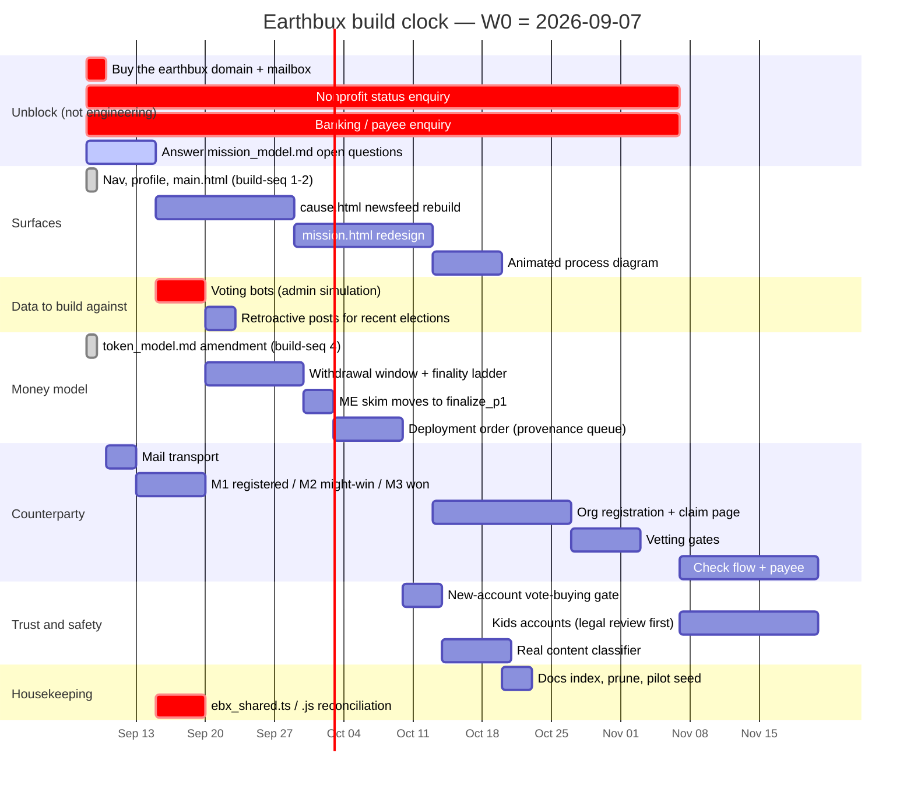

# The plan — two clocks

*Written 2026-09-08 (build-seq §5: "Prepare to design gantt chart and/or planning
aid as described in conversation"). The five swimlanes and every item in them are
Jax's, from `docs/INSTRUCTIONS.md` ## CONVERSATION. What this file adds is
**when**, **in what order**, and **why that order** — plus the spec for the
planning aid, at the end, for when it stops being a document and becomes a page.*

---

## 0. The thing that makes this plan unusual

**There are two clocks, and almost every scheduling mistake available to this
project comes from reading a date on the wrong one.**

| | **The build clock** | **The mission clock** |
|---|---|---|
| runs on | calendar weeks, one team | every mission, independently |
| starts | when you start | **T**, the week its initiative is elected |
| repeats | never | **every week**, seven causes deep |
| example item | "buy the email address" | "org has 7 weeks to claim" |
| what late means | it ships later | **it missed a mission that will not come back** |

The Organization, Beneficiary, and most of the Earthbux lanes are on the mission
clock: they are not tasks, they are **obligations that fire on a date a mission
sets**. A mission's initiative is elected at **T**, its organization at
**T+8wk**, its budget is set at **T+15wk** (`BUDGET_SET_WEEKS = 7`), and its
credit release begins at **T+16wk**. Those are already fixed by
`EBX.Cycle.missionDates`; nothing in this plan can move them.

The Benefactor and Venture lanes are on the build clock.

**Consequence for the chart:** one gantt cannot show both without lying. Part 1
is the build clock. Part 2 is the mission clock, drawn once as a *template* that
every mission instantiates. The planning aid in Part 3 is the thing that
overlays them.

---

## 1. The build clock

Anchored at **Monday 2026-09-07** (W0 = the week this pass ran). Durations are
working estimates for one builder plus this assistant, not commitments.



### Why this order

Four items are marked critical, and only one of them is code.

1. **The domain and mailbox.** Head of the longest chain in the whole
   project — address → transport → M1/M2/M3 → weekly digest → self-serve password
   reset — and it costs ten minutes. Nothing unblocks it and it blocks five
   things. **See the recommendation at the end of §2.**
2. **Nonprofit status and banking.** External lead times measured in weeks. They
   gate the check flow, and the check flow gates the first real payout. Starting
   them late is the one mistake in this plan that a good month of building cannot
   repair.
3. **Voting bots.** Every remaining surface renders an election, a tally, a pool
   or a mission in flight, and none can be *seen* in a real state with one
   account. `mission.html` in particular is a page about eight weeks of
   accumulated activity: built against an empty database, it gets built twice.
   This is why they are here and not in housekeeping, where the queue files them.
4. **`ebx_shared.ts` / `.js` reconciliation** (found this pass, §0b of the pass
   write-up). The shipped engine is ahead of its TypeScript source by six
   `EBX.*` entry points and twelve changed functions, so the documented build
   command deletes live code. A guard now refuses that build, but the guard is a
   safety catch, not a fix, and every day the two drift further.

### What is deliberately not on this chart

**Mission trips, travel, and spots on missions.** The largest unscoped idea in
the file — a new product with its own safety, cost and liability surface. It
should not be designed until one mission has actually resolved. Putting a bar on
a chart for it would imply otherwise.

---

## 2. The mission clock

Every mission runs this, and one starts every week. Drawn once, relative to T.

```
        T-7wk        T           T+8wk        T+15wk      T+16wk        …
          │          │             │             │           │
  cause   │  INITIATIVE  ORGANIZATION   FRAMING    BUDGET   RELEASE   RESOLVE
  opens   │   ELECTION     ELECTION     7 weeks     SET      steps    years
──────────┼──────────┼─────────────┼─────────────┼───────────┼───────────────
BENEFACTOR│ suggest  │ vote the tiv │ vote the org │ budget    │ moderate
          │ + case   │ 10% FINAL    │ 5/16 FINAL   │ 100% FINAL│ resolutions
          │          │ one change   │ withdraw     │ withdrawal│
          │          │ only, after  │ window OPEN  │ window    │
          │          │ this point   │ (7 weeks)    │ SHUT      │
──────────┼──────────┼─────────────┼─────────────┼───────────┼───────────────
ORG       │ nominate │ nomination   │ ELECTED      │ binding   │ deliver,
          │ any time │ can fire on  │ → claim, 7wk │ agreement │ report,
          │          │ the tiv vote │ mission stmt │ + budget  │ respond
          │          │              │ then timeline│ content   │
──────────┼──────────┼─────────────┼─────────────┼───────────┼───────────────
EARTHBUX  │ verify   │ AUTO POST:   │ AUTO POST:   │ publish   │ parallel
          │ the tivs │ winner update│ winner + claim│ the budget│ reporting,
          │ (science)│ 24h after    │ link +        │ live on   │ audit
          │          │ finalize     │ countdown     │ mission   │
──────────┼──────────┼─────────────┼─────────────┼───────────┼───────────────
BENEFICIARY                        │              │ voice at   │ testimonial,
                                   │              │ phase-2    │ photo/video,
                                   │              │ start      │ verification
```

Three things this drawing settles that prose kept losing:

- **The withdrawal window and the framing phase are the same seven weeks.**
  T+8wk → T+15wk is simultaneously the organization's claim-and-frame period and
  the benefactor's last chance to withdraw. That is a *feature* — the money stays
  revocable exactly as long as the counterparty is unproven — and it means the
  framing checklist and the withdrawal countdown are two views of one clock and
  should be built as one component.
- **"If they don't get through the framing phase, they only get 1/16."**
  Jax's note, placed: it is the penalty at T+15wk, and it is coherent with §0f of
  `token_model.md` — 1/16 is *Earthbux's* guarantee, so an org that never framed
  gets the small guaranteed slice and nothing from the 19/32 the benefactors
  retain. Worth confirming, because 1/16 currently appears in the model as
  Earthbux's number, not as an unclaimed org's.
- **Org nomination fires at the tiv vote, not after it.** Which is exactly why
  the "+ org" button went onto every slider row in the mission ballot this pass:
  the moment a benefactor decides they want an initiative to happen is the moment
  they know who should run it.

### The recommendation you asked for: gmail or your own domain?

**Your own domain, and buy it this week.** Three reasons, in order of how much
they cost you later:

1. **Deliverability and trust with counterparties.** Lane 2 of this plan is cold
   outreach to charities telling them money is waiting for them. From
   `earthbux@gmail.com` that is indistinguishable from a scam — it is *exactly*
   the shape of one — and the organizations most worth reaching are the ones with
   the strictest filters.
2. **It is the identity, not the mailbox.** `you@earthbux.org` survives changing
   mail providers; a gmail address becomes an address you cannot leave. You will
   also want `news@`, `press@`, `orgs@`, `noreply@` — one domain gives you all of
   them and a role account is what a small team needs before it is a team.
3. **The nonprofit application will ask.** So will a bank. Both go faster with a
   domain that matches the name on the form.

Practically: register the domain, point mail at any provider (Google Workspace,
Fastmail, Zoho — the choice is reversible, the domain is the part that is not),
and keep a personal address off every outbound path. Also register `.org` and
`.com` together if both are free; the second one costs a few dollars a year and
prevents the impersonation problem in reason 1 from being someone else's to
create.

---

## 3. The planning aid — what to build, when the chart is not enough

A gantt is a picture of a plan. The thing this project actually needs is a page
that answers *"what is late, and what does it block?"* without being maintained
by hand. Spec:

**Source of truth.** Not a file of dates. Two feeds:
1. the **mission clock**, derived — `EBX.Cycle.missionDates` already returns
   every date for every mission, so every obligation in §2 is computable, not
   entered;
2. the **build clock**, a small list of items with `{lane, title, estimate,
   depends_on, state}` — the only hand-kept data, and short enough to live in one
   JSON file until it deserves a table.

**The view.** Two stacked bands sharing one horizontal time axis:
- **top** — the build lanes, ordinary gantt bars, dependency arrows drawn only
  for `depends_on` edges that cross a lane (inside a lane the order is the
  order);
- **bottom** — a **mission ribbon**: one row per open mission, coloured by cause,
  with its four fixed marks (T, T+8wk, T+15wk, T+16wk) and today's line running
  through both bands.

That shared *today* line is the whole point: it is the one place where "the
claim page is two weeks out" and "three organizations are inside their claim
window right now" appear in the same picture.

**What it must do that a chart does not.**
- **Colour by slack, not by lane.** An item is red when the mission clock has
  already passed the date it was meant to serve. Nothing else earns red.
- **Answer "what does this block?"** on click — walk `depends_on` forward and
  highlight the chain. The four critical items in §1 exist because someone walked
  that chain by hand; the page should do it.
- **Show the external items as what they are.** The nonprofit and banking bars
  are *waiting*, not *working*. Draw them hollow.

**Where it lives.** `admin.html` — it is a staff tool, it reads mission data the
console already loads, and it is the one page in the site that is allowed to be
dense. Not a sixth nav tab.

**When to build it.** After the mission page (build-seq §3). It is a tool for
running the project, and the project's next three weeks are already legible from
this file; a tool that saves an hour a week is worth building once the thing it
schedules is bigger than the thing it delays.

---

## 4. Sources

- `docs/INSTRUCTIONS.md` ## CONVERSATION — the five swimlanes and every item.
- `docs/PLAN_2026-09-02.md` — the pass ordering this chart dates.
- `docs/mission_model.md` — the phase map §2 draws.
- `docs/token_model.md` §0 — the finality ladder the benefactor lane follows.
- `EBX.Cycle.missionDates` in `resources/js/ebx_shared.js` — the mission clock,
  and the reason §2 is derived rather than typed.
