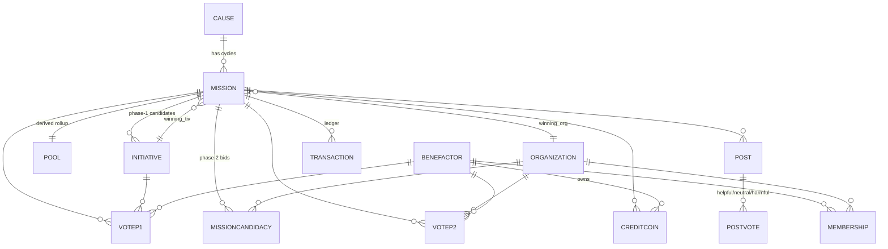
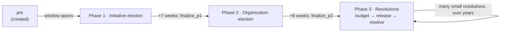

# Earthbucks — System Overview
*Drafting for V3.*

Earthbux is a weekly charity pool elected by its community. Each week a **mission**
for one of seven rotating **causes** opens and runs through **two elections**:
an **initiative election** (which idea?), an **organization election** (who runs
it?).

**Earthbux News (EN)** Stimulating discussion, connecting parties, and pooling resources, funded by a cut of the pool. Supervises, publicizes, and helps organize the missions by creating a network around each mission.

*The DEX* 'credit coins' traded like crypto

**Doc map** — how files are organized
- **README.md** (this file) — the system model: architecture, data model, APIs,
  lifecycle, the discussion model, money, and the credit framework.
- **docs/structure.md** — the page-by-page build spec (one section per route).
- **docs/INSTRUCTIONS.md** — the build queue (`## BUILD SEQUENCE`) plus the
  living `## BACKLOG`.
- **docs/mission_model.md** - Each missions process in full. [§3](#3-mission-lifecycle) is the summarized version.
- **docs/token_model.md** — the money model in full. [§5](#5-the-money-model) is the summarized version.
- **docs/research.md** - Research justifying Earthbux, situating it in the charity ecosystem, planning relationships, finding missions and/or causes to focus on.
- **docs/roles.md** - Earthbux job descriptions, and 
---
## 1. Architecture

```
                          ┌──────────────────────────────────────────┐
   Browser (static)       │  FastAPI app  (backend/app/main.py)       │
 ┌───────────────────┐    │                                           │
 │ index / cause /   │    │  routers/  ── crud.py ── models.py (ORM)   │
 │ profile / admin   │◄──►│     │            │           │            │
 │ / mission.html    │HTTP│  auth.py     scheduler.py   database.py    │
 │                   │    │  (JWT)       bootstrap.py        │         │
 │ resources/js/     │    └───────────────────────────────── │ ───────┘
 │  ebx_shared.js    │                                       ▼
 └───────────────────┘                                  SQLite (earthbucks.db)
        ▲                                                Alembic-migrated
        │ built by esbuild from
        └ frontend/src/ebx_shared.ts
```

- **Backend** — FastAPI + SQLAlchemy 2.0 (typed ORM) + SQLite, schema-managed by
  Alembic. Served by `uvicorn app.main:app`. The same process also hosts the
  static HTML/JS, so the frontend talks to the API on the same origin.
- **Frontend** — plain HTML pages with inline scripts, plus a shared engine
  compiled from TypeScript: `frontend/src/ebx_shared.ts` → (esbuild) →
  `resources/js/ebx_shared.js`, exposed as a global `EBX`. **A `.ts` edit ships
  nothing until `npm run build` regenerates the JS.**
- **Auth** — JWT bearer tokens (`/auth/login`). Accounts carry a `role`
  (`benefactor | employee | admin`); employee/admin unlocks staff-only actions.
- **Kids accounts (planned)** — benefactors aged **12–17** get full *voice*
  but gated *money*: they can vote and post like any benefactor, but **cannot
  add money without parental approval**. Implies a birthdate (or age bracket)
  on `BenefactorAccount`, a guardian link, and an approval flow on every
  money-in action; votes from unfunded kid accounts still carry
  `BASE_VOTE_EBX` weight. Legal review (COPPA/GDPR-K) before build — see the
  INSTRUCTIONS `## BACKLOG`.
- **Railway** https://ebx-production.up.railway.app/ 

*future*
- add native os and mobile apps.
---

## 2. Data model (v2)

One weekly **Mission** per `(cause, cycle)`. Initiatives and organizations are *candidates* that point at a mission; the singular winners are
pointers on the mission itself. All money movement and vote mutations are logged
in one append-only **Transaction** ledger.



**16 tables.** `causes`, `missions`, `initiatives`, `organizations`,
`benefactor_accounts`, `memberships`, `mission_candidacies`, `votes_p1`,
`votes_p2`, `cause_votes`, `pools`, `credit_coins`, `posts`, `post_votes`,
`queries`, `transactions`.

Naming convention throughout the code: **`ben`** = benefactor, **`tiv`** =
initiative, **`org`** = organization (so e.g. `tiv_id = ForeignKey("initiatives.id")`).

Key design choices:
- **Mission spine** — created at cycle start (`current_phase='pre'`), holds
  `winning_tiv_id` / `winning_org_id` (the singular winners); the many candidates
  live on the back-ref collections.
- **Split voting** — `VoteP1` (initiative election) and `VoteP2` (org election)
  are separate, so phase-1 state can never leak into phase-2. The committed EBX
  lives on `VoteP1` (the old `Contribution` table merged in).
- **`MissionCandidacy`** — an org's bid to run a mission (replaces the old
  `OrgRegistration`); approval is what grants page-build access.
- **`Transaction`** — the single append-only ledger for both vote mutations
  (`type='vote'`) and money transfers (`type='transfer'`, with a `bucket`).
- **`CauseVote`** — §5 (2026-08-06): one benefactor's vote, for one WEEK, on
  which cause should hold an upcoming window. The seven causes are themselves
  elected (§4, *Changing a cause*), so `Cause` grew `status`
  (`active | suggested | retired`), `proposed_by_id`, and a **nullable**
  `index` — a suggested cause holds no window until it wins one.
- **`Query`** — saved, staff-only data-console lookups (the admin browser).
- **`valence`** (`helpful | neutral | harmful`) on votes & posts — `harmful`
  means a vote *against* a tiv or a *block* on an org.
---
*future*
- Credit coins will need dex logic

## 3. Mission lifecycle
Phases are server-authoritative (advanced by `scheduler.py`); the frontend only
*displays* phase. Timeline is anchored on `mission.started_at` (the day the
cause's window opens):



**Three phases, but five code values (for now).** The lifecycle is now modeled as
three phases — **initiative election**, **organization election**, and
**resolutions** — where *resolutions* is the entire post-election back half:
budgeting, credit release, and the ongoing stream of resolved outcomes are
**stages within one phase, not separate phases.**

The code's `current_phase` enum still carries the old five values —
`pre · initiative · budget · credit · resolution` — which now map onto the three
phases:

| Phase | `current_phase` value(s) | Advanced by |
|---|---|---|
| 1 — Initiative election | `pre`, `initiative` | `finalize_p1` sets the winning tiv and keeps the mission in `initiative` while the org race runs |
| 2 — Organization election | `initiative` (org-race sub-state) | `finalize_p2` |
| 3 — Resolutions | `budget` → `credit` → `resolution` | `finalize_p2` opens budgeting; then per-resolution events (`distribute_mission` marks entry) |

> **Budget → release → resolve is one stream.** A mission does not "reach
> resolution" as a single event — it **opens** budgeting, releases credits in
> stages, and closes through MANY tiny **resolutions** (see [§5 — S/S/S &
> resolutions](#5-the-money-model)), possibly over years. Collapsing the three
> back-half enum values into a single `resolutions` value is proposed work — see
> the INSTRUCTIONS `## BACKLOG`.

### Goals

Streamline and publicize charity missions. Pool donations to avoid redundant or
competing efforts, expose wasteful or fraudulent actors, and reorient attention
toward the cause rather than the sponsor. Democratize *which* idea and *which*
organization gets funded, and report on the work independently through Earthbux
News (EN).

### Full phase map

Three phases. The back half (budgeting → credit release → resolved outcomes) is
one **Resolutions** phase with internal *stages*, not three separate phases:

**T** is the initiative election — "mission started", UX week 0 — and it is
`started_at + 7wk`, because `started_at` is when the cause window OPENS. Every
later date in the model is quoted from T, so the table is too, with the
`started_at` week beside it.

| Phase | Stage | Window (from T) | (from `started_at`) | What happens | Driven by |
|---|---|---|---|---|---|
| **1 — Initiative election** | pre / initiative | T−7wk → **T** | weeks 0 → 7 | Benefactors propose and vote on initiatives | *context* + *case* posts |
| **2 — Organization election** | — | T → **T+8wk** | weeks 7 → 15 | Benefactors nominate/vote on organizations | *analysis* + *review* posts |
| **3 — Resolutions** | budget | T+8wk → **T+15wk** | weeks 15 → 22 | Elected org drafts budgets from socially-selected **budgeting** (S/S/S) items; **EN verifies the org**; advance released | *budgeting* + *investigation* posts |
| | release | T+16wk onward | weeks 23+ | Credits released in stages; 7–12 step progress reports (org report vs. EN parallel report, benefactor-moderated) | *mission-update* posts |
| | resolve | continuous | — | Many small **resolutions** accumulate, each moving coin value; impact summary. Missions may take **many years** to fully resolve | *budgeting* (S/S/S) posts |

*Corrected 2026-09-08 (§0c).* This table used to put the organization election at
"~week 8" and the budget window at "weeks 9–16" from `started_at`. The
organization election is at **T+8wk**, which is `started_at + 15wk` — the old
row had it at T+1wk, so every row from phase 2 down was seven weeks early — and
the budget window is **seven** weeks (`BUDGET_SET_WEEKS = 7`), not eight. The
authorities are `EBX.Cycle.missionDates` (T = `started_at + 7wk`, `phlElected =
T + 8wk`, `creditRelease = T + 16wk`) and `token_model.OE_AFTER_ME_WEEKS = 8`.

The **organization election (phase 2) happens before any budgeting** — the org is
chosen on credentials and a short statement, not a detailed plan. Everything after
that election is the single **Resolutions** phase, and it runs post-by-post:
*budgeting* (S/S/S) posts become the budget and the resolutions themselves (see
[§5](#5-the-money-model)).

### Phase 2 — nominate → register/claim → elect

An initiative is a proposition; an organization is a **counterparty** that must
receive funds and do the work. So phase 2 is three steps, not one:

- **Nomination & registration (both open, no gate).** Orgs can self-register any
  time; benefactors can nominate any org as a candidate for any phase-2 mission
  (minimum: a name and a mission statement — required to be *elected*, not to
  receive votes). An org is a single entity — never nominated twice, no separate
  pages; near-duplicate names get a "did you mean?" prompt. Nominating and
  voting are free.
- **Claiming a mission (the gate).** A real representative **claims** the
  mission → their account gains authority over the budget and mission sequence.
  Claiming requires a **click-through legal agreement** (representative
  attestation — the basis to litigate fraud; see `docs/CONTRACT_DRAFT.md`). A
  nominated (not self-registered) org may claim until Phase 4 starts (claim
  window: `pre|initiative|budget`). Claiming bumps the mission's
  **guaranteed-to-pool rate** (unclaimed 0.20 → claimed 0.35, in `config.py`) —
  rewarding orgs for showing up, protecting benefactors when no one does.
- **Identity verification is EN's responsibility, performed during phase 3** —
  EN only verifies one organization per week (the week's single elected
  mission).

**If no org claims:** the mission is **not cancelled**. Advances are still sent;
the community executes the mission as best it can (e.g. donating the pool
onward) and EN still reports. These cases tend to end with smaller pools.
Earthbux never creates its own organizations — the community elects existing
ones.

**Fraud handling:** the advance lands at the *start* of phase 3, but EN verifies
*during* phase 3 — a fraudulent group could in theory win the advance.
Mitigations: the click-through agreement (litigation basis), EN verification
before the full pool unlocks, and recovery through litigation.

**Election content** (benefactor-authored, pre-vote due diligence): *Evaluation*
(my verdict on this org), *Context* (neutral background / track record),
*Analysis* (data or expert take). Org-authored: a *Pitch / mission statement*
plus *Responses*, kept visually distinct. "Feedback" is reserved for the
post-mission performance phases (4–5); evaluation = pre-vote.

### Withdrawals

*Restated 2026-09-04 against the DEX money model ([§5](#5-the-money-model)).*

**There is exactly one withdrawal in the system, and it happens before any
commitment:** purchased tokens that have not yet entered a mission can be
withdrawn at face value, to Cash. That is the whole of it. Once tokens are
committed they are **EBX — non-withdrawable, permanently.** The commitment was a
completed gift the moment it was made, which is what makes the receipt valid at
commit; a mechanism that gave the money back would invalidate the receipt that
justifies the mechanism.

- **What replaces withdrawal is the DEX.** A benefactor who no longer believes in
  a mission sells its EBX for another mission's EBX. They keep their charitable
  exposure and change its direction. They never get cash, and the money never
  leaves charity.
- **Phase-2 withdrawal (CLOSED 2026-08-20b, restated 2026-09-04):**
  `crud.withdraw_p1` raises a named refusal, and now refuses on principle rather
  than on timing. Every earlier wording here described a mechanism that no longer
  exists — the three-conversion budget (retired with `MAX_CONVERSIONS`), the
  loser's 90% cash refund, and the week-roll window in which an allocation could
  be set back down (retired with the ratchet). `cause.html` still shows the
  button; removing it is a backlog item.
- **Phase-3 org-loss withdrawal — CLOSED, not deferred (2026-09-04).** The old
  plan gave a benefactor whose org lost an 80–90% cash withdrawal after
  acknowledging distrust of the winning organization. That is now answered by
  the DEX: distrust is expressed by **selling the position**, which costs the
  benefactor nothing, tells everyone else something true, and keeps the donation
  intact. A cash exit for distrust would have made every receipt provisional.

### Membership roles

Every org account is a set of members: **Contributor** (a benefactor who voted
for the org / holds credits for the mission — community), **Representative**
(may edit the mission page), **Executive** (highest org permission), and
**Beneficiary** (represents the recipients; unique profile surface; gets a
voice at the start of phase 2). Earthbux retains override authority (e.g. to
revoke a claim from a fraudulent or inactive rep). Mission memberships (held by
benefactors) and org memberships (held by approved org admins) are distinct,
but one person holding both gets a single combined experience.

---

## 4. The weekly cycle & bootstrap

Seven causes run staggered 7-week windows — one cause's window opens each week
(the homepage annulus rotates 1/7 per week). Mission ids are `<prefix><cycle>`:

| Cause | prefix | Cause | prefix |
|---|---|---|---|
| atmosphere | `atm` | wildlife | `wil` |
| oceans | `oce` | human-rights | `hmr` |
| land | `lan` | human-progress | `hpr` |
| forests | `for` | | |

- **Genesis** `2026-06-15`. The first rotation is **`atm0, oce0, lan0, for0,
  wil0, hmr0, hpr0`**; the next is `atm1, …`. Cause *i*, cycle *k* opens at
  `genesis + (i + 7k)·week`.
- **`bootstrap.py`** — `bootstrap()` seeds the first rotation and assigns each
  cause's catalog initiatives to its cycle-0 mission as phase-1 candidates;
  `ensure_due()` is the idempotent weekly loader that creates each new mission as
  its window opens.
- **`scheduler.py`** — `run_due()` calls `ensure_due()` then advances every due
  phase (open → finalize_p1 → finalize_p2 → distribute). `maybe_run()` is a
  throttled hook wired into `GET /missions`, so reads keep the clock current
  without a separate cron. The frontend cycle anchor (`cycleStart`) matches the
  genesis date so the annulus reflects the real missions.

Current DB state: **atm0 = `initiative` (open)**, oce0…hpr0 = `pre` (open weekly
through 2026-07-27).

### ME and OE — the two halves a benefactor sees

The lifecycle above is one continuous machine, but a benefactor is only ever
looking at one of two things, and the Context page names them (2026-08-06):

- **ME — Mission Election.** *The entire process before the initiative election,
  i.e. before the mission starts.* It covers the cause being settled for that
  window and the initiatives competing to become the mission. It ends the moment
  an initiative is elected: the mission has initiated.
- **OE — Organization Election.** *The mission's first 8 weeks*, in which the
  community elects the organization that will run it. It ends when
  `winning_org_id` is set and budgeting begins.

They are page states, not new database phases — ME is a mission in `pre` /
`initiative` with no `winning_tiv_id`; OE is one with a winner and no
`winning_org_id`.

### Changing a cause

The seven causes are not fixed forever. Any cause window can be contested:

- Benefactors vote for a **challenger** cause to hold an upcoming window, or
  suggest a new one for the catalogue.
- **A challenger only wins if the SAME challenger takes the week 7 weeks in a
  row** (raised from 6 on 2026-08-06 — one week per column of the streak bars).
  A run that breaks — or that moves to a different challenger part-way — resets
  to the incumbent and pushes the swap date out by a full challenge period. This
  is deliberate: a cause has to be resistant to a single bad week, or the
  rotation could be captured by whoever happens to show up.
- If no challenger clears that bar, the window's incumbent is **confirmed** and
  the interface says so outright: *"&lt;incumbent&gt; will be the next cause for
  the mission commencing &lt;ME day&gt;"* — which is always at least 7 weeks out,
  because that is how long the challenge period runs.
- A replaced cause takes over the window that would have been the incumbent's;
  the rotation length (7) does not change.

Causes must be **ubiquitously essential human experiences**, corruption-
resistant ("thick skin" — resources allocated to resilience), with a real
prospect of change (`INSTRUCTIONS.md` → Cause framework).

**Status: built 2026-08-06.** `cause_votes` holds one vote per
`(benefactor, window, week)`; `causes` carries `status`
(`active | suggested | retired`), `proposed_by_id` and a nullable `index` — a
suggested cause holds no window until it wins one. Endpoints:
`POST /causes/suggest` (name + colour, hex-validated, refused if it clashes with
an active cause's colour), `POST /causes/vote`, `GET /causes/ballot/{slot}`,
`GET /causes/vote/mine`. Migration `b7d4e9a1c206`, applied automatically at
startup.

**Seven columns, advertised as six.** The ballot's leftmost column is the
current week; the rightmost aggregates the six weeks *before* the contest
opened, so a challenger that was already winning arrives with that behind it
instead of starting from nothing. A column is won by whoever clears >50% of the
votes cast in it, and the streak fills from the left — lose a week and it
resets.

**Still to build:** the swap itself. Nothing yet retires the incumbent and hands
its window to a challenger that has taken all seven columns; that belongs in
`scheduler.run_due()`, before `bootstrap.ensure_due()` creates the window's
mission.

---

## 5. The money model

*Rewritten **2026-09-04**, amended **2026-09-08**. ⚠ **This section is the
2026-09-04 text.** It is still right about what EBX IS, about the DEX, and about
Earthbux being funded from the deployment schedule rather than from a toll at a
gate. It is wrong about three things the amendment put back and about WHEN a
donation completes — see the note at the top of this file, and
`docs/token_model.md` §0, which is the current statement. Everything here that
says "there is no skim" or "the receipt is valid at commit" should be read
against §0a and §0b there.*

**The sentence the whole model turns on: cash buys a position in a mission, and
the only way out of a position is into another mission.**

**EBX is a non-withdrawable digital unit representing a holder's position in a
mission's remaining charitable capital.** Each mission runs its own fungible EBX
pool. EBX may be traded on the **Earthbux DEX** for EBX associated with other
missions, letting benefactors reallocate their charitable exposure as mission
performance and confidence change. EBX is progressively **consumed** as its
mission's capital is deployed — to the elected organization, to Earthbux
operations, and to authorized citizen-research rewards.

A **Mission A EBX** is, precisely:

> a transferable, mission-specific claim on a portion of charitable capital that
> is scheduled to be deployed through Mission A, with the holder retaining the
> ability to exchange that claim for exposure to another mission before it is
> consumed.

### The benefactor's loop

```
Choose mission
   ↓
Commit capital ─────────────────► donation receipt is valid HERE
   ↓
Receive Mission EBX position
   ↓
Watch researchers / organization / budget / resolutions
   ↓
Gain or lose confidence
   ↓
Hold  /  sell  /  buy another mission     ◄──┐
   ↓                                          │
Continue participating ───────────────────────┘
   ↓
Eventually all capital is deployed
```

The loop has **no exit to cash anywhere on it**. That is not a restriction bolted
on afterwards; it is the load-bearing beam. Because a benefactor can never take
money back out, the commit is a **completed gift at the moment it is made** —
which is why the receipt is valid at commit rather than at some later crossing.
Everything the benefactor does afterwards is about *direction*, not ownership.

### Three states, and one door that only opens outward

```
$ CASH ──buy──▶ ◇ TOKEN ──commit──▶ ● MISSION EBX ──deploy──▶ ✓ CONSUMED
                   │                   ▲        │
                   │ withdrawable      │        │
                   │ until committed   └── DEX ─┘
                   ▼                    swap for another
                ✓ CASH BACK             mission's EBX
                                        (never for cash)
```

| State | What it is | Movable | Withdrawable |
|---|---|---|---|
| **Token** ◇ | the pre-commit unit: the weekly grant, or cash you bought in with | anywhere | **yes**, if purchased and not yet committed |
| **Mission EBX** ● | a position in one mission's remaining capital | **on the DEX**, into any other mission's EBX | **never** |
| **Consumed** ✓ | capital that has been deployed; the EBX that represented it is burned | — | — |

**`minted` is gone as a separate state.** Commit and mint were two events in the
old model because EBX could not predate its mission's identity. The mission
spine now *is* the identity — a mission exists from the cycle's start
(`current_phase='pre'`), before its initiative is elected — so committing to a
mission issues that mission's EBX on the spot. The old
`unallocated → committed → minted → donated` chain collapses to
**`unallocated → committed (donated, EBX issued) → consumed`**, with the DEX as a
loop on the middle state.

**This retires the entire change-your-mind apparatus.** The week-roll ratchet,
`MAX_CONVERSIONS`, the soft-until-close initiative allocation, marked tokens and
early EBX all existed to answer one question: *how does a benefactor move money
between races before its mission identity is final?* The DEX answers it better
and answers it permanently. A benefactor does not need a window in which to
change their mind, because the market is always open. Deliberation is priced by
supply and demand instead of by a calendar.

### What a commit does

**100% of a commitment becomes the mission's charitable capital. Nothing is
skimmed.** The clean 10% at the organization election is retired
(`P2_SKIM → 0`), and so is the idea of a toll at the gate. Earthbux is not paid
*before* the mission; Earthbux is a **line item inside** the mission's
deployment schedule, on the same footing as the organization and the research
rewards. There is one pot, it is charitable from the first second, and the split
below describes where it goes — not what it costs to enter.

```
$100,000 committed to Mission A
│
├── Organization allocation ─────────→ eventually spent by the organization
├── Earthbux allocation ─────────────→ eventually spent by Earthbux
│                                         └── some seeds DEX liquidity (open — below)
└── Benefactor allocation ───────────→ represented by Mission A EBX
                                          │
                                          ├── held
                                          ├── traded
                                          ├── converted to other mission EBX
                                          └── eventually consumed
```

**Donate and spend still mean different things, and the gap got wider.** The
benefactor **donates once**, at commit, for the whole amount. Earthbux and the
organization then **spend** their shares incrementally over the life of the
mission. So a benefactor watches their donation being *used* without their
donation ever changing size — which was always the point of holding a receipt
whose worth tracks how well the money was spent. What changed is that the
donation is now complete before the watching starts.

### EBX outstanding, and what a unit is a share of

A mission's EBX outstanding is the **denominator of direction**, not a dollar
count. Your holding divided by the mission's outstanding EBX is your share of
what remains to be deployed. Two consequences the model must own:

- **Deployment burns pro rata.** When capital is deployed, EBX is consumed
  across every holder in proportion, including whatever inventory sits in the
  liquidity pool. Nobody's position is singled out, and holding to the end pays
  nothing extra — the terminal state of every EBX is consumption.
- **The weekly grant mints ordinary EBX** (decided 2026-09-04), so outstanding
  EBX exceeds committed cash by whatever the grants added. **Grants dilute
  direction, not money**: since no unit can ever be redeemed for cash, a diluted
  claim claims a slightly smaller say, never a smaller pile. At ten tokens
  (\$1) per benefactor per week the effect is small, and the simplicity of one
  EBX class is worth it. **Named exposure:** at scale — many accounts, thin cash
  — grant-minted EBX could come to outweigh committed capital and let free units
  vote real money around the DEX. A cap on grant-minted EBX as a fraction of a
  mission's outstanding is the obvious lever; it is **not decided**, and it
  should be decided before grants and the DEX are live at the same time.

### The DEX

The Earthbux DEX is where a benefactor changes their mind. It trades **EBX for
EBX** and never EBX for cash, which is what keeps every commitment a completed
gift no matter how many times a position is rotated afterwards.

```
        Mission facts
             │
             ▼
     Performance metrics
             │
             │ informs
             ▼
People's confidence ──────► DEX price
```

**Price is an exchange rate of charitable preference, not a return.** Nobody ever
gets paid. A benefactor pays more Mission B EBX for Mission A EBX because they
would rather their remaining capital go through A — that is the entire content
of the number. A mission trading at a premium is one the community wants to fund
more of; one trading at a discount is one people are quietly exiting. It is a
confidence reading that costs nothing to produce and cannot be faked by a survey.

**Pricing is a constant-product pool.** Buy a mission's EBX and less of it is
left in the pool, so the next unit costs more; sell into the pool and there is
more of it, so the next unit costs less. `x · y = k`, the standard AMM curve —
there is no order book, no counterparty to find, and no listing committee.

**A mission delists when its capital is fully deployed.** Supply walks to zero as
the mission runs; the last EBX is consumed, not sold. Trading has to close
before the pool goes empty, and *when* — at the final resolution, at some
outstanding floor, or on a schedule — is open below.

#### The maturity confound (named, not solved)

EBX of a mission about to deploy heavily is shorter-lived than EBX of a mission
that just opened, so a holder who wants to keep their options open will rotate
out of late-stage missions on timing alone. That puts a **systematic discount on
maturity that has nothing to do with performance**, directly contaminating the
one signal the DEX exists to produce. Candidate answers — normalize the
displayed price by remaining-capital fraction; quote confidence as price *per
unit of remaining capital*; or accept the drift and label it in the UI. **Not
decided.**

### Open fork — where the liquidity actually sits

**UNDECIDED as of 2026-09-04.** Three shapes, and the choice changes what a price
even means:

| Shape | How it works | For | Against |
|---|---|---|---|
| **One common pool** | every mission's EBX trades against a single shared reserve; a mission↔mission swap is two hops | deepest liquidity, one price surface, easiest to reason about and to display | the shared reserve is a single point of failure and a single point of manipulation |
| **Per-mission pools + common reserve** | each mission gets its own pool paired against the shared reserve — classic AMM | prices move per mission on that mission's own buy/sell pressure, which is the signal we actually want | eight-plus pools to seed; thin pools price badly and swing on small trades |
| **Direct mission↔mission pairs** | pools between specific missions | maximum expressiveness — "I want out of A specifically into B" | liquidity fragments across 8+ open missions; almost certainly unworkable at this scale |

Two questions ride on the answer and are open with it:

- **Where does the initial inventory come from?** Earthbux seeding the pool out
  of its own allocation (the "some returned to DEX/liquidity" branch above) is
  the leading candidate; a genesis inventory minted at mission creation, or
  benefactors LP-ing their own EBX, are the alternatives.
- **Does capital follow the claim, or only the claim?** If a swap moves real
  capital between mission reserves, missions that lose confidence lose budget —
  coherent with "a position in remaining capital", brutal for an organization
  mid-mission whose guaranteed floor stops being a floor. If only the claim
  moves, per-mission capital is fixed at commit and the DEX is a pure secondary
  market in direction. **The second is the safer default and the one the rest of
  this section assumes**, but it is not ratified.

### Legal — the claim this model makes, and who has to bless it

The receipt is valid at commit because the benefactor has irrevocably parted with
the money: no unit can be redeemed for cash, by anyone, ever. **Two things need
counsel before this is asserted to a benefactor**, and neither should be assumed
from the fact that the mechanism is clean:

1. **Does a DEX trade constitute receiving value?** A donor swapping A for B
   receives something with an observable market price. The intended answer is
   that both sides are non-withdrawable charitable claims so no value leaves
   charity — but that is an argument, not a ruling, and it is the strongest
   reason to keep a cash leg off the DEX permanently.
2. **Whose donation is it after a trade?** If the buyer's capital ends up
   deployed through a mission the seller chose, the deduction and the deployment
   have come apart. Deduction is fixed at commit by amount; the model must be
   able to say that plainly on a receipt.

*Not legal advice, and nobody here is a lawyer — this is a flag for review, in
the same bucket as the kids-accounts COPPA/GDPR-K item in the INSTRUCTIONS
`## BACKLOG`.*

### Votes by phase

| Phase | Elects | Vote rule | At the close |
|---|---|---|---|
| **1 — Initiative** | which initiative the mission runs | a percentage split across up to 10 initiatives, times one commit | nothing is skimmed and nothing is refunded. Every backer — winner's and losers' alike — holds this mission's EBX, because the **mission** is the unit, not the initiative |
| **2 — Organization** | which org runs it | one philanthropy per benefactor; weight follows the curve | nothing is skimmed. The org is now named, so deployment can begin |

**The losing backer is not consoled, compensated or carried anywhere.** They hold
Mission A EBX, they did not want Mission A to run this initiative, and the DEX is
where they act on that. This is the single largest simplification in the
rewrite: one mechanism replaces the loser carryover, the `commitment_fund` skim,
marked tokens, early EBX and the rule-8 way back — all of which were attempts to
give a losing backer somewhere to go.

### The deployment schedule

*Formerly "the resolution split". Same 32nds, different meaning: this is no
longer how a pool is carved up at resolution, it is the schedule by which a
mission's capital is deployed — and each deployment consumes EBX pro rata.*

| Slice | Fraction | Notes |
|---|---:|---|
| EN — mission side | 8/32 (¼) | EN's operating budget |
| EN — advance | 2/32 (1/16) | releases with the case post reward |
| **EN total** | **10/32 (5/16)** | funded here, not by a skim at the gate |
| Org — mission side | 8/32 (¼) | guaranteed |
| Org — advance | 2/32 (1/16) | releases with the case post reward |
| **Org guaranteed** | **10/32 (5/16)** | the budgeting **floor** |
| Reward — best context | 1/32 | authorized citizen-research reward |
| Reward — best investigation | 1/32 | authorized citizen-research reward |
| Reward — best analysis | 1/32 | authorized citizen-research reward |
| **Flexible remainder** | **9/32** | released in the credit phase → org or back into the mission's pool |
| **Total** | **32/32** | |

The three destinations in the EBX definition map onto this table exactly: the
**organization** (10/32 guaranteed + most of the flexible 9/32), **Earthbux
operations** (10/32), and **authorized citizen-research rewards** (3/32).

**Still open in the schedule:** what *triggers* each deployment after the first
(a budget release? a resolved step? the org drawing funds?), and whether the
9/32 flexible remainder can be steered by DEX price. Both belong to the
resolutions work, which is parked.

### The discussion model — a post type for every phase

Every phase is a structured discussion, and **the posts are what drive the
outcome**: *reswearch* posts (context/investigation/analysis) inform the
elections and carry the rewards, *review* posts (case/evaluation) argue the
initiative and judge the org's effort, and *budgeting* posts (service/supply/
support) become the budget and the resolutions. Commentary does **not** live in
the voting dialog. **New discussions originate on the Context page (`main.html`,
each tiv/org row's own thread) or the Mission page (`mission.html`)**; the
**Landing** page (`index.html`) aggregates all posts; the **cause/election page is
view-only**, showing only the top few posts per phase. The winning post in each
rewarded type is displayed prominently next to its **prize**.

**Two-tier types.** Every post carries a **`category` (supercategory)** and a
**`type` (subcategory)**. The single source of truth is
`backend/app/post_config.py` — limits, reactions, edit locks, rewards, and
membership-to-win all read from that one table. Three benefactor categories:

**Reactions are one backend enum, three columns** — `helpful · neutral · harmful`
(stored on `PostVote`; one `react_to_post` path for every post). A post type only
declares **which columns the frontend shows** and how they're **labelled**. No
type gets its own vote code.

| Category | Type (subcategory) | Limit per ben / mission | Reactions shown | Rewarded? |
|---|---|---|---|---|
| **Budgeting** | Service · Supply · Support | **one per type** (up to 3), rolling — a new slot opens only when the current item is **paid out** | **Helpful only** (upvote); neutral & harmful hidden, counts stay 0 | no — a budget line, not a prize |
| **Research** | Context · Investigation · Analysis | **one each** | **Helpful / Neutral / Harmful** (full) | **yes — the 3 rewarded types**, one 1/32 each |
| **Review** | Case · Evaluation | **one each** | **Fair / Unfair** (= helpful / harmful); no neutral (count stays 0) — **both** counts displayed | perk (comm line), not cash |

Research must be tied to a mission.
Case -> Initiative or Cause
Evaluation -> Philanthropy

Author tags: `<ben>` = benefactor · `<org>` = the mission's org · `<ebx>` =
Earthbux News. The three categories above are **benefactor-authored**; org/EN
posts (`org_update`, `mission_update`, `testimonial`, `editorial`, `headline`) are
unlimited, sit outside the per-ben allowance, and win nothing.

- **Budgeting.** Service = something we send people to DO (orgs) · Supply = what
  they need (bens) · Support = how we ensure honest resolution (ebx). Items are
  **never revoked** — a slot frees only when the money is **actually paid out**.
  Some fields (the committed cost line, once adopted) **cannot be edited**. S/S/S
  is **its own category now — it has nothing to do with context.**
- **Mission Support.** The three rewarded posts. **Neutral matters here** — it
  signals people are reading and feel neutral about a post, i.e. engagement where
  commitment isn't necessary. Winners resolve on a staggered clock: **context with
  the advances · investigation at the end of phase 3 · analysis later.**
- **Review.** *Case* pitches the initiative the ben supports; *evaluation* reviews
  the org's effort. Rated **fair / unfair**; **winner = most fair votes** (for now).
  Each winner earns a **direct line to Earthbux and the org** — a perk, so the
  winner **must be a member**.

**Edits are versioned updates.** Editing keeps the prior versions viewable (an
audit trail) rather than overwriting. **Replying to your own post is an allowed
alternative to editing it.** Budgeting items are the exception — some parts lock
once adopted (above).

**Membership is a requirement of being eligible to win.** Anyone in scope may post;
only mission members can *win* a reward or the review comm-line. This reconciles
the tax-deductible-reward claim with `is_mission_member` (§6): a winner is by
construction a member.

**Where each type may live:** *review* (case/evaluation on an org) can be posted on
**any org, any time**; *mission-support* and *budgeting* only exist **inside an
active mission**. Clicking a comment/reply opens the **Context** page for P1/P2 and
the **Mission** page for P3+. The **P1 recap** carries just two types — *context*
and *case*.

Post rules (limits, reactions, edit locks, membership-to-win) are enforced from
`post_config.py` — one table, read by both `create_post`/`react_to_post` and the
frontend composer. See [budgeting procedure](#sss--resolutions-the-budgeting-procedure).

### Post rewards (refined) — which post wins, decided by which vote, paid when

The three **mission-support** types are the rewarded posts — one **1/32** slice
each. This replaces the old best_case / context_or_analysis / comments slices; the
total 32nds split is unchanged in size. Winners resolve on a staggered clock, and
**a winner must be a mission member**:

| Rewarded type | Judged by | Winner decided / paid |
|---|---|---|
| **Context** | its post-votes (most helpful) | **with the advances** |
| **Investigation** | its post-votes (most helpful) | at the **end of phase 3** |
| **Analysis** | its post-votes (most helpful) | **later** (post-phase-3) |

**Review** posts win no cash: the most-*fair* **case** and the most-*fair*
**evaluation** each earn their author a **direct line to Earthbux and the org**
(plus any upgraded membership perks). **Budgeting** posts aren't prizes at all — an
upvoted item becomes a budget line and pays out as the money is spent.

Only *which post type wins each slice and when it releases* changed; the 32nds
sizes are unchanged. Enforcement reads the rewarded set from `post_config.py`
(`REWARDED_TYPES` = context · investigation · analysis).

- EN only draws its share once the pool clears `POOL_THRESHOLD` ($100).
- **Budgeting range** (`mission_budget_range`): the org's **minimum** is a
  concrete figure (its guaranteed 10/32 of today's pool); the **maximum** is
  *uncapped* (guaranteed + the 9/32 flexible, and both grow as new donations
  arrive). The org drafts hypothetical budgets between the two. **Whether DEX
  trading can move that floor** is the "does capital follow the claim" fork in
  §5 — under the assumed answer (only the claim moves) it cannot, and the org's
  floor is safe from the market.
- **There is no skim** (2026-09-04). The clean 10% at the organization
  election, the 20%/10% and 100%/20% send rates, and the loser carryover with
  its `commitment_fund` skim are all **retired**. 100% of a commitment is
  charitable capital from the moment it is committed, and EN is funded from its
  10/32 of the deployment schedule like any other line. See
  [§6](#6-voting--the-election-algorithm).
- Every slice is written to the `transactions` ledger; `pools` is a derived cache.

### EBX, the coin, and deductibility

- **EBX is a position, not a second currency and no longer a "state".** It comes
  into existence when a benefactor commits to a mission, it is fungible with
  every other unit of that mission's EBX, and it leaves existence when the
  capital it represents is deployed. Between those two events it is **tradeable
  on the DEX and withdrawable nowhere**.
- **The mint and the coin are two events.** EBX exists at commit; the COIN —
  `models.CreditCoin`, the receipt — is issued at budget (`BUDGET_SET_WEEKS`).
  `mint_mission_coins` still runs at `finalize_p2`, which is the older timing and
  a named backlog item. **Holding a coin = mission membership.** Staff/test coins
  render greyed in the wallet.
- **A coin now has to survive its holder trading out.** A benefactor who sells
  their entire Mission A position still donated to Mission A and still holds that
  receipt; whether they also keep Mission A *membership* (and its right to win
  rewards) after exiting is **not decided** — the honest options are that
  membership follows the receipt, that it follows the position, or that it
  decays. Pick before the DEX ships.
- `GET /coin-value` = global value (net platform flow / `coin_value_scale`);
  `mission.credit_value` moves with resolutions (`resolution_value_bump`). DEX
  price is a **separate number** from coin value and the two must never be
  rendered as one: coin value is what the mission has achieved, DEX price is what
  people expect next.
- **Deductibility is fixed at commit, by amount.** Each commitment is deductible
  in full on the day it is made, because it is irrevocable on that day. Trading
  afterwards does not create a second deduction, does not reverse the first, and
  does not change its size. "Converting" and "crossing in tranches" are both gone
  from the model.
- **Design for failure:** many missions will fail (bad org, extreme costs). The
  DEX makes failure *visible and tradeable* rather than trapped — which is an
  improvement — but the coin model must still tolerate a mission that resolves to
  nothing, and a pool whose price goes to the floor without any fraud having
  occurred.

### What the code still does

*The model above is ahead of the implementation. As of 2026-09-04 nothing in the
DEX exists in code, and the parts of the old model this rewrite retires are
still running. Nobody should read this section as a plan; it is a list of
disagreements between the docs and the build.*

| Still in the code | What the model now says |
|---|---|
| `P2_SKIM = 0.10`, booked at `_settle_oe_stakes` | no skim; 100% is charitable capital at commit |
| `minted_ct` / `donated_ct` on `votes_p2` | one event now — commit issues EBX and completes the donation |
| `wallet.harden_due`, the week roll | retired; the DEX replaces the ratchet |
| `marked_tiv_id`, early EBX, `_relist_losers` money paths | retired; every backer holds the mission's EBX and trades if unhappy |
| `POST /wallet/withdraw`, `crud.withdraw_p1` | withdrawal survives **only** for purchased tokens that have not been committed |
| `token_model_check` (108 assertions) · `wallet_check` (123) | both assert the retired arithmetic and will fail against the new model — they are the spec of the OLD model until rewritten |

**Not built, named rather than assumed:** the DEX itself (pool, pricing,
swap, delisting), the deployment triggers after the first, the
Earthbux/organization percentages inside a deployment, buying tokens
(`purchased_ct` is the column the real thing will write), the grant-dilution cap,
and the influence multipliers, which are still not wired into the tallies.

### S/S/S → resolutions: the budgeting procedure

The key objects of Earthbux reporting:

| Term | Meaning | Carried by |
|---|---|---|
| **Service** | something we can send people to DO | orgs |
| **Supply** | WHAT those people need to do it | bens |
| **Support** | how we ensure the issue is resolved honestly | ebx |

A **resolution** is a small, mission-tied outcome we can reasonably assume was
accomplished; when it lands, its evaluation point is given and it moves the
mission's credit-coin value. **Resolution is not a single closing event** — the
Phase-3 resolutions stream *is* many tiny resolutions, and achieving them ahead
of schedule earns a higher cash reward.

> ✅ **Resolved (2026-07-19).** S/S/S is its own **category** (`budgeting`) with
> three **types** — service · supply · support. It is **not** a stance on context.
> The taxonomy lives in `backend/app/post_config.py`.

The procedure, end to end:

1. **Suggest (budgeting posts).** A benefactor posts a **budgeting** item under one
   of the three types — **service · supply · support** (one open per type, rolling).
   Orgs post itemized cost lists; users **upvote** items (upvote-only — no down or
   neutral); the socially selected picks drive the money routing. An item is never
   revoked, and its slot frees only when it is **paid out**.
2. **Budget (phase 3).** The org drafts hypothetical budgets between its
   guaranteed floor (10/32) and the uncapped maximum (+9/32 flexible, growing
   with donations). The release phase gets a projected **mission length** /
   end date (`missions.projected_end_at`) — one strategy: end right before
   that cause's next phase-1, so the org can bid for another pool.
3. **Steps.** Each release-phase **step** (`mission_steps`) carries a
   guaranteed + potential pool, finalized by the end of budgeting (no
   maximums). Step creation locks when the mission leaves `budget`.
4. **Resolve.** `POST /posts/{id}/resolve` (context → resolution) and
   `POST /missions/{id}/steps/{id}/resolve`, gated on mission operators; each
   bumps coin value and logs an `evaluation`-bucket ledger note; early step
   resolution is flagged for bonus. Admin gantt renders the plan.

Post lanes now live in `post_config.py`, not scattered constants. **Membership
gates posting as well as winning** — settled 2026-09-08 (§0c), where this line
said the opposite of the code and the code won. `POST_REQUIRES_MEMBERSHIP` covers
all three benefactor categories and `crud.create_post` enforces it: to author a
*budgeting*, *research* or *review* post on a mission you must hold a membership
there **or** have committed a phase-1 stake, which the model reads as an
agreement to become a member. It is a low bar on purpose — a stake is one
click — and it keeps drive-by posting off missions the author has no position in.
Reversing it is one line in `post_config.py`; reversing it in the docs alone is
what produced the disagreement. Org/EN lanes are unchanged: `org_update` =
authoring-org members · `editorial` / `headline` = staff.

### The creditcoin — front & back (planned: the 3D earth)

The creditcoin becomes a two-sided card, **born on `mission.html`**:

- **Front** — the facts: value, initiative, organization, election info, key
  dates.
- **Back** — a **3D earth** the user can rotate toward three key locations:
  1. the current user's home location,
  2. the location(s) where the mission must take place,
  3. the location(s) of the organization(s).

Missions will have different **location-types** (e.g. a fixed site vs. a
region vs. distributed/global), which the globe must render appropriately.
Requires location fields on benefactors, missions (typed), and organizations —
see the INSTRUCTIONS `## BACKLOG`.

### Transactional credit — what the DEX answered, and what it did not

Benefactors should be able to **tune** a donation — to a cause, to an initiative
within a cause, or simply to *the next mission* — and change the availability of
their money throughout the process. The 2026-09-04 rewrite answers the biggest
questions in this list by making the answer structural rather than a setting:
**you tune by trading.** What remains open is listed after.

**Answered by the model:**

- ~~At each phase, what fraction is withdrawable?~~ **None, ever, once
  committed.** Withdrawal exists only for purchased tokens before commit.
- ~~Which states can money be in?~~ `unallocated → committed (donated, EBX
  issued) → consumed`, with DEX trading as a loop on the middle state.
- ~~Can availability be scheduled, or only toggled?~~ Neither — a position is
  changed by swapping it, at whatever the pool prices it at, at any time.
- ~~What happens to targeted money when the target never materializes?~~ It does
  not arise: capital is committed to a **mission**, which always exists, and a
  benefactor who dislikes what the mission elected sells into another one.
- ~~Tax-deductibility timing: at commit, at send, or at conversion?~~ **At
  commit**, in full, by amount. See the legal flags above.
- ~~Does changing a target mid-phase re-price the send rate already accrued?~~
  There are no send rates. There is a pool price.

**Still open:**

**1. Targets below the mission.** Committing is per-mission by construction. Is
there any sub-mission target left worth having — a location, a beneficiary type,
an S/S/S line — and is such a target a *constraint* (money can only go there,
and can strand) or a *preference* (routing weight, which dilutes intent)?

**2. Does price do anything, or only say something?** Today it is pure signal.
Candidates for giving it teeth: steering the 9/32 flexible remainder toward
premium missions, gating an org replacement on a sustained discount, or feeding
the cause election. Each one turns the DEX into a governance mechanism and
invites the manipulation in §5 below.

**3. Routing & precedence.** When constraints conflict (org X but location Y, and
X doesn't operate in Y), who wins — and is the benefactor told at commit time or
at routing time? Does untargeted capital inherit the socially-selected S/S/S
picks by default (it should — decide explicitly)?

**4. Ledger & value.** Is a swap a `Transaction` of its own type (`swap`), or a
paired burn/mint? Do coins carry the position that funded them, or the position
currently held? Does DEX price appear on the coin front at all — and if it does,
how is it kept visually distinct from coin value?

**5. Abuse & failure modes.** The DEX adds a market, and markets attract the
things markets attract:
- **Wash trading to manufacture confidence.** A benefactor round-tripping their
  own position moves the price without changing anyone's exposure. Caps, fees,
  or per-account netting?
- **Steering a pool toward a colluding org** by buying that mission's EBX to
  make it look supported — cheaper than the old "buying an election via
  availability games", so this got *more* pressing, not less.
- **Thin-pool swings.** With per-mission pools, a small trade in a quiet mission
  produces a dramatic price. Minimum liquidity before a price is displayed at
  all?
- **Grant-funded market pressure** — free units trading against committed
  capital (see the named exposure above).
- **Kids' accounts.** Money gated by parental approval (see §Accounts)
  presumably cannot be traded without re-approval — and a trade is now the
  ordinary way to act, not an edge case. Confirm before kids' accounts ship.
- **Failed missions.** Tightly-held EBX in a mission that resolves to nothing:
  the holder donated, the money did little, and there is no remedy by design.
  Confirm this is what we mean to say to them, in those words.

---

## 6. Voting & the election algorithm

All vote logic lives in `crud.py`; the scheduler (`scheduler.run_due`) decides
*when* to call it, the routers expose it. Money is **never refunded** — a vote's
"send rate" only sets the irrevocable-vs-returnable split computed later at credit
release.

**Constants** (`crud.py`): `EBX_PER_VOTE = 10` (10 EBX = 1 vote), `BASE_VOTE_EBX
= 10` (a vote carries weight even with no tokens committed), `SHARE_SUM_CAP = 1.0`,
`VALENCE_SIGN = {helpful:+1, neutral:0, harmful:−1}` and `P1_SEND_* = 0` (the
initiative election is a routing step). The win/lose fork went on 2026-08-27c;
`P2_SKIM` goes to **0** with the 2026-09-04 model — it is still `0.10` in the
code, which is the largest single disagreement in
[What the code still does](#what-the-code-still-does).

### Phase 1 — initiative election (`VoteP1`, one row per `(ben, tiv)`)

- **Cast / re-slate** (`replace_p1_shares`): **one amount and one slate.** The
  slate is a percentage split across at most `MAX_SPLIT_TIVS` (10) initiatives —
  the VOTE, which needs no tokens to stand — and the commit is one number for the
  whole election. Each row's `stake_ct = commit × share`, by largest remainder,
  so a mission's rows sum to the commit exactly. Editable any time before
  finalization; every change writes a vote `Transaction`.
  Since 2026-08-27c the commit is reconciled against the **wallet**: raising it
  spends unallocated ct and granted ct may only enter the elections of the cause
  it was granted against. The client-side `10 + localStorage` budget that
  preceded it is gone, along with the double count it caused in the allocations
  panel. **Under the 2026-09-04 model, lowering a commit no longer hands the
  difference back** — committing issues EBX and completes the donation, so the
  slate is a split of an amount that is already given. Reducing exposure to this
  mission is a DEX trade, not an edit. The code still refunds; it is on the
  disagreements list.
  Every tiv in a slate **must belong to that mission** — the guard matches ids
  explicitly, so an initiative with a NULL `mission_id` is rejected rather than
  silently inserted (that hole produced a `UNIQUE(ben_id, tiv_id)` 500; §0a
  2026-08-05). `create_tiv` now adopts the cause's open phase-1 mission when a
  proposal arrives without one, and `adopt_orphan_tivs` repairs legacy orphans at
  startup.
- **Commit** (`commit_p1_ebx`, `commit_p1`): locks EBX onto a tiv; allowed only
  while the mission is `pre`/`initiative`.
- **Tally** (`p1_tally`): per tiv, `votes = Σ (ebx_committed / EBX_PER_VOTE) ·
  sign(valence)`; harmful subtracts, neutral is 0. `weighted_share` is each tiv's
  positive share of the total. (The amplified weight `1 + b_ebx /
  (pool_excl · n · size_factor)` is documented here and scaffolded via
  `size_factor`; the live tally is currently the EBX-weighted form above.)
- **Finalize** (`finalize_p1`, fired by the scheduler on the **first day of the
  cause's active period**): elects the top `weighted_share` tiv (no-op if there's
  no positive signal yet, so an empty mission stays open). The winner → `active`,
  `mission.winning_tiv_id` is set, and the org race opens. **Status vocabulary is
  just `suggested | active | resolved`** (losers stay `suggested`; the winner is
  `active` through phases 2-4, then `resolved` at `distribute_mission`). The phase
  a tiv is in comes from its mission, not its status.
- **Loser re-listing** (`_relist_losers`, renamed 2026-08-20): every non-winning
  initiative is **re-listed automatically into its cause's next-cycle mission**
  (`status` back to `suggested`, created on demand). **The idea moves; the money
  does not** — and under the 2026-09-04 model the money does not move *anywhere*,
  because it was committed to the mission rather than to the initiative.
  `COMMITMENT_FUND_SKIM` is 0 and there is no other skim to replace it.
- **Carrying the money forward** (`_open_oe_stakes`, 2026-08-20): every backer —
  the winner's and the losers' alike — gets a `VoteP2` stake in THIS mission's
  organization election holding the whole of what they committed, with no
  philanthropy named, plus the credit coin's **first element** (cause,
  initiative backed, date, winning initiative). Idempotent per mission. The name
  is now misleading: nothing is *carried* anywhere, since the stake never left
  the mission. It opens an organization-election row against a position that
  already exists.

### What happens to a commitment once phase 1 closes

Rewritten **2026-09-04**. `docs/token_model.md` is the full statement, and this
section is now much shorter than it used to be, which is the point:

- **Nothing happens to the money.** A commitment was made to a **mission**, not
  to an initiative, and the mission is the same mission whichever initiative
  won. There is no settlement at the close because there is nothing to settle: no
  skim, no roll to another cause, no split of backers into two classes.
- **Every backer holds this mission's EBX**, in the amount they committed, from
  the moment they committed. Backing the winning initiative does not mint
  earlier, and backing a loser does not leave a token in limbo.
- **Being right is worth influence, not money.** The multipliers survive intact
  (2× organization election, 1.5× research; see `docs/token_model.md`), and so
  does the upgraded mission membership for backing the winning philanthropy.
  What was retired is the idea that being right should change how much money you
  hold or when you hold it.
- **A benefactor who dislikes the elected initiative sells.** That is the whole
  remedy, it is available immediately, and it is available again next week.
- **Retired here:** early EBX, marked tokens (`VoteP2.marked_tiv_id`), the
  eight-open/fourteen-lifetime field, and the rule-8 way back into an initiative
  election. All four were machinery for moving a stake between races before its
  mission identity was final; the DEX makes the question moot.
- **The pre-2026-08-20 carryover machinery still exists** —
  `GET/PUT /missions/{id}/p1/carryover`, `_send_floor`, the `carryover` ledger
  bucket — and still describes races finalized under the old rules honestly.
  Removing the endpoints is a backlog item.

### Phase 2 — organization election (`VoteP2`, one row per `(ben, mission)`)

- **Cast** (`cast_p2`): 1 vote for 1 org; extra votes bought at rising prices;
  `helpful` supports, `harmful` blocks.
- **Tally** (`p2_tally`): net votes (`Σ votes · sign(valence)`; blocks subtract).
  §2 (2026-08-05) it also reports **EBX per org** plus `total_ebx` /
  `total_votes`, and sorts on EBX — the Context page's election cards rank and
  size an org race by money, not by percentage, "because that allows one to
  estimate the total pool size". EBX counts at face value regardless of valence:
  a block still spent its money. `GET /benefactors/me/p2-votes` returns every
  org vote a benefactor holds (the twin of `/p1-votes`) so a page full of cards
  needs one round-trip, not one per card.
- **Finalize** (`finalize_p2`, fired **8 weeks after the initiative election** = 15
  weeks after the mission opens): elects the top net-vote org, sets `winning_org_id`, advances the mission to
  `budget`. No-op without a positive signal.
- **Settlement** (`_settle_oe_stakes`) — **retired by the 2026-09-04 model, still
  running in the code.** There is nothing to settle at the close: the commitment
  became EBX at commit and no skim falls here. What the organization election
  actually produces is a *named recipient*, which is what unblocks deployment.
  The function still mints and skims; `minted_ct` / `donated_ct` are the columns
  it writes and both lose their meaning under the new model. See
  [What the code still does](#what-the-code-still-does).
- **Phase-2 withdrawal** (`withdraw_p1`) is a **named refusal**, and now a
  permanent one: committed capital is EBX and EBX is never withdrawable. The only
  exit from the token bin is `POST /wallet/withdraw`, open to purchased ct that
  has not entered a mission. A benefactor who wants out of *this* mission uses
  the DEX. (The phase-3 "org loses → 80% withdrawable with a distrust
  acknowledgment" path is **closed**, not deferred — see
  [§3 Withdrawals](#withdrawals).)

---

## 7. API surface (63 routes)

| Router | Prefix | Highlights |
|---|---|---|
| `auth` | `/auth` | `signup`, `login`, `me` |
| `causes` | `/causes` | list / get / create (staff) |
| `organizations` | `/organizations` | list / get / `{id}/causes` (derived) / create (staff) |
| `initiatives` | `/initiatives` | list (cause/mission/status) / get / create / `{id}/approve` (staff) / `{id}/commit` |
| `missions` | `/missions` | list / get / `{id}/pool` / `{id}/budget-range`; fires the scheduler |
| `candidacies` | `/candidacies` | create bid / list / `{id}/approve` (staff) |
| `votes` | `/missions/{id}/p1\|p2/…` | `p1/votes` (PUT), `p1/commit`, `p1/tally`, `p2/vote`, `p2/commit`, `p2/tally` |
| `posts` | `/posts` | list / create (editorial = staff) / `{id}/react` |
| `benefactors` | `/benefactors/me` | watchlist, `credit-coins`, `memberships` |
| `transactions` | `/transactions` | the ledger (staff) |
| `admin` | `/admin` | `query/entities`, `query/run`, saved `queries`, `accounts/{id}/role`, `missions/{id}/distribute` |

Domain errors raise `ValueError` (→ 4xx); permission errors raise
`PermissionError` (→ 403). Staff-gated routes use the `get_current_staff`
dependency.

---

## 8. Admin data console (`admin.html`)

A from-scratch, read-only back-office over the live DB: employee sign-in, a
left-hand filetree of all 15 tables (`/admin/query/entities` + `/admin/query/run`
with simple column filters), and a ledger view (`/transactions`). It is
**DB-only** — every number comes from a live API call; the only localStorage key
is the auth token. Staff actions (`set_role`, `distribute`) have endpoints; the
page is browse-first for now.

---

## 9. Frontend status

The public pages were built on a **client-side simulation** (a mock election
engine + synthetic vote standings + per-browser localStorage votes). That layer
has been **fully deconstructed**:

- **Engine** (`ebx_shared.ts`) — `LocalElections` (which used to promote a
  phase-1 winner into phase-2) and the mock `Votes` synthesizer are neutralized;
  the data loaders now read **real v2 shapes** (`loadInitiatives`,
  `loadOrganizations`, `loadFeed`, new `loadMissions`); `cycleStart` is aligned
  to the mission genesis.
- **Pages** (`cause.html`, `index.html`, `profile.html`) — all localStorage vote
  stores and dead v1 endpoint calls are gutted into honest stubs that name their
  v2 replacement.

**Result:** the bugs where phase-1 votes leaked into phase-2 and where org
standings appeared before an election are gone — the client no longer fabricates
state. Pages render honest empty vote states.

**Remaining (rebuild):**
1. ✅ v2 data loaders + cycle anchor.
2. ✅ Wire the cause page phase-1/phase-2 widgets to `/missions/{id}/p1|p2`
   (read tallies, write votes — server-authoritative).
3. ✅ Homepage cards + profile wallet (`/benefactors/me/credit-coins`) from the
   backend.

### The five surfaces, as of 2026-08-28

| Page | What it is | State |
|---|---|---|
| `index.html` | About Earthbux — §1a–§1e, the runway off `GET /stats` | built |
| `main.html` | **The Election Page** — the voting surface | ◑ |
| `cause.html` | **The Discussion** — the posts box, the wheel, the cause bar | ◑ |
| `mission.html` | Mission page — grid a–g, post-support annulus layer 1 | ◑ |
| `profile.html` | **The benefactor's own side of the election page** | ◑ |
| `admin.html` | Read-only back office over the live DB | ◑ |

Three things landed on 2026-08-28 that change how two of those read:

- **The election cards are the FIELD again.** They carry the top three, and
  nothing about the reader. "My vote" and "what is left of my budget" were two
  of a card's three rows and they have moved to `profile.html`, where a
  benefactor's own position now has a page instead of fourteen fragments of one.
- **One annulus.** `main.html`'s ring is thin and static: seven sectors, the
  selected cause coloured, a white glow around **this week's** sector, and the
  marker travelling clockwise through it. The twenty-one chevron rays are gone —
  the marker is the only moving thing on the ring, so it is what direction
  means. The pie is untouched and the ring frames it.
- **One cause bar, on both pages.** `cause.html` carries the same seven-tab bar
  as `main.html`, and with it the sentence that used to caption the wheel, plus
  the step the chosen cause is standing on.

---

## 10. Data & seeding

- **Reference data** (the 7 causes) — should live in an idempotent seed.
- **Live-data port** — ~~`backend/seed/port_v1.py`~~ **is not in the tree.** It
  copied the real data out of the pre-cutover backup at the v2 cutover and was
  removed once it had run; so was the backup it read
  (`backend/earthbucks.db.pre-v2.bak`). Both were documented here long after
  they were gone, including a command that cannot execute. Corrected 2026-09-08
  (build-seq §6).
- **Sample data** — `backend/seed/pilot.py` is **retired** (build-seq §6,
  "remove pilot seed"). It is v1-shaped, it cannot run against the v2 schema,
  and it is the origin of the synthetic `init-0NN` initiatives and the
  GameMaster account that still make up most of the development database. It is
  listed in `docs/to_delete.md` §B rather than deleted here, because deleting
  the generator does not remove the rows and the rows are what the pages are
  currently developed against. **What replaces it is the voting bots**
  (`docs/gantt.md` §1, marked critical): synthetic benefactors driving the REAL
  endpoints, so the data has the shape the code actually produces.
- Current DB: 7 causes · 5 accounts (4 benefactors + the GameMaster admin) ·
  35 orgs · 55 tivs · 20 missions.

---

## 11. Migrations & the v2 cutover

```
… e8c5d2a7b491 → f4a9c1d2e6b3 (v1 head) → a9f2c1b4d7e3  (v2 rebuild)
                                        … → c5d8f2a91e67  (aug27c finalized ME/OE — CURRENT HEAD)
```

`a9f2c1b4d7e3` drops the v1 tables and builds the mission-centric schema. The
cutover renamed the v2 modules into place. **The inert v1 source this paragraph
used to describe — `*_old.py`, `routers_old/`, and the
`backend/earthbucks.db.pre-v2.bak` backup — is no longer in the tree**; it was
removed at some point and documented here anyway (corrected 2026-09-08,
build-seq §6). Git has it if it is ever wanted. Run with
`uvicorn app.main:app` from `backend/`.

---

## 12. File map

```
backend/
  app/
    main.py            FastAPI entrypoint (+ static hosting)
    models.py          15-table ORM (mission-centric)
    schemas.py         Pydantic v2 request/response models
    crud.py            domain logic: voting, tallies, money split, ledger, query console
    scheduler.py       phase clock + weekly mission auto-load
    bootstrap.py       mission timeline (genesis, prefixes, ensure_due)
    auth.py            password hashing + JWT + current-user/staff deps
    database.py        engine / session / Base
    config.py          settings (DATABASE_URL, size_factor, …)
    routers/           auth, causes, organizations, initiatives, missions,
                       candidacies, votes, posts, benefactors, transactions,
                       admin, stats
    token_model.py     the money arithmetic (pure)
    wallet.py          the only module that lets the money touch the database
    post_config.py     post categories, types, limits, the flag classifier stub
  alembic/versions/    migrations (head c5d8f2a91e67)
  seed/                pilot.py (v1 sample — RETIRED, see §10)
frontend/
  src/ebx_shared.ts    shared engine source — AHEAD-OF/BEHIND its build, see below
index.html  main.html  cause.html  mission.html  profile.html  admin.html
resources/js/
  ebx_shared.js      the built engine — and, today, the SOURCE OF TRUTH for six
                     entry points the .ts has never had (Dialogs, formatTokens,
                     formatTokenUSD, formatVoteWindow, openP1Mission,
                     USD_PER_TOKEN). `npm run build` now runs
                     `scripts/build_guard.js`, which REFUSES a build that would
                     drop them. Reconciling the two is a queued task.
  ebx_page.js        page helpers: the html escaper, date/number formatters,
                     the watchlist (2026-09-08)
  css/ebx_frontend.css   shared styles, incl. the five-tab site nav
scripts/             the check suite — see §13
```

### The docs index

*Build-seq §6: "index for docs that is described in readme. Also we don't need
all of these docs." Nine of the fourteen earn their place; the verdict column is
the answer to the second half.*

| File | What it is | Verdict |
|---|---|---|
| `structure.md` | page-by-page build spec, one section per route | **canonical** |
| `INSTRUCTIONS.md` | the build queue (`## BUILD SEQUENCE`) + the single backlog | **canonical** |
| `token_model.md` | the money model in full — DEX (2026-09-04), amended (2026-09-08) | **canonical** |
| `mission_model.md` | what a mission IS between the two elections: phases, obligations, the framing artifacts | **canonical** — it is the spec `mission.html` gets built from |
| `gantt.md` | the plan: build clock, mission clock, and the planning-aid spec | **canonical** (new 2026-09-08) |
| `roles.md` | the six jobs Earthbux has to staff | keep — one screen, and it is the org chart |
| `to_delete.md` | the removal register, tiered by how safe each one is | keep — working file |
| `PLAN_2026-09-02.md` | the queue sorted into five categories and seven passes | keep until its passes are done, then **fold into `gantt.md`** |
| `ME_OE_FINALIZATION.md` | the 2026-08-27c decision record | **historical** — read for WHY the old machinery existed, never for what is true |
| `RESEARCH.md` | the donation-landscape research push, sourced | keep — it is the evidence base for the pitch, not a build doc |
| `Donation_Landscape_Brief.md` | the short version of the same research | **fold into `RESEARCH.md`** — two files, one argument |
| `Endowed_Grantmakers_Deep_Dive.md` | endowed grantmakers, sourced | **fold into `RESEARCH.md`** |
| `Donation_Recipient_Landscape.xlsx` · `DRL.csv` | the recipient landscape, as data | keep the CSV, **drop the xlsx** — same table, and one of them is diffable |
| `CONTRACT_DRAFT.md` | the representative attestation behind the claim gate | keep — it is a legal artifact, not a doc |

Three folds and one drop take the count from fourteen to ten. None of them is
urgent; all of them are listed in `to_delete.md` so they happen once rather than
being re-litigated.

---

## 13. Running locally

```bash
cd backend
./.venv/bin/python -m alembic upgrade head        # schema (already applied)
# ./.venv/bin/python -m seed.port_v1              # GONE — see docs/to_delete.md §B
./.venv/bin/python -c "from app.database import SessionLocal; from app import bootstrap; bootstrap.bootstrap(SessionLocal())"   # seed atm0..hpr0
./.venv/bin/uvicorn app.main:app --reload --port 8000
# → http://localhost:8000  (pages) · /admin (console) · /docs (API)
```

Rebuild the frontend engine after editing the TypeScript:

```bash
cd frontend && npm run build      # ebx_shared.ts → resources/js/ebx_shared.js
```

---

## 14. The checks — what each one is, and how to run it

*Added 2026-08-28; **thirteen** since 2026-09-08. None of them is a unit test:
each drives the real server and asserts something a person would notice. Run
them against a server on `127.0.0.1:8000`.*

> **2026-09-08:** the eight non-Chromium checks were run at the end of that pass
> and all pass. The three Chromium ones (`oe_check`, `ce_check`,
> `profile_check`) were **not** run — you keep Chromium and prefer to run them
> yourself. Two of them have assertions that this pass deliberately changed and
> that you should expect to see move: `oe_check` now requires **Commit on the OE
> ballot** (it used to assert its ABSENCE), and its eight-row table assertions
> now describe the *Show all races* view rather than the default.

### Two flavours

**jsdom checks** render a page in a headless DOM and read what it says. Fast,
no browser, but jsdom cannot drag a slider or click through a flow.

```bash
node scripts/<name>.js [http://127.0.0.1:8000]
```

**Playwright checks** drive a real Chromium, because what they guard is a
*sequence* — sign in, dial an amount, press Commit, read the server back.

```bash
npx playwright install chromium      # once
node scripts/<name>.js
# or point them at a browser you already have:
PW_CHROME=/path/to/chrome node scripts/oe_check.js
```

### The eleven

| Check | Browser | What it guards |
|---|---|---|
| `render_check` | jsdom | Every page mounts, every expected element is present exactly once, no script errors. The smoke test — run it first. |
| `landing_check` | jsdom | `index.html`'s §1a–§1e say the words they are supposed to say. 43 assertions. |
| `posts_box_check` | jsdom | `cause.html`'s discussion box: the phase tabs, the category tabs, what is open when. |
| `carryover_check` | jsdom | The signed-OUT path still renders — the failure mode where a page only works logged in. |
| `date_audit` | jsdom | Every mission's five dates, from `EBX.Cycle.missionDates`, against the 7-week rotation. Two of them are FIXED POINTS you gave directly (atm0 → Aug 11, atm1 → Sep 29): if a change breaks either, the change is wrong. |
| `unit_sweep` | jsdom | **Tokens vs EBX.** Walks the visible text of every page and flags any "EBX" sitting beside a vote or commit word. A source grep cannot do this — `EBX.` is the client namespace. |
| **`ce_check`** | **Chromium** | **The CAUSE election.** Thirteen dated windows, six already confirmed and seven open; that a row of the cause table points the panel at the cause holding that window; that clicking keep-or-replace only DRAFTS a vote and Commit is what sends it; that the server refuses a confirmed window and an active cause as a challenger; that `?state=ce` deep-links. 80 assertions. |
| **`oe_check`** | **Chromium** | **The ORGANIZATION election table**, and above all the conservation law: eight races and one unallocated balance share a single pot, so it dials amounts up and down and checks that nothing is created or destroyed on the way. Also: that a commitment is a POSITION (revisable inside its week), that the race pool moves when you commit, that an unassigned stake is still in the pool, that a refresh does not pay the grant twice. 90 assertions. |
| **`profile_check`** | **Chromium** | The profile page's shape: three cards on top, seven weekly windows around the globe, the clockwise rule (top card in columns, side cards in rows, and the left column reversed), two cause colours per card, the globe actually turning, and that member mode is gated on a coin being *selected*. 42 assertions. |
| `token_model_check` | — | Pure arithmetic in `token_model.py`. No server. 108 assertions. **Asserts the pre-2026-09-04 model** — it is the spec of the retired skim/mint/tranche arithmetic and must be rewritten with it. |
| `wallet_check` | — | `wallet.py` against a live database: the position, the week roll, unlimited moves, withdrawal, early EBX vs a mark, the flat skim. 126 assertions. **Also pre-2026-09-04** — the week roll and the mark are retired; the flat skim is BACK, one gate earlier (`token_model.md` §0b). |
| **`build_guard`** | — | **New 2026-09-08, and it is a safety catch rather than a check.** `npm run build` runs it: it builds `ebx_shared.ts` to a temp file, compares the symbol inventory and the `EBX.*` entry points against the SHIPPED `resources/js/ebx_shared.js`, and **refuses** if anything would be lost. It refuses today — the shipped engine is ahead of its source by six entry points including `Dialogs`. `node scripts/build_guard.js --check` reports without writing. |
| **`carry_audit`** | — | **New 2026-09-08.** Lists phase-1 positions standing in an initiative election that has already closed with **no phase-2 row to carry them** — money that was invisible on every surface until the `read_wallet` fix. It prints and stops: each line is a case-by-case call (carry it, refund it, or leave it), and where the organization election is already decided, carrying it would inject money into a settled race. Eight positions today, six of them mechanical. |

Both Chromium checks used to carry a hardcoded `executablePath` pointing at a
directory, so **neither had ever run** until 2026-08-28. They resolve a browser
properly now — `PW_CHROME`, then the known install paths, then Playwright's own.
